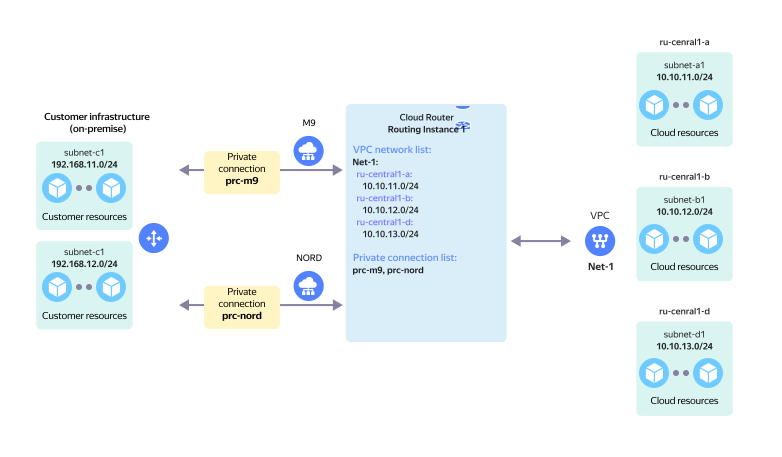

# On-prem with redundancy and 1 VPC

Reserved on-prem connection via two {{ interconnect-name }} [private connections](../../vpc/concepts/network.md) to a single `RI` with a single [cloud network](../../interconnect/concepts/priv-con.md).

The network topology is presented on the diagram in the following configuration:

* `On-Prem` client with two local subnets: `subnet-c1` and `subnet-c2`.
* The on-prem network hardware connects to the {{ yandex-cloud }} network hardware via [Cloud Interconnect](../../interconnect/concepts/index.md).
* Two [private connections](../../interconnect/concepts/priv-con.md), `prc-m9` and `prc-nord`, established via two [points of presence](../../interconnect/concepts/pops.md), `M9` and `NORD`, connect to `RI` in {{ yandex-cloud }}.
* The `Net-1` virtual network comprised of three subnets, `subnet-a1`, `subnet-b1`, and `subnet-d1`, connects to `RI` on the {{ yandex-cloud }} side.

This topology enables network connectivity between `On-Prem` subnets and `Net-1` VPC subnets.

Use appropriate {{ interconnect-name }} [routing tools](prc-ha-with-active-standby.md) to prioritize traffic between [private connections](../../interconnect/concepts/priv-con.md).

In case of failure of any of the private connections above, all network traffic will be automatically switched over to the remaining private connection.

