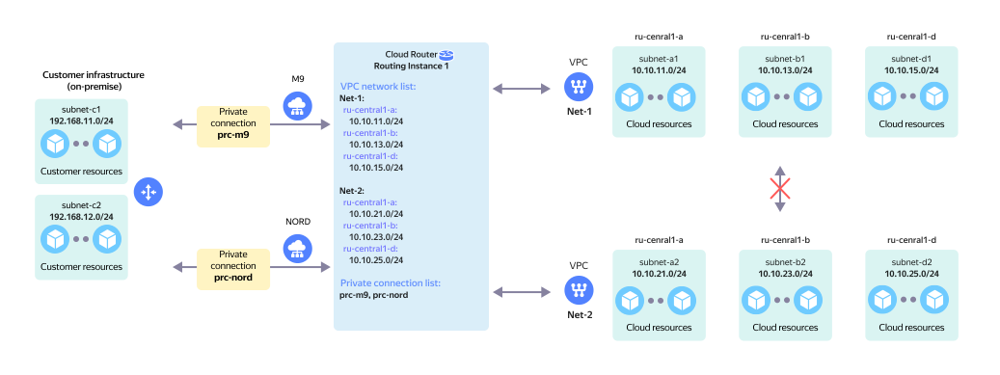

# On-prem with redundancy and multiple VPCs

Reserved on-prem connection via two {{ interconnect-name }} [private connections](../../vpc/concepts/network.md) to a single `RI` with two or more [cloud networks](../../interconnect/concepts/priv-con.md) without network connectivity between them.

The network topology is presented on the diagram in the following configuration:

* `On-Prem` client with two local subnets: `subnet-c1` and `subnet-c2`.
* The on-prem network hardware connects to the {{ yandex-cloud }} network hardware via [Cloud Interconnect](../../interconnect/concepts/index.md).
* Two [private connections](../../interconnect/concepts/priv-con.md), `prc-m9` and `prc-nord`, established via two [points of presence](../../interconnect/concepts/pops.md), `M9` and `NORD`, connect to `RI` in {{ yandex-cloud }}.
* Two virtual networks connect to `RI` on the {{ yandex-cloud }} side:
  * `Net-1` comprised of three subnets: `subnet-a1`, `subnet-b1`, and `subnet-d1`.
  * `Net-2` comprised of three subnets: `subnet-a2`, `subnet-b2`, and `subnet-d2`.

This topology enables network connectivity between:

* `On-Prem` subnets and `Net-1` VPC subnets `subnet-a1`, `subnet-b1`, and `subnet-d1`.
* `On-Prem` subnets and `Net-2` VPC subnets `subnet-a2`, `subnet-b2`, and `subnet-d2`.

In case of failure of any of the private connections above, all network traffic will be automatically switched over to the remaining private connection.

This topology enables network connectivity between `Net-1` and `Net-2` virtual networks subnets.

