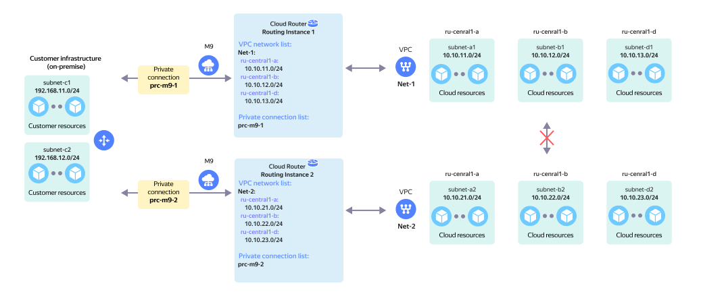

# Two separate RIs without on-prem redundancy

Two separate independent network topologies. In each topology, there is a [private connection](../../interconnect/concepts/priv-con.md) connected to `RI` on one side and a [virtual cloud network](../../vpc/concepts/network.md) on the other.

The network topology is presented on the diagram in the following configuration:

* `On-Prem` client with two local subnets: `subnet-c1` and `subnet-c2`.
* The on-prem network hardware connects to the {{ yandex-cloud }} network hardware via [Cloud Interconnect](../../interconnect/concepts/index.md).
* The `prc-m9-1` [private connection](../../interconnect/concepts/priv-con.md) via the `M9` [point of presence](../../interconnect/concepts/pops.md) connects to `Routing Instance 1` in {{ yandex-cloud }}.
* The `Net-1` virtual network comprised of three subnets, `subnet-a1`, `subnet-b1`, and `subnet-d1`, connects to `RI 1` on the {{ yandex-cloud }} side.
* The `prc-m9-2` [private connection](../../interconnect/concepts/priv-con.md) via the `M9` [point of presence](../../interconnect/concepts/pops.md) connects to `Routing Instance 2` in {{ yandex-cloud }}.
* The `Net-2` virtual network comprised of three subnets, `subnet-a2`, `subnet-b2`, and `subnet-d2`, connects to `RI 2` on the {{ yandex-cloud }} side.

This creates two network topologies (based on the number of RIs used):

* Topology 1 enables network connectivity between on-prem subnets and `Net-1` VPC subnets via `RI 1`.
* Topology 2 enables network connectivity between on-prem subnets and `Net-2` VPC subnets via `RI 2`.

These topologies do not enable network connectivity between `Net-1` and `Net-2` virtual networks subnets.



If needed, customers can enable network connectivity between `Net-1` and `Net-2` VPC subnets by setting up traffic routing between private connections on their network hardware.



