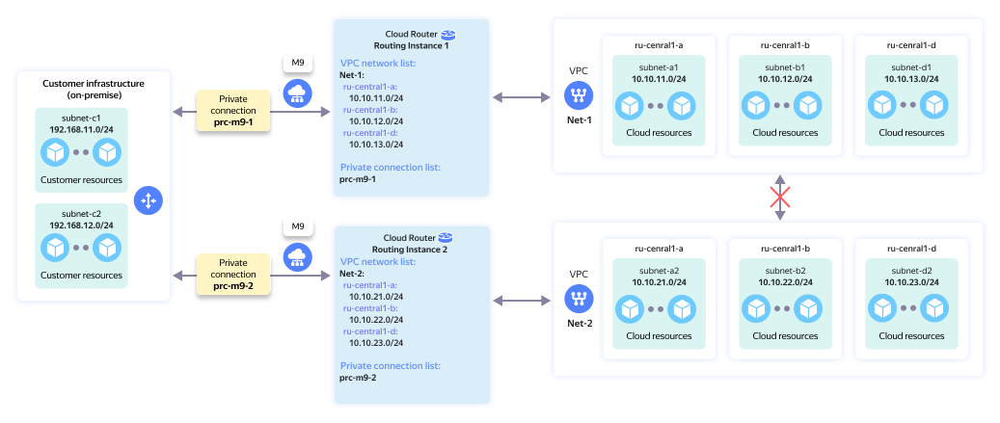

# Two separate virtual routers without on-prem redundancy

Two separate independent network topologies. In each topology, there is a [private connection](../../interconnect/concepts/priv-con.md) on one side of the virtual router and a [virtual cloud network](../../vpc/concepts/network.md) on the other.

The network topology is presented on the diagram in the following configuration:

* `On-Prem` client with two local subnets: `subnet-c1` and `subnet-c2`.
* The on-prem network hardware connects to the {{ yandex-cloud }} network hardware via [Cloud Interconnect](../../interconnect/concepts/index.md).
* [Private connection](../../interconnect/concepts/priv-con.md) `prc-m9-1` established via the `M9` [point of presence](../../interconnect/concepts/pops.md) connects to virtual router 1 in {{ yandex-cloud }}.
* On the {{ yandex-cloud }} side, the `Net-1` virtual network comprised of three subnets, `subnet-a1`, `subnet-b1`, and `subnet-d1`, connects to virtual router 1.
* [Private connection](../../interconnect/concepts/priv-con.md) `prc-m9-2` established via the `M9` [point of presence](../../interconnect/concepts/pops.md) connects to virtual router 2 in {{ yandex-cloud }}.
* On the {{ yandex-cloud }} side, the `Net-2` virtual network comprised of three subnets, `subnet-a2`, `subnet-b2`, and `subnet-d2`, connects to virtual router 2.

This creates two network topologies (based on the number of virtual routers used):

* Topology 1 enables connectivity between on-prem subnets and `Net-1` VPC subnets via virtual router 1.
* Topology 2 enables connectivity between on-prem subnets and `Net-2` VPC subnets via virtual router 2.

These topologies do not enable network connectivity between the subnets of virtual networks `Net-1` and `Net-2`.



If needed, the customer can establish network connectivity between `Net-1` and `Net-2` VPC subnets by setting up routing between private connections on their network hardware.



