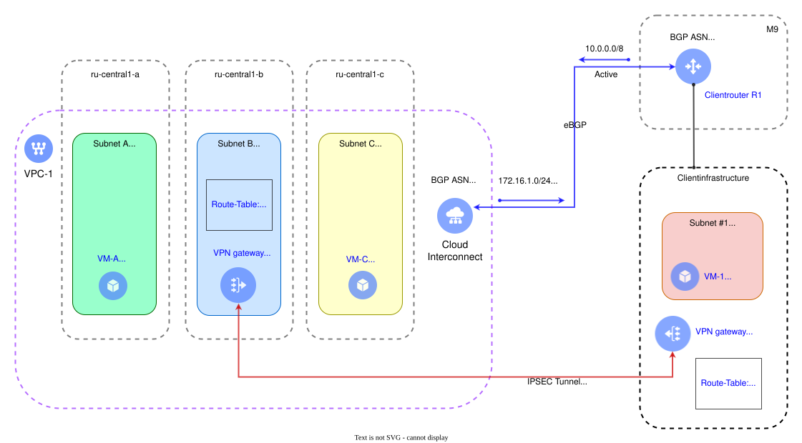

# Prioritizing a static VPC route over routes from on-prem

The following flowchart shows how to set up traffic routing from a cloud network for a specific prefix via a VPN gateway, while sending all other traffic over a {{ interconnect-name }} connection:

The customer edge router uses the `M9` PoP to announce the short prefix from the customer infrastructure, `10.0.0.0/8`, over BGP towards {{ yandex-cloud }}.

The long customer infrastructure prefix , `10.10.10.0/24`, is configured with the help of the cloud network's static route table to route traffic towards the VPN gateway with the `172.16.2.10` IP, which is deployed in the `{{ region-id }}-b` [availability zone](../../overview/concepts/geo-scope.md).

This way, all traffic from the cloud network to the `10.0.0.0/8` customer infrastructure will be transmitted via the {{ interconnect-name }} connection, while the traffic heading to the `10.10.10.0/24` subnet will run through the VPN gateway.
