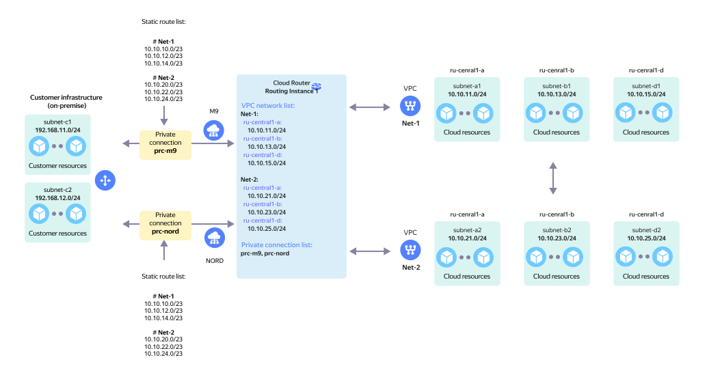

# Establishing network connectivity between two or more cloud networks and on-prem resources (VPC Stitching)



Reserved on-prem connection via two private Cloud Interconnect connections to one RI with two *or more* cloud networks and network connectivity between the cloud networks. This fully-connected topology is called `Full Mesh`.

The scenario uses the following components:

* `On-Prem` client with two local subnets: `subnet-c1` and `subnet-c2`.

* The `On-Prem` network hardware connects to the Yandex Cloud network hardware via [Cloud Interconnect](../../interconnect/concepts/index.md).

* Two private connections, `prc-m9` and `prc-nord`, established via two [points of presence](../../interconnect/concepts/pops.md), `M9` and `NORD`, connect to the `Routing Instance` in Yandex Cloud.

* From the Yandex Cloud side, these two virtual networks connect to the `Routing Instance`:

  * `Net-1` comprised of three subnets: `subnet-a1`, `subnet-b1`, and `subnet-d1`.
  * `Net-2` comprised of three subnets: `subnet-a2`, `subnet-b2`, and `subnet-d2`.

* To achieve network connectivity between virtual networks `Net-1` and `Net-2` for the `prc-m9` and `prc-nord` private connections, you need to configure [stitching announcements](../concepts/vpc-stitching.md) for the CIDRs of the corresponding subnets in virtual networks `Net-1` and `Net-2`.



Using the actual subnet prefixes of the virtual networks as stitching announcements is not permitted.



This topology enables network connectivity between:

* `On-Prem` subnets and VPC `Net-1` subnets.
* `On-Prem` subnets and VPC `Net-2` subnets.
* VPC `Net-1` and `Net-2` subnets.



In case of failure of any of the private connections above, all network traffic will be automatically switched over to the remaining private connection.



