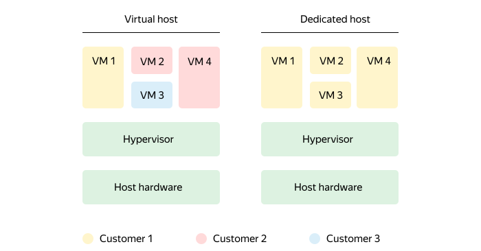
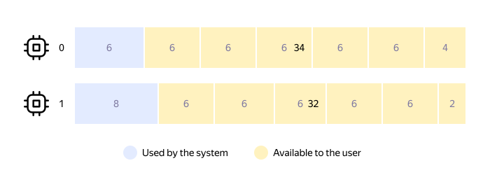

# Dedicated hosts

A _dedicated host_ is a physical server that is intended solely for hosting your VMs in {{ yandex-cloud }}. VMs on dedicated hosts have all the features of regular VMs plus they're physically isolated from other users' VMs. You can also distinguish your VMs used for different projects:



You can create a group of one or more dedicated hosts of the same type. To optimize the use of resources, you can host multiple [VMs with different configurations](vm-platforms.md) on each dedicated host.

Advantages of using dedicated hosts:
* Security and compliance.
   You can use a dedicated host to physically isolate your VM in the public cloud if this is required by your company's information security service or industry standards (such as medical or finance).
* Using your own licenses.
   
   If your company has licenses from Microsoft or other vendors that require linking to physical resources, you can use them in {{ yandex-cloud }} following the <q>Bring your own license</q> (BYOL) model.
* Managing your VM placement.
   
   You can choose which dedicated host to run your VM on or allow {{ compute-name }} to do it automatically.




## Types of dedicated hosts {#host-types}

The configuration of a dedicated host is determined by its _type_. Host types differ by their models and the number of available CPU cores, RAM size, and the number and size of local SSD disks.

The type of the dedicated host is specified when creating a host group. This type will be assigned to every host in the group, and you won't be able to change it.

The number of free dedicated hosts of each type per [availability zone](../../overview/concepts/geo-scope.md) is limited and changes with time. When a host group is created or resized, {{ compute-name }} checks that there are enough dedicated hosts of this type. If there's not enough hosts, you'll see an error.


### List of types {#host-types-list}

Current type: On the Intel® Ice Lake platform

| : Type and processor<br>(Ice Lake platform) | Processors | Cores | vCPU^1^ | RAM, GB | Disks | Disk size |
  --- | --- | --- | --- | --- | --- | ---
| `intel-6338-c108-m704-n3200x6`<br>[Intel® Xeon® Gold 6338](https://ark.intel.com/content/www/ru/ru/ark/products/212285/intel-xeon-gold-6338-processor-48m-cache-2-00-ghz.html) | 2 | 64 | 108 | 704 | 6 | 3200 × 10^9^ B <br>(~ 2.91 TB) |



You can only create hosts of this type in the `{{ region-id }}-a` and `{{ region-id }}-b` availability zones. For more information, see [{#T}](../../overview/concepts/ru-central1-c-deprecation.md).







Do not use archived types to create dedicated hosts. Select one of the current types (see above).



| Type and processor<br>(Cascade Lake platform) | Processors | Cores | vCPU^1^ | RAM, GB | Disks | Disk size |
--- | --- | --- | --- | --- | --- | ---
| `intel-6230-c66-m454`<br>[Intel Xeon Gold 6230](https://ark.intel.com/content/www/ru/ru/ark/products/192437/intel-xeon-gold-6230-processor-27-5m-cache-2-10-ghz.html) | 2 | 40 | 66 | 454 | 4 | 1600 × 10^9^ B <br>(~ 1,46 TB) |
| `intel-6230-c66-m704-n1600x4`<br>Intel Xeon Gold 6230 | 2 | 40 | 66 | 704 | 4 | 1600 × 10^9^ B <br>(~ 1,46 TB) |
| `intel-6230r-c84-m328-n3200x4`<br>[Intel Xeon Gold 6230R](https://ark.intel.com/content/www/ru/ru/ark/products/199346/intel-xeon-gold-6230r-processor-35-75m-cache-2-10-ghz.html) | 2 | 52 | 84 | 328 | 4 | 3200 × 10^9^ B <br>(~ 2.91 TB) |
| `intel-6230r-c84-m454-n3200x4`<br>Intel Xeon Gold 6230R | 2 | 52 | 84 | 454 | 4 | 3200 × 10^9^ B <br>(~ 2.91 TB) |



The above lists of the current and archived types are examples and may change. You can get an up-to-date list of types (without splitting them into current and archived):

* In the [management console]({{ link-console-main }}), on the dedicated host group creation page in {{ compute-name }}.
* Or in the CLI, by running the command `yc compute host-type list` (to learn more, see the [instructions on creating a group](../operations/dedicated-host/create-host-group.md)).

^1^ This specifies the number of vCPUs where you can run VMs. The other vCPUs of the host are allocated for system usage (for more information, see [below](#resource-fragmentation)): on the Intel Xeon Gold 6230 processors — 14 vCPU, on Intel Xeon Gold 6230R and Intel Xeon Gold 6338 processors — 20 vCPU.

### Fragmentation of host's physical resources {#resource-fragmentation}

Two processors are installed on a physical server. However, not all of their cores are available for running VMs. Some cores are allocated for system usage.

For example, a dedicated host with two Intel Xeon Gold 6230 processors can use 66 vCPUs to run VMs (34 on the first processor and 32 on the second one). The remaining 14 vCPUs (6 + 8) are used by the system.

When creating a VM on a dedicated host, you may encounter resource fragmentation: the number of free vCPUs is sufficient, but you can't run your VM. For example, you can only run 10 VMs with 6 vCPUs each on a dedicated host with 66 vCPUs.



In this case, you can run 2 VMs with 2 and 4 vCPUs to use the dedicated host's vCPUs at full capacity.

## Scaling policy {#scale-policy}

When creating a host group, specify the number of dedicated hosts. When updating the group, you can reduce or increase the number of hosts in it. The scaling policy is defined by the `ScalePolicy` parameter:

```
yc compute host-group create \
  --fixed-size <number of hosts> \
  ...
```

Where `fixed-size` is the number of dedicated hosts in the group.

## Maintenance policy {#maintenance-policy}

{{ compute-name }} stops VMs during maintenance without moving them to other hosts. Subsequent VM behavior depends on the physical server status.

If the physical server is restarted, the VMs running on it are automatically restarted, too, and linked:
* To the same host group if the VM was linked to any group. Linking to a different host in the group is possible.
* To a dedicated host if the VM was linked to a specific host.

The maintenance policy is set when creating a group of dedicated hosts and defined by the `MaintenancePolicy` parameter:

```
yc compute host-group create \
  --maintenance-policy restart \
...
```

Where `maintenance-policy` is the maintenance policy. Possible values: `restart`: Stop VMs for maintenance and restart them afterwards.

If the physical server is completely stopped, {{ compute-name }}:
1. Disables access to your dedicated host.
1. Deletes the physical server and its unique ID (`server-id`). In this case, the IDs of the host group (`host-group-id`) and each dedicated host (`host-id`) are preserved.
1. Replaces failed hardware and assigns a new ID.
1. Moves VMs from faulty to new hardware according to the [VM linking rules](#bind-vm).

## Linking a VM to a group or host {#bind-vm}

To uniquely map a VM and a physical server, you can create a VM that is linked:
* To a group of dedicated hosts.
   
   When the VM is stopped, it won't be available on the group hosts, and when it's restarted, it may be linked to a different host from the group.
* To the selected host from a group of hosts.
   
   When the VM is stopped, it won't be available on the host, and when it's restarted, it will be linked to the same host from the group.

Linking a VM ensures that it will run on the same physical server or group of servers even after a scheduled outage.

To move a VM from one dedicated host to another:
1. [Stop the VM](../operations/vm-control/vm-stop-and-start).
1. Link the VM to a different host in the group.
1. Restart the VM.

When creating a VM, you can specify multiple host groups or specific hosts that it can be linked to. Example of linking a VM to a host group:

```
yc compute instance create \
  --host-group-id 1 \
  --network-interface subnet-name=default-{{ region-id }}-a \
  --zone {{ region-id }}-a
```

In this case, the VM will be linked to one of the specified host groups:

```
done (33s)
id: abcdefghigklm12no3pq
folder_id: a1b23cd45efg6higklmn
created_at: "2020-09-08T20:19:41Z"
zone_id: {{ region-id }}-a
platform_id: standard-v2
resources:
  memory: "2147483648"
  cores: "2"
  core_fraction: "100"
host-group-id: 2
...
```

## Pricing {#billing}

For information about pricing for dedicated hosts, see [{#T}](../pricing.md#prices-dedicated-host).


_Intel and Xeon are trademarks of Intel Corporation or its subsidiaries._