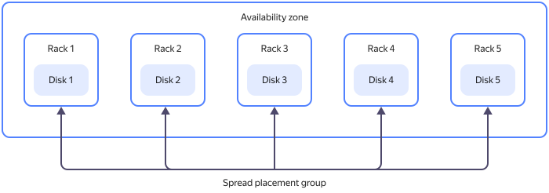
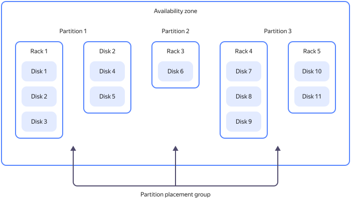

# Non-replicated disk placement groups

When creating [non-replicated disks](disk.md#disks_types), resources are automatically distributed across the {{ yandex-cloud }} physical infrastructure. Your disks might get hosted on the same physical media. To make multiple disk failures less likely, you can combine your disks into _placement groups_.

Grouping non-replicated disks reduces the risk of their simultaneous failure. However, the placement requirements are more demanding, so a physical resource shortage is more likely for non-replicated disks in a placement group rather than for the same number of ungrouped disks. You might fail to create a non-replicated disk in a placement group, but succeed to create one outside the group without any issue.

You can only place a non-replicated disk in a single group, which must reside in the same [availability zone](../../overview/concepts/geo-scope.md).

For more information about the organizational and technical limits of placement groups, see [{#T}](../concepts/limits.md).

In a placement group, non-replicated disks are located in the server racks of the data center of the selected availability zone according to one of the placement strategies.

## Spread placement {#spread}

_Spread placement_ is a non-replicated disk placement strategy which ensures that each disk resides on a separate server rack in the data center of the selected availability zone. If one of the server racks hosting the group's disks fails, only one disk will be affected.

## Partition placement {#partition}

_Partition placement_ is a non-replicated disk placement strategy where partitions with disks are guaranteed to reside on different server racks in a data center of the selected availability zone. If one of the server racks with the group's partitions fails, only one partition will be affected. A single partition may host multiple disks. A single placement group may contain up to 5 partitions.

### See also {#see-also}

* [How to create a disk placement group](../operations/disk-placement-groups/create.md).
* [How to create a non-replicated disk in a placement group](../operations/disk-create/nonreplicated.md#nr-disk-in-group).
* [How to add a disk to a placement group](../operations/disk-placement-groups/add-disk.md).