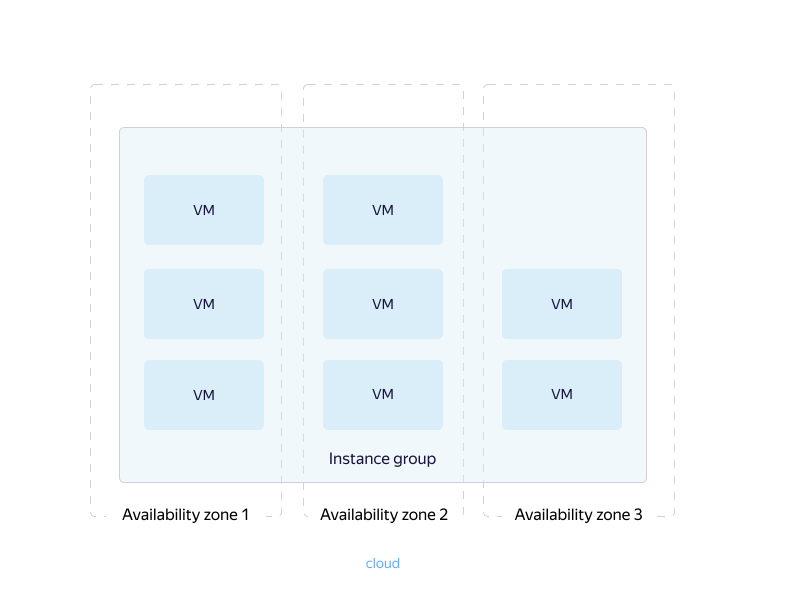

# {{ ig-name }} concepts





If you have instance groups in the `{{ region-id }}-c` availability zone, [move](../../operations/instance-groups/move-group.md) them.



{{ ig-name }} is a {{ compute-name }} component that allows you to create and manage VM instance groups.
{{ ig-name }} can automatically identify and fix unhealthy instances in a group to ensure their optimal performance.



All operations in {{ ig-name }} must be performed on behalf of a service account. For more information, see [{#T}](access.md).



Each group consists of one or more instances of the same type. Group instances may reside in different availability zones. You can read more about {{ yandex-cloud }} availability zones [here](../../../overview/concepts/geo-scope.md).

Group instances can also be part of a [VM placement group](../placement-groups.md). To enable this, when [creating an instance group](../../operations/placement-groups/create-ig-in-pg.md), describe placement group parameters in the [instance template](instance-template.md#instance-template). You can create an instance group in a placement group using the [CLI](../../../cli/quickstart.md) and [API](../../api-ref/).

You can use {{ ig-name }} to:

- Simultaneously [update](deploy/index.md) all instances in a group.

- Provide integration with [{{ network-load-balancer-full-name }}](../../../network-load-balancer/concepts/index.md) and [{{ alb-full-name }}](../../../application-load-balancer/concepts/index.md) and evenly distribute workloads across instances.

- Create [automatically scaled instance groups](scale.md#auto-scale).

- Automatically [recover](autohealing.md) a VM instance if an application fails.

- Maintain the performance of application services in a reliable environment with multi-zone features instead of allocating resources for each zone.

When creating a group, you need to describe the following:

- [Template](instance-template.md) for deploying group instances.

- [{#T}](policies/index.md) for scaling, deployment, and allocation.

An instance group created in a folder can be accessed by all VMs connected to the same cloud network. For more information about networking, see the [{{ vpc-name }} documentation](../../../vpc/).
