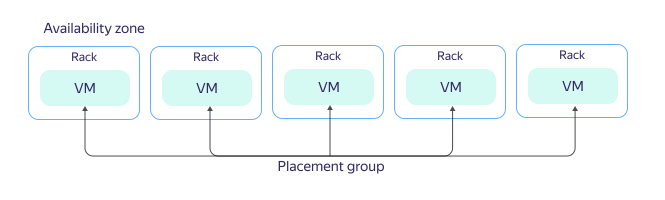

# VM placement groups

Once VMs are created, they are automatically distributed across the {{ yandex-cloud }} physical infrastructure. To manage hardware fault tolerance levels, you can combine your VMs into placement groups.

_VM placement groups_ are groups of VMs, where each one is hosted on physical hardware according to a certain strategy. {{ compute-full-name }} uses the distributed placement strategy.

_Distributed placement_ (`spread`) is a strategy for VM allocation that ensures that each VM is guaranteed to be hosted in a separate server rack in one of the availability zones. If one rack fails, the others continue to run normally.

By grouping VMs based on the distributed placement strategy, you can ensure a high level of fault tolerance and reduce the risk of concurrent failure of VMs hosted on the same server rack. However, the placement requirements are more demanding, so a physical resource shortage is more likely for VMs in a placement group rather than for the same number of ungrouped VMs.

For more information about the organizational and technical limits of placement groups, see [{#T}](../concepts/limits.md).

## See also {#see-also}

* [How to create a placement group](../operations/placement-groups/create.md).
* [How to add a VM to a placement group](../operations/placement-groups/add-vm.md).
* [How to create a VM in a placement group](../operations/placement-groups/create-vm-in-pg.md).