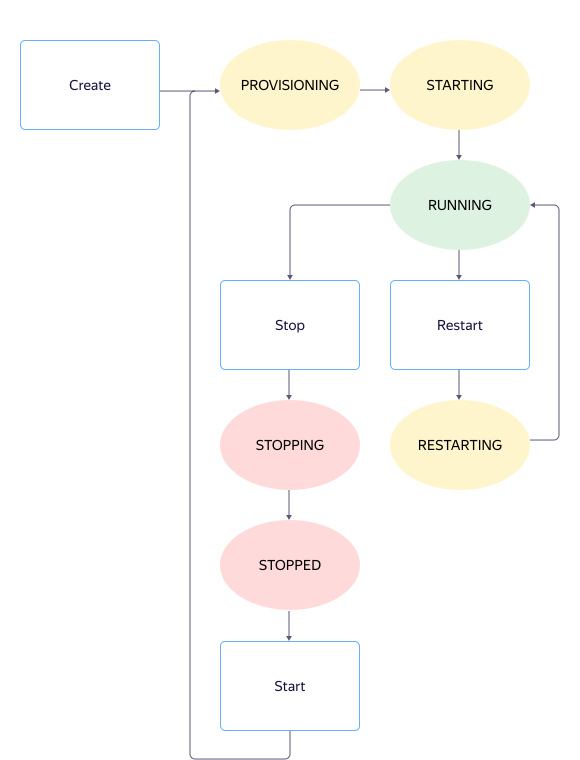

# VM statuses

## List of statuses {#list-of-statuses}

A VM can have one of the following statuses:

- `PROVISIONING`: {{ yandex-cloud }} is allocating resources to the VM.
- `STARTING`: VM is being started.
- `RUNNING`: VM has been started and is running.
- `STOPPING`: VM is being stopped.
- `STOPPED`: VM has been stopped.
- `RESTARTING`: VM is being restarted.
- `UPDATING`: VM is being updated.
- `CRASHED`: VM crashed and will be restarted automatically.
- `ERROR`: Fatal error occurred and the VM cannot be recovered.
- `DELETING`: VM is being deleted.

## Operations on a VM {#operations-on-VM}

The diagram below shows only switching statuses under normal operation during the following actions:

- VM [creation](#create)
- VM [stop and start](#stop-and-start)
- VM [restart](#restart)

The diagram does not show the following intermediate statuses:

- `UPDATING` ([update](#update))
- `DELETING` ([deletion](#delete))
- `CRASHED` and `ERROR` ([errors](#error))

### Creation {#create}

When a VM is [created](../operations/vm-create/create-linux-vm.md), it gets the `PROVISIONING` status. At this stage, the VM is allocated computing resources, such as the number and performance of processor cores (vCPUs) and the amount of RAM. It is also assigned an IP address and gets its disks created.

After this, the VM will automatically start and switch to the `STARTING` status.

If the startup is successful, the VM's status will change to `RUNNING` and the operating system will start loading. Once this is complete, you will be able to connect to your VM.

### Stop and start {#stop-and-start}

When [stopped](../operations/vm-control/vm-stop-and-start.md#stop), the VM switches to the `STOPPED` status.

At the next [start](../operations/vm-control/vm-stop-and-start.md#start), the VM will go through the same statuses as when it was created: `PROVISIONING` → `STARTING` → `RUNNING`.

### Restart {#restart}

When being [restarted](../operations/vm-control/vm-stop-and-start.md#restart), the VM switches to the `RESTARTING` status. Since all computing resources have been already allocated for it, it will go back to the `RUNNING` status once it is restarted.

### Updating {#update}

You can update the VM parameters, such as change its name, regardless of the VM status. Once updated (the `UPDATING` status), the VM will go back to the previous status.

If you update the [metadata](vm-metadata.md), it will be available from inside the VM immediately after the update. You do not need to stop or restart the VM in this case.

### Delete {#delete}

When you [delete](../operations/vm-control/vm-delete.md) a VM, all ongoing operations are first cancelled or stopped, and then the VM switches to the `DELETING` status.

When the deletion is complete, the VM disappears from the list of available resources.

## Errors {#error}

There are two error statuses:

- `CRASHED`: Error occurred and the VM cannot continue working.

    If the VM has switched to this status, {{ yandex-cloud }} will try to restart it. Restart attempts will be repeated until the VM status changes to `RUNNING` or `ERROR`.

- `ERROR`: Fatal error occurred and the VM cannot be recovered.

    If the VM has switched to this status or is continuously switching to the `CRASHED` status, contact [technical support](../../support/overview.md) or create a new VM.

