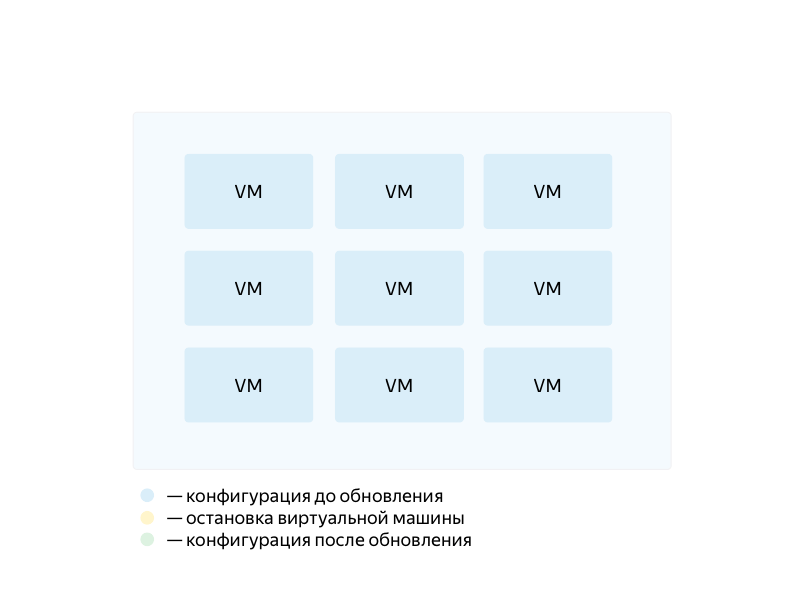

# Rolling updates

To perform a rolling update of your service, discontinuing no more than *N* virtual machine instances at a time:

1. Define the instance [template](../../../concepts/instance-groups/instance-template.md) you need.
1. Set the [deployment policy](../../../concepts/instance-groups/policies/deploy-policy.md) with a non-zero value for `max_unavailable`, which stands for the maximum number of instances to discontinue at a time.
1. Start group [updating](../../../operations/instance-groups/update.md).

For example, to update an instance group sequentially, discontinuing one VM instance at a time, configure `deploy-policy` as follows:
```
...
deploy-policy:
    max_unavailable: 1
    max_expansion: 0
    ...
...
```

The group will be updated as follows:

