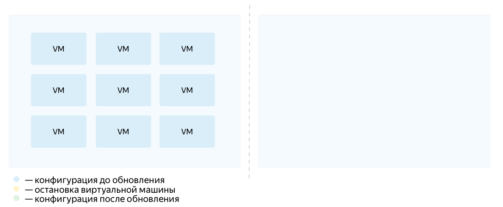

# Zero-downtime updates

To keep your service available, you can update instance groups by creating additional instances with new configurations. 
As you add VM instances with the new configuration to the group, those with the old configuration will be removed.

For this, follow these steps:

1. Define the instance [template](../../../concepts/instance-groups/instance-template.md) you need.
1. Set the [deployment policy](../../../concepts/instance-groups/policies/deploy-policy.md) with a non-zero value for `max_expansion`, which stands for the maximum number of additional instances to create.
1. Start group [updating](../../../operations/instance-groups/update.md).

For example, to update a group by adding and removing one VM instance at a time, configure `deploy-policy` as follows:

```
...
deploy-policy:
    max_unavailable = 0
    max_expansion = 1
    ...
...
```

The group will be updated as follows:

