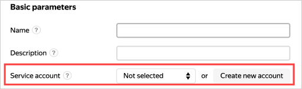

# Working with {{ yandex-cloud }} from inside a VM

This section describes how to work with {{ yandex-cloud }} from inside a [VM](../../concepts/vm.md) via the API or CLI.

To automate operations with {{ yandex-cloud }} from inside a VM, we recommend using [service accounts](../../../iam/concepts/users/service-accounts.md). This is more secure since you do not need to save your [OAuth token](../../../iam/concepts/authorization/oauth-token.md) on a VM and can restrict access rights to a service account.

{{ yandex-cloud }} provides simplified authentication via the API and CLI from inside a VM for service accounts. To authenticate:
1. If you do not have a service account yet, [create one](../../../iam/operations/sa/create.md) and [configure access rights for it](../../../iam/operations/sa/assign-role-for-sa.md).
1. [Link the service account](#link-sa-with-instance) to your VM.
1. [Authenticate from inside a VM](#auth-inside-vm).

## Link your service account {#link-sa-with-instance}

Link your service account to an existing or new VM. You can only link one service account.

To link a service account to a VM, you must have permission to use this account. This permission is included in the [iam.serviceAccounts.user](../../../iam/security/index.md#iam-serviceAccounts-user) and [editor](../../../iam/roles-reference.md#editor) roles and higher.

### Linking to an existing VM {#link-with-exist-instance}



- Management console {#console}

   1. In the [management console]({{ link-console-main }}), select the folder the VM belongs to.
   1. Select **{{ ui-key.yacloud.iam.folder.dashboard.label_compute }}**.
   1. Click the VM name.
   1. Click  **{{ ui-key.yacloud.compute.instance.overview.button_action-edit }}** in the top-right corner of the page.
   1. Under **{{ ui-key.yacloud.compute.instances.create.section_access }}**, select an existing service account or create a new one.
   1. Click **{{ ui-key.yacloud.compute.instance.edit.button_update }}**.

- CLI {#cli}

   

   

   Update the VM parameters by specifying the service account via the `--service-account-name` or `--service-account-id` option:

   ```bash
   yc compute instance update my-instance --service-account-name test
   ```

- API {#api}

   Use the [update](../../api-ref/Instance/update.md) REST API method for the [Instance](../../api-ref/Instance/) resource or the [InstanceService/Update](../../api-ref/grpc/Instance/update.md) gRPC API call. Specify the service account ID in your request.



### Linking to a new VM {#link-with-new-instance}



- Management console {#console}

   In the management console, you can link a service account that is in the same [folder](../../../resource-manager/concepts/resources-hierarchy.md#folder) as the new VM. If the service account is in a different folder, use the CLI or API.

   To link your service account to a VM, specify it when [creating the VM](../index.md#vm-create). You can select an existing service account or create a new one:

   

- CLI {#cli}

   

   

   Create a VM and specify the service account using the `--service-account-name` or `--service-account-id` option:

   ```bash
   yc compute instance create \
     --name my-instance \
     --network-interface subnet-name=default,nat-ip-version=ipv4 \
     --ssh-key ~/.ssh/id_ed25519.pub \
     --service-account-name my-robot
   ```

- API {#api}

   Use the [create](../../api-ref/Instance/create.md) REST API method for the [Instance](../../api-ref/Instance/) resource or the [InstanceService/Create](../../api-ref/grpc/Instance/create.md) gRPC API call. Specify the service account ID in your request.



## Authenticating from inside a VM {#auth-inside-vm}

To authenticate from inside a VM on behalf of the linked service account:



- CLI {#cli}

   1. [Connect](../vm-connect/ssh.md) to your VM over SSH.

   1. 

   1. Create a new profile:

      ```bash
      yc config profile create my-robot-profile
      ```


   1. Configure your profile to run commands.

      

      You can also get a [{{ iam-full-name }} token](../../../iam/concepts/authorization/iam-token.md), for example, to authenticate with the API:

      ```bash
      yc iam create-token
      ```

      The [lifetime of an {{ iam-name }} token](../../../iam/concepts/authorization/iam-token.md#lifetime) in this case will be less than {{ iam-token-lifetime }}. Request an {{ iam-name }} token more often, e.g., every hour. To learn the remaining token lifetime, use the API instructions.

- API {#api}

   1. Connect to the VM via [SSH](../vm-connect/ssh.md).
   1. Get an {{ iam-name }} token from metadata in Google Compute Engine format:

      ```bash
      curl -H Metadata-Flavor:Google http://169.254.169.254/computeMetadata/v1/instance/service-accounts/default/token

      {"access_token":"CggVAgAAA...","expires_in":39944,"token_type":"Bearer"}
      ```

      The {{ iam-name }} token will be returned in the `access_token` field of the response. The remaining lifetime of the {{ iam-name }} token is specified in the `expires_in` field.

   1. 

  Keep track of the {{ iam-name }} token lifetime or request a new token more often, e.g., every hour.

