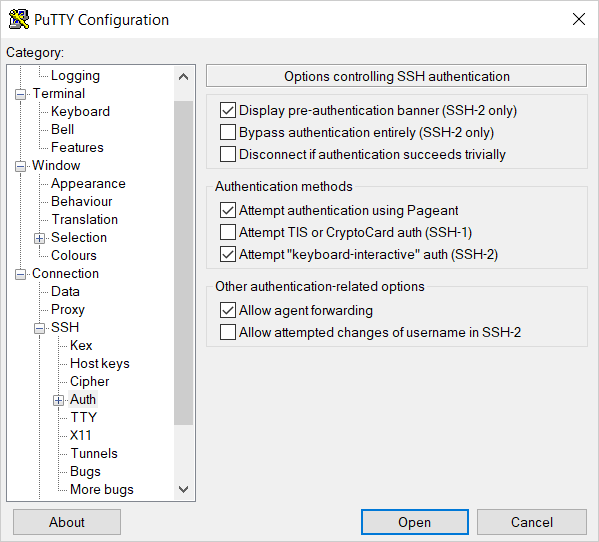

# Connecting to a Linux VM via SSH

To connect to a [VM](../../concepts/vm.md) over SSH, you need a key pair: the public key resides on the VM, and the private one is kept by the user. This method is more secure than connecting with login and password.

To enable another user to connect to your VM, add an SSH key for them by following [this guide](#vm-authorized-keys).



When creating a VM accessible via [{{ oslogin }}](./os-login.md), specify SSH keys in the [metadata](../../concepts/vm-metadata.md#how-to-send-metadata). This way, you will be able to [connect to the VM via SSH](#vm-connect) even if you disable {{ oslogin }} access for it.



To connect to a Linux VM via SSH:

1. [Create an SSH key pair](#creating-ssh-keys).
1. [Copy the public key](#copy-key) to the **{{ ui-key.yacloud.compute.instances.create.field_key }}** field on the VM creation page.
1. [Connect to the VM](#vm-connect).


## Creating an SSH key pair {#creating-ssh-keys}





Save the private key in a secure location, as you will not be able to connect to the VM without it.



## Copying a public key to the clipboard {#copy-key}

The [previously created](#creating-ssh-keys) public key has the following format:

```text
<key_type> <public_key_body> <optional_comment>
```

Example:

> ```text
> ssh-ed25519 AAAAC3NzaC1lZDI1NTE5ABFLIFyapYheN7OZNhTaNqEHefjmU5mtzK********+gRPCz user@Desktop
> ```



The `<optional_comment>` section is not used when connecting via SSH, so you can skip copying it.



Open the `<key_name>.pub` file using any text editor, such as Notepad, and copy the key from it. The key must be written as a single line (without returns or line breaks).

You can also copy the key using the command line:



- Linux/macOS {#linux-macos}
  
  In the terminal, use one of the following methods to copy the key:

   * Manually. To do this, output the file contents to the screen:

      ```bash
      cat <key_file_path>/<key_name>.pub
      ```

      The public key will be shown on the screen. Copy it to the clipboard.

   * Use the appropriate command:

       * For Linux: `cat <key_file_path>/<key_name>.pub | xclip -selection clipboard`.

       * For macOS: `cat <key_file_path>/<key_name>.pub | pbcopy`.

       The above-mentioned commands copy the entire content of the file, including the optional comment.

- Windows {#windows}

  1. Run `cmd.exe` or `powershell.exe`.
  1. Use one of the following methods to copy the key:

     * Manually. To do this, output the file contents to the screen:

        ```shell
        type <key_file_path>\<key_name>.pub
        ```

        The public key will be shown on the screen. Copy it to the clipboard.

     * Use the appropriate command:

        ```shell
        type <key_file_path>\<key_name>.pub | clip
        ```

        The above-mentioned command copies the entire content of the file, including the optional comment.



After that, paste the public key into the **{{ ui-key.yacloud.compute.instances.create.field_key }}** field when creating a new VM in the [management console]({{ link-console-main }}).

## Connecting to a VM {#vm-connect}

You can connect to a VM with the `RUNNING` status over SSH. Some time may be required to initialize all the services after the VM [starts](../vm-control/vm-stop-and-start.md#start). If there is a connection error, retry after a few minutes.

VM [security groups](../../../vpc/concepts/security-groups.md) must allow incoming TCP traffic to port 22.

To connect, specify the VM's [public IP address](../../../vpc/concepts/address.md#public-addresses). You can find out the public IP address in the management console: on the VM page, go to the **{{ ui-key.yacloud.compute.instance.overview.section_network }}** section and find the **{{ ui-key.yacloud.compute.instance.overview.label_public-ipv4 }}** field. If you created a VM with an internal IP address only, [bind it to a public IP address](../vm-control/vm-attach-public-ip.md).

You can also use the [internal IP addresses](../../../vpc/concepts/address.md#internal-addresses) and [FQDNs](../../../vpc/concepts/address.md#fqdn) to establish an SSH connection between the VMs on a single [cloud network](../../../vpc/concepts/network.md#network) in {{ yandex-cloud }}.



- Linux/macOS {#linux-macos}

  In the terminal, run this command:

  ```bash
  ssh <username>@<VM_public_IP_address>
  ```

  Where `<username>` is the VM account username. If you created the VM via the CLI, `yc-user` is the default user.

  If you have multiple private keys, specify the one you need:

  ```bash
  ssh -i <key_path/key_file_name> <username>@<VM_public_IP_address>
  ```

  If this is your first time connecting to the VM, you will see an unknown host warning:

  ```text
  The authenticity of host '51.250.83.243 (51.250.83.243)' can't be established.
  ED25519 key fingerprint is SHA256:6Mjv93NJDCaf/vu3NYwiLQK4tKI+4cfLtkd********.
  This key is not known by any other names.
  Are you sure you want to continue connecting (yes/no/[fingerprint])?
  ```

  Type `yes` in the terminal and press **Enter**.

- Windows 10/11 {#windows}

  Make sure the Windows account has read permissions for the folder containing the keys.

  To connect to the VM, execute the following command in the command line:

  ```shell
  ssh <username>@<VM_public_IP_address>
  ```

  Where `<username>` is the VM account username. If you created the VM via the CLI, `yc-user` is the default user.

  If you have multiple private keys, specify the one you need:

  ```shell
  ssh -i <key_path\key_file_name> <username>@<VM_public_IP_address>
  ```

  If this is your first time connecting to the VM, you will see an unknown host warning:

  ```text
  The authenticity of host '89.169.132.223 (89.169.132.223)' can't be established.
  ECDSA key fingerprint is SHA256:DfjfFB+in0q0MGi0HnqLNMdHssLfm1yRanB********.
  Are you sure you want to continue connecting (yes/no/[fingerprint])?
  ```

  Type `yes` in the command line and press **Enter**.

- Windows 7/8 {#windows7-8}

  Establish a connection using the PuTTY app:
  1. Run the Pageant application.
     1. Right-click the pageant icon in the task bar.
     1. In the context menu, select **Add key**.
     1. Select a PuTTY-generated private key in `.ppk` format. If a password is set for the key, enter it.
  1. Run PuTTY.
     1. In the **Host Name (or IP address)** field, enter the public IP address of the VM you want to connect to. Set the port to `22` and connection type to **SSH**.

        

     1. In the tree on the left, select **Connection** → **SSH** → **Auth**.
     1. Set the **Allow agent forwarding** option.

        

     1. In the tree on the left, select **Connection** → **SSH** → **Auth** → **Credentials**.

     1. In the **Private key file for authentication** field, select the file with the private key.

        

     1. Go back to the **Sessions** menu. In the **Saved sessions** field, enter any session name and click **Save**. The session settings are saved under the specified name. You can use this session profile to connect using Pageant.

        

     1. Click **Open**. If this is the first time you connect to a VM, you might see a warning about an unknown host:

        

        Click **Accept**. A terminal window will open prompting you to enter the username of the user on whose behalf the connection is being established. Type the username that you specified when creating the VM and press **Enter**. If you created the VM via the CLI, `yc-user` is the default user.

        If all the settings are correct, the connection with the server will be established.

        

  If you saved the session profile in PuTTY, you can use Pageant to establish a connection in the future:
  1. Right-click the pageant icon in the task bar.
  1. Select the **Saved sessions** menu item.
  1. In the saved sessions list, select the session you need.



For more information on how to solve connection issues, see [FAQ](../../qa/connection.md).

## Adding SSH keys for other users {#vm-authorized-keys}

You can add SSH keys for another VM user. To do this, create a new user and add a file with the authorized keys for this user.

To create multiple users with keys at the same time, use [metadata](../../concepts/vm-metadata.md#how-to-send-metadata).

To configure users from within the VM, follow these steps:

1. [Connect](#vm-connect) to the VM under the username you specified when creating the VM in the management console.

   

   To get information about a VM with user metadata, run the command:

   ```bash
   yc compute instance get --full <VM_name>
   ```

   

1. Create a new user named `testuser` and specify `bash` as the default wrapper for this user:

   ```bash
   sudo useradd -m -d /home/testuser -s /bin/bash testuser
   ```

1. Switch to the new user:

   ```bash
   sudo su - testuser
   ```

1. Create the `.ssh` folder in the new user's home directory:

   ```bash
   mkdir .ssh
   ```

1. In the `.ssh` folder, create a file named `authorized_keys`:

   ```bash
   touch .ssh/authorized_keys
   ```

1. Add the public key of the new user to the `authorized_keys` file:

   ```bash
   echo "<public_key>" >> /home/testuser/.ssh/authorized_keys
   ```

1. Change the access permissions to the `authorized_keys` file and the `.ssh` folder:

   ```bash
   chmod 700 ~/.ssh
   chmod 600 ~/.ssh/authorized_keys
   ```

1. Disconnect from the VM using the `exit` command.
1. [Restart the VM](../vm-control/vm-stop-and-start.md#restart).
1. Check the connection for the new user:

   ```bash
   ssh testuser@<VM_public_IP_address>
   ```

#### What's next {#what-is-next}

* [Learn how to work with {{ yandex-cloud }} from inside a VM](auth-inside-vm.md).

#### See also {#see-also}

* [{#T}](rdp.md)
* [{#T}](powershell.md)
* [{#T}](os-login.md)
