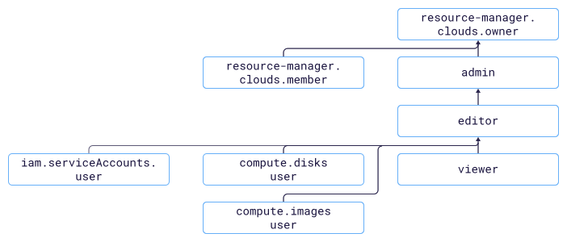

# Access management in {{ compute-name }} 

In this section, you'll learn:

* [What resources you can assign roles to](#resources).
* [What roles exist in the service](#roles-list).



## What resources you can assign roles to. {#resources}



## What roles exist in the service {#roles-list}



### Service roles

| Role | Permissions |
| ----- | ----- |
| `compute.admin` | Gives rights to manage virtual machines and [instance groups](../../compute/concepts/instance-groups/index.md). |
| `compute.disks.user` | Lets you use disks to create new resources, such as virtual machines. |
| `compute.images.user` | Lets you use images to create new resources, such as virtual machines. |
| `iam.serviceAccounts.user` | Verifies the right to use the service account. This role is required to perform operations with instance groups. If you enter a service account in the request, {{ iam-short-name }} checks that you have rights to use this account. |
| `resource-manager.clouds.member` | The role required to access resources in the cloud for all users except [cloud owners](../../resource-manager/concepts/resources-hierarchy.md#owner) and [service accounts](../../iam/concepts/users/service-accounts.md). |
| `resource-manager.clouds.owner` | Grants you full access to a cloud and the resources in it. You can only assign this role for a cloud. |

For more information about service roles, see [{#T}](../../iam/concepts/access-control/roles.md) in the {{ iam-full-name }} documentation.

### Primitive roles



#### What's next {#what-is-next}

* [How to assign a role](../../iam/operations/roles/grant.md).
* [How to revoke a role](../../iam/operations/roles/revoke.md).
* [Learn more about access management in {{ yandex-cloud }}](../../iam/concepts/access-control/index.md).
* [For more information about role inheritance](../../resource-manager/concepts/resources-hierarchy.md#access-rights-inheritance).

