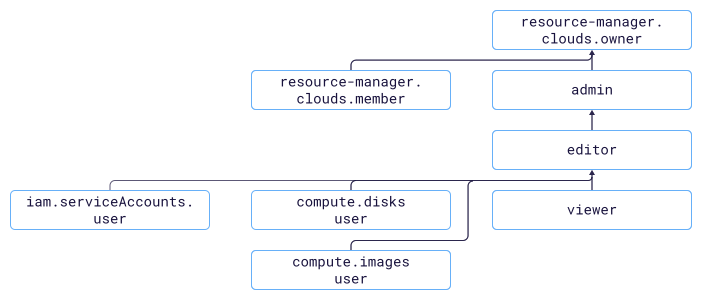

# Access management in {{ compute-name }}

In this section, you will learn:

* [Which resources you can assign a role for](#resources).
* [Which roles exist in the service](#roles-list).



Roles for a resource can be assigned by users who have the `compute.admin` role or one of the following roles for that resource:



## Which resources you can assign a role for {#resources}



You can also assign roles for individual resources of the service:



- Management console {#console}

  Use the [management console]({{ link-console-main }}) to assign roles for the following resources:

  

- CLI {#cli}

  You can use the [{{ yandex-cloud }} CLI](../../cli/cli-ref/compute/cli-ref/index.md) to assign roles for the following resources:

  

- {{ TF }} {#tf}

  Use [{{ TF }}]({{ tf-provider-link }}) to assign roles for the following resources:

  

- API {#api}

  You can use the [{{ yandex-cloud }}](../api-ref/authentication.md) API to assign roles for the following resources:

  



## Which roles exist in the service {#roles-list}



### Service roles {#service-roles}

#### compute.auditor {#compute-auditor}



#### compute.viewer {#compute-viewer}



#### compute.editor {#compute-editor}



#### compute.admin {#compute-admin}



#### compute.osLogin {#compute-oslogin}



#### compute.osAdminLogin {#compute-osadminlogin}









#### compute.disks.user {#compute-disks-user}



#### compute.images.user {#compute-images-user}



#### compute.operator {#compute-operator}



#### compute.snapshotSchedules.viewer {#compute-snapshotSchedules-viewer}



#### compute.snapshotSchedules.editor {#compute-snapshotSchedules-editor}



#### iam.serviceAccounts.user {#iam-serviceAccounts-user}



For more information about service roles, see [{#T}](../../iam/concepts/access-control/roles.md) in the {{ iam-full-name }} documentation.

### Primitive roles {#primitive-roles}





#### What's next {#what-is-next}

* [How to assign a role](../../iam/operations/roles/grant.md).
* [How to revoke a role](../../iam/operations/roles/revoke.md).
* [Learn more about access management in {{ yandex-cloud }}](../../iam/concepts/access-control/index.md).
* [Learn more about inheriting roles](../../resource-manager/concepts/resources-hierarchy.md#access-rights-inheritance).
