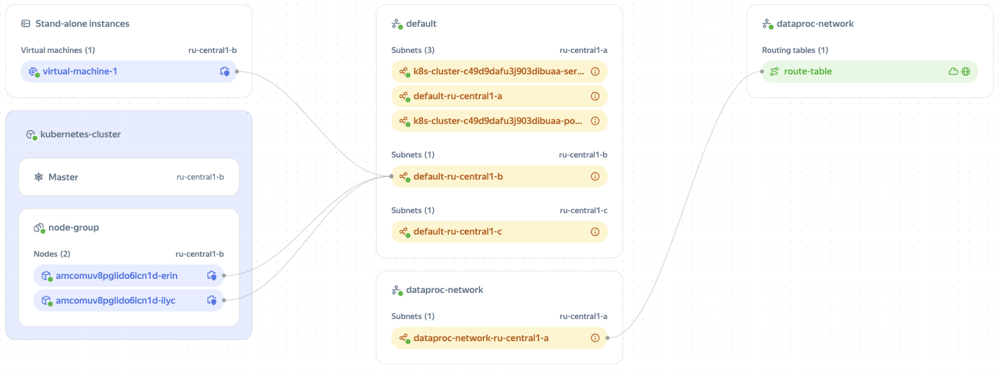

# Infrastructure map

The infrastructure map shows the relationships between cloud resources as well as between [networks](*network) and [subnets](*subnet) within the resource folder.

Infrastructure map example:

You can use the infrastructure map to visualize networks. For example, with the map, you can identify the subnets with the highest loads or with configured route tables.

## Resources displayed on the infrastructure map {#resources}

* [Instance groups](../../compute/concepts/instance-groups/index.md).
* [Virtual machines](../../compute/concepts/vm.md).
* [{{ managed-k8s-full-name }} clusters](../../managed-kubernetes/concepts/index.md#kubernetes-cluster).
* [{{ managed-k8s-name }} nodes and node groups](../../managed-kubernetes/concepts/index.md#node-group).
* [{{ mpg-full-name }} clusters](../../managed-postgresql/concepts/index.md).
* [{{ mch-full-name }} clusters](../../managed-clickhouse/concepts/index.md).
* [Cloud networks](../../vpc/concepts/network.md#network).
* [Subnets](../../vpc/concepts/network.md#subnet).
* [Route tables](../../vpc/concepts/routing.md#rt-vpc).

You have the option to only map network connections for specific resources. This can be useful if you have a large network with a vast number of resources. You can also use the map to navigate to resource pages with a single click. For more information on using the map, see [this guide](../operations/view-infrastructure-map.md).

#### Useful links {#see-also}

* [{#T}](../operations/view-infrastructure-map.md)

[*network]: A cloud network is similar to a traditional LAN in a data center. Cloud networks are created in folders and used for transmitting information between cloud resources and connecting resources to the internet. For more information, see [{#T}](../../vpc/concepts/network.md#network).

[*subnet]: A subnet is a range of IP addresses in a cloud network. Addresses from this range can be assigned to cloud resources, such as VMs and database clusters. For more information, see [{#T}](../../vpc/concepts/network.md#subnet).
