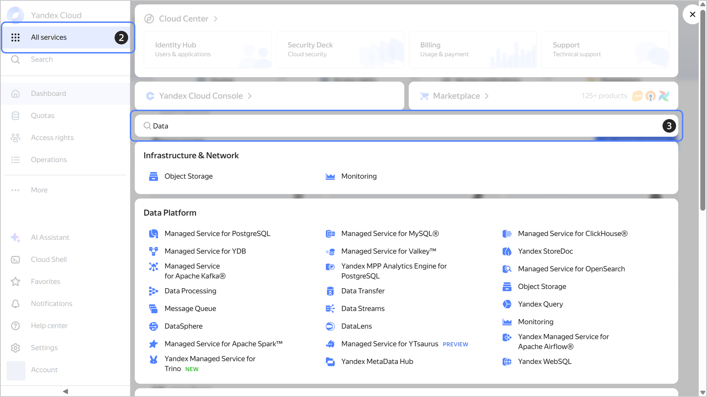
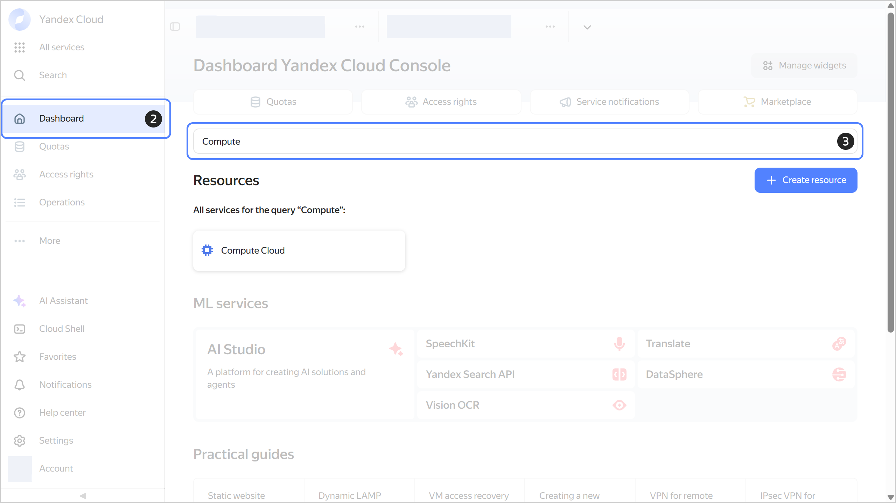
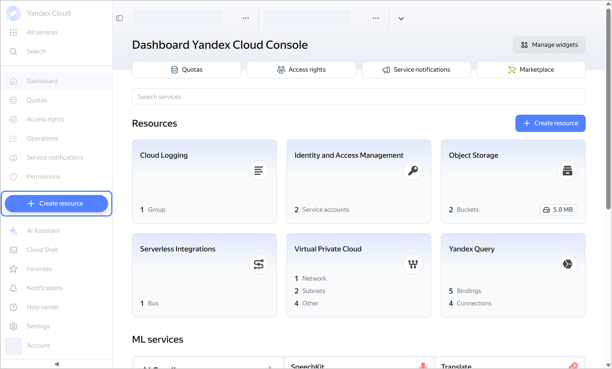
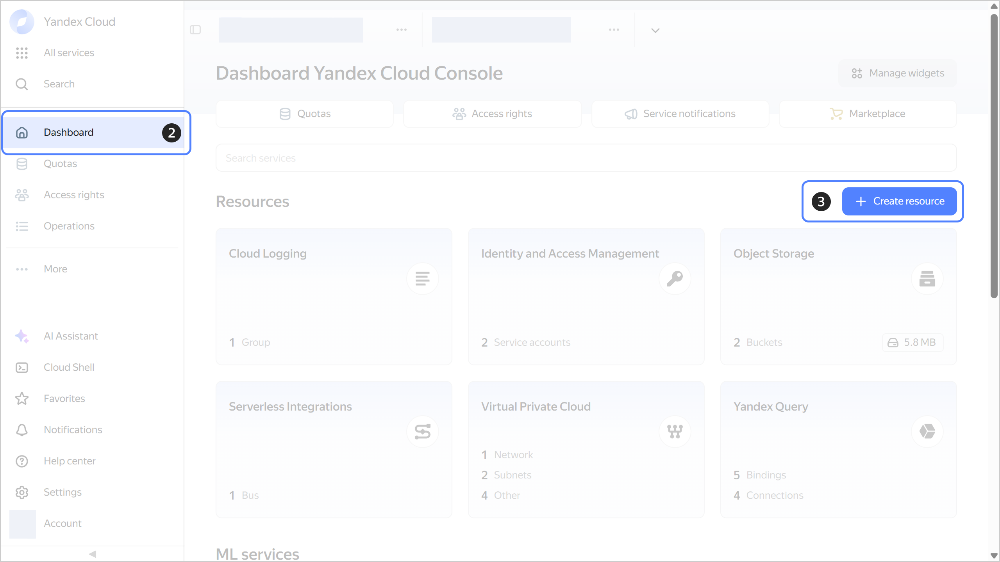

# How to get started with the services and create resources

In the {{ yandex-cloud }} management console, you can navigate to a desired service and create resources via the dashboard or left-hand panel.



## How to open a service's page {#select-service}

### Navigating to a service from the left-hand panel {#select-service-panel}

  1. In the [management console]({{ link-console-main }}), select a folder.
  1. In the left-hand panel, click  **{{ ui-key.yacloud.components.AsideNavigation.label_all-services_6sGQy }}**.
  1. In the **{{ ui-key.yacloud.dashboard.DashboardPage.CreateResourceDialog.search_kV4c1 }}** line, enter the name of the service.
  1. Select the service.

  

### Navigating to a service from the dashboard {#select-service-dashboard}

  1. In the [management console]({{ link-console-main }}), select a folder.
  1. In the left-hand panel, click  **{{ ui-key.yacloud.dashboard.dashboard_j9z5M }}**.
  1. In **{{ ui-key.yacloud.dashboard.DashboardPage.ResourceSearch.placeholder_3my5Y }}**, enter the the name of the service.
  1. Under **{{ ui-key.yacloud.dashboard.DashboardPage.ResourcesSection.title_7kYbU }}**, select the service.

  

## How to create a resource {#create-resource}

### Creating a resource using the left-hand panel {#create-resource-panel}

  1. In the [management console]({{ link-console-main }}), select a folder.
  1. In the left-hand panel, click  **{{ ui-key.yacloud.dashboard.label_create-resource_4KN3M }}**.
  1. Select the resource.

  

### Creating a resource using the dashboard {#create-resource-dashboard}

  1. In the [management console]({{ link-console-main }}), select a folder.
  1. In the left-hand panel, click  **{{ ui-key.yacloud.dashboard.dashboard_j9z5M }}**.
  1. Click **{{ ui-key.yacloud.dashboard.DashboardPage.ResourcesSection.create-resources_rGA1t }}**  to the right.
  1. Select the resource.

  

#### See also {#see-also}

* [{#T}](search.md)
* [{#T}](ai-assistant.md)