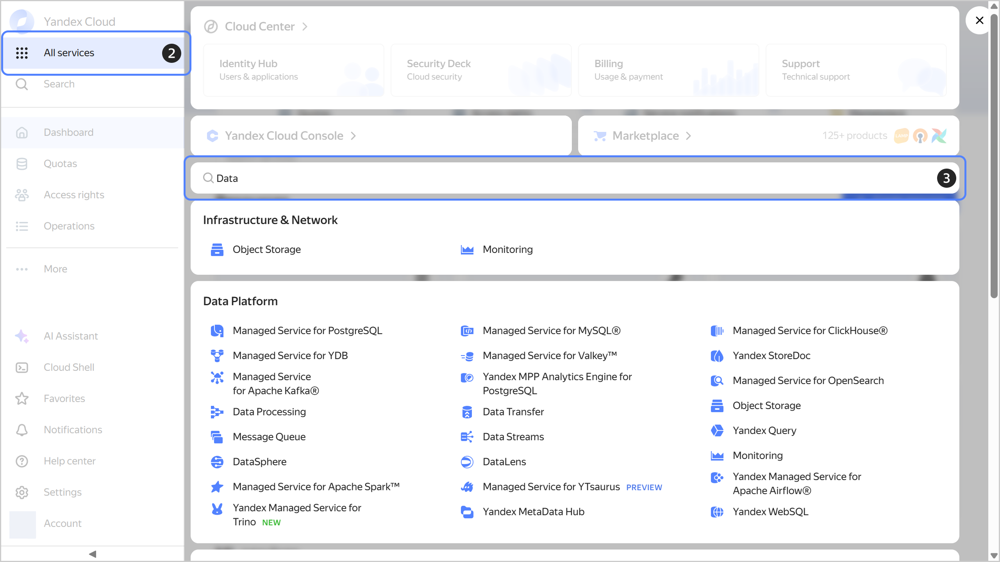
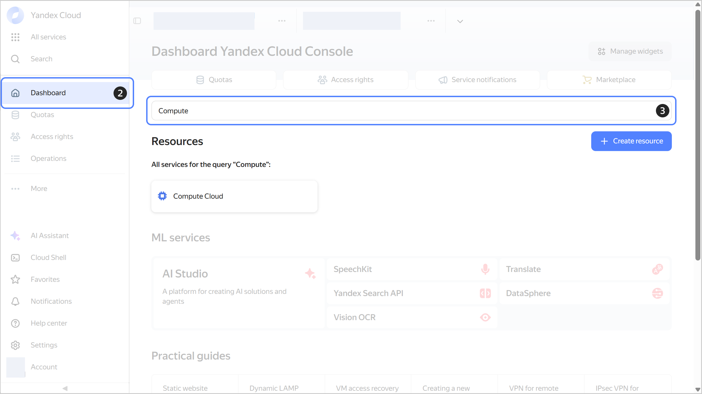
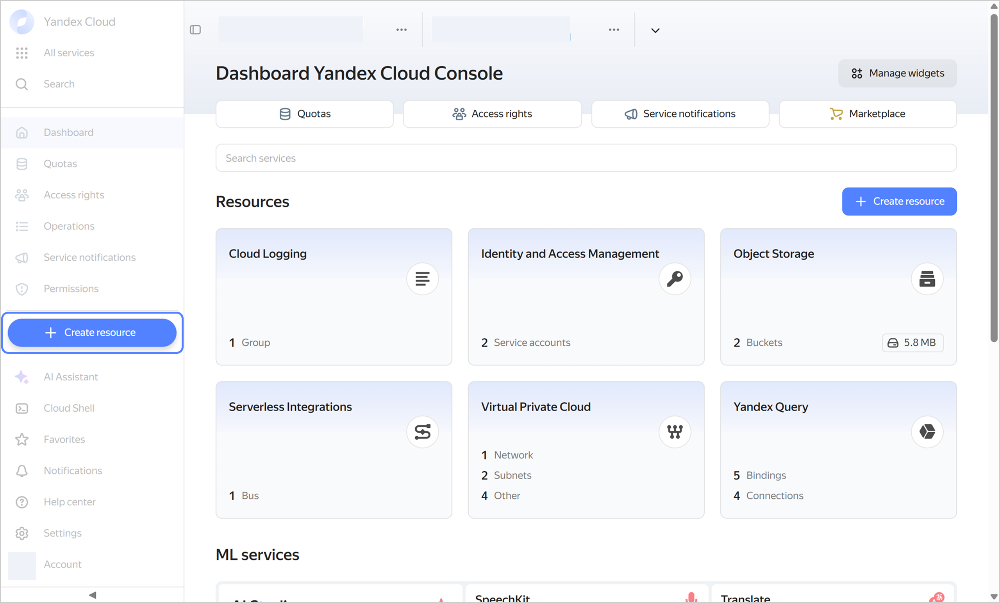
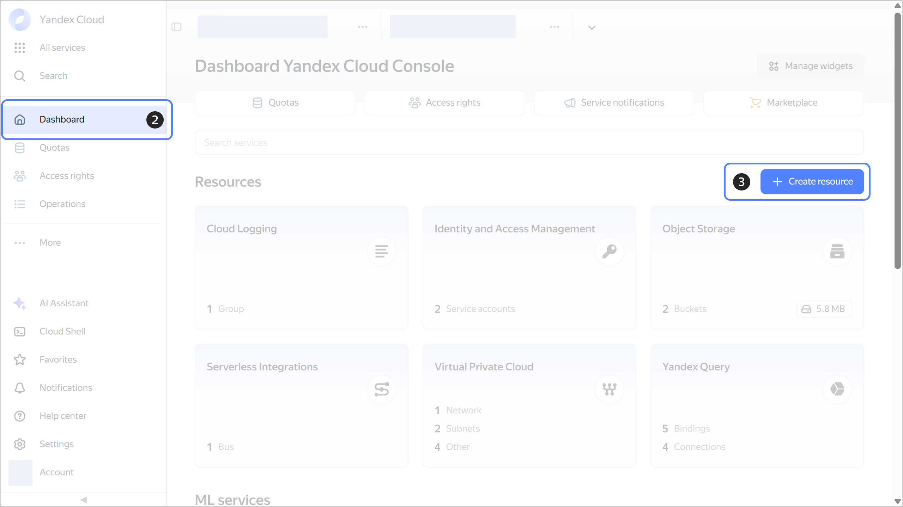

# How to get started with the services and create resources

In the {{ yandex-cloud }} management console, you can navigate to a desired service and create resources via the dashboard or left-hand panel.



## How to open a service's page {#select-service}

### Navigating to a service from the left-hand panel {#select-service-panel}

  1. In the [management console]({{ link-console-main }}), select a folder.
  1. In the left-hand panel, click  **{{ ui-key.yacloud.components.AsideNavigation.label_all-services_6sGQy }}**.
  1. In the **{{ ui-key.yacloud.dashboard.DashboardPage.CreateResourceDialog.search_kV4c1 }}** line, enter the name of the service.
  1. Select the service.

  

### Navigating to a service from the dashboard {#select-service-dashboard}

  1. In the [management console]({{ link-console-main }}), select a folder.
  1. In the left-hand panel, click  **{{ ui-key.yacloud.dashboard.dashboard_j9z5M }}**.
  1. In **{{ ui-key.yacloud.dashboard.DashboardPage.ResourceSearch.placeholder_3my5Y }}**, enter the the name of the service.
  1. Under **{{ ui-key.yacloud.dashboard.DashboardPage.ResourcesSection.title_7kYbU }}**, select the service.

  

## How to create a resource {#create-resource}

### Creating a resource using the left-hand panel {#create-resource-panel}

  1. In the [management console]({{ link-console-main }}), select a folder.
  1. In the left-hand panel, click  **{{ ui-key.yacloud.dashboard.label_create-resource_4KN3M }}**.
  1. Select the resource.

  

### Creating a resource using the dashboard {#create-resource-dashboard}

  1. In the [management console]({{ link-console-main }}), select a folder.
  1. In the left-hand panel, click  **{{ ui-key.yacloud.dashboard.dashboard_j9z5M }}**.
  1. Click **{{ ui-key.yacloud.dashboard.DashboardPage.ResourcesSection.create-resources_rGA1t }}**  to the right.
  1. Select the resource.

  

### Generating code to create a resource {#generate-resource-code}

When creating a resource via the management console, you can generate code for {{ TF }}, CLI, or API. The code is generated automatically based on your settings in the management console. No manual input is required.

To generate code to create a resource:

1. Navigate to [resource creation](#create-resource) in the [management console]({{ link-console-main }}).
1. Fill out the required fields and click  **{{ ui-key.yacloud.components.Terraform.button.TerraformButton.button_terraform_ozL8u }}**.
1. In the window that opens, select one of the tabs:

    

    The choice of tabs available to you will depend on whether it is possible to create this type of resource in the tool.

    

   

   - {{ TF }} {#tf}

        Select `{{ ui-key.yacloud.components.Terraform.TerraformDialog.button_code-terraform }}` and copy the resource creation command.

        To get information about the [{{ TF }}](../../tutorials/infrastructure-management/terraform-quickstart) provider resource, click `{{ ui-key.yacloud.components.Terraform.TerraformDialog.button_documentation }}`.

   - {{ yandex-cloud }} CLI {#cli}

        Select `{{ ui-key.yacloud.components.Terraform.TerraformDialog.button_code_cli }}` and copy the resource creation command.

        To get information about the [CLI](../../cli/quickstart.md) command, click `{{ ui-key.yacloud.components.Terraform.TerraformDialog.button_documentation_cli }}`.

        

   - API(gRPC) {#api}

        Select `{{ ui-key.yacloud.components.Terraform.TerraformDialog.button_code_api_grpc }}` and copy the resource creation request.

        To get information about the {{ yandex-cloud }} [API](../../api-design-guide/concepts/general.md) request, click `{{ ui-key.yacloud.components.Terraform.TerraformDialog.button_documentation_api_grpc }}`.

        

   

#### Useful links {#see-also}

* [{#T}](search.md)
* [{#T}](ai-assistant.md)
* [{#T}](cloud-shell-options.md)
