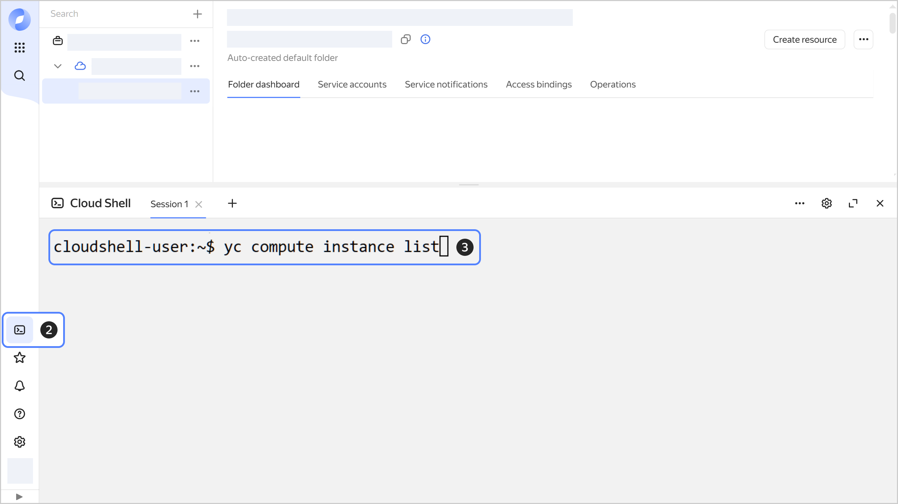

# Getting started with {{ cloud-shell-full-name }}

With {{ cloud-shell-name }}, you can use [{{ yandex-cloud }} CLI](../../cli/) and other terminal tools without any prior setup, directly in your browser. The {{ cloud-shell-name }} environment provides essential cloud management tools and popular programming language SDKs.

To get started with {{ cloud-shell-name }}:

1. Navigate to the [management console]({{ link-console-main }}) and log in to {{ yandex-cloud }}, or sign up if you have not already.

1. On the **[{{ ui-key.yacloud_billing.billing.label_service }}]({{ link-console-billing }})** page, make sure you have a billing account linked and it has the `ACTIVE` or `TRIAL_ACTIVE` [status](../../billing/concepts/billing-account-statuses.md). If you do not have a billing account, [create one](../../billing/quickstart/index.md) and [link](../../billing/operations/pin-cloud.md) a cloud to it.

1. In the [management console]({{ link-console-main }}), select  **{{ ui-key.yacloud.cloud-shell.label_service }}** in the left-hand panel.

    A terminal window will open: wait for the session to start and the development environment to be created.

1. Use {{ yandex-cloud }} CLI commands to manage cloud resources from the terminal. For example, to list all VMs in the cloud, run this command:

    ```bash
    yc compute instance list
    ```

   

    For more command examples, see [Getting started with the CLI](../../cli/quickstart.md#example). To view the full list of available commands, run the `yc --help` command or open the [CLI reference](../../cli/cli-ref/).

    

    You can run up to four parallel sessions in the terminal. To run a new session, click . Once started, a session can remain active for up to 12 hours. Inactive sessions are automatically terminated after 30 minutes of inactivity. For more on {{ cloud-shell-name }} limits, see [Limits](../concepts/cloud-shell/limits.md).

    
   
1. Install the required applications using the `apt` tool. For example, to install `postgresql-client` for [connecting to a {{ mpg-full-name }} cluster](../../managed-postgresql/operations/connect/index.md), run this command:

    ```bash
    sudo apt update && sudo apt install --yes postgresql-client
    ```

    

    The {{ cloud-shell-name }} VM will be automatically stopped and deleted 15 after the last active session ends. Any system changes, including installed applications and packages, will be reset.

    


## Troubleshooting {#troubleshooting}

### What should I do if the session is not created and loading does not end when I launch the terminal? {#session-not-starting}

Create a new session by clicking . If the issue persists, open the management console in Incognito mode and run {{ cloud-shell-name }}.

If the session still cannot be created, record an [HAR file](../../support/create-har.md) while reproducing the issue. Start recording before launching the terminal. If the server response contains the `No active billing accounts found` error, check for an [active billing account and your access permissions for it](#no-active-billing-accounts). In all other cases, create a ticket and send the HAR file to [support]({{ link-console-support }}).

### What should I do if I get the `No active billing accounts found` error? {#no-active-billing-accounts}

You can get a code `403` error if there is no active billing account or the user has no permissions to view it.

On the [{{ ui-key.yacloud_billing.billing.label_service }}]({{ link-console-billing }}) page, check if there is a billing account and what its [status](../../billing/concepts/billing-account-statuses.md) is. To use {{ cloud-shell-name }}, you need an account which is either `ACTIVE` or `TRIAL_ACTIVE`. If there is no billing account, [create one](../../billing/quickstart/index.md) and [link](../../billing/operations/pin-cloud.md) a cloud to it, then try creating a session again.

If a billing account exists and is active, ask its administrator to [assign](../../billing/security/index.md#set-role) to you the `billing.accounts.viewer` role for the billing account directly and try creating a session again.

Do not delete the auto-assigned `billing.accounts.member` role: you need it to have the billing account listed among accounts available to you.

## Useful links {#see-also}

* [Managing {{ cloud-shell-name }}](../operations/cloud-shell-options.md)
* [{{ cloud-shell-name }} limits](../concepts/cloud-shell/limits.md)
* [CLI reference](../../cli/cli-ref/)
