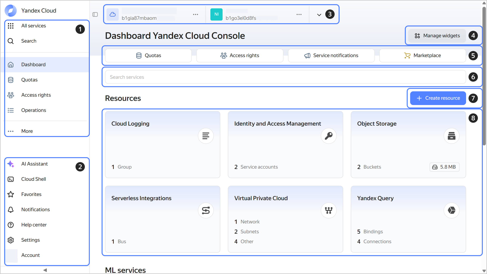

# Getting started with {{ console-full-name }}

{{ console-name }} is a UI you can use to manage your cloud, folder, and service resources, set up notifications, and contact support.

To get started with the management console:

1. Create a [Yandex ID]({{ link-yandex }}/support/passport/authorization/registration.html) account.

1. Log in to the [management console]({{ link-console-main }}).

   When you log in to the management console for the first time, the `cloud-<Yandex_ID>` [cloud](../../resource-manager/concepts/resources-hierarchy.md#cloud), `default` [folder](../../resource-manager/concepts/resources-hierarchy.md#folder), and `default` [network](../../vpc/concepts/network.md#network) are automatically created.

1. [Create a billing account](../../billing/operations/create-new-account.md). The `cloud-<Yandex_ID>` cloud will be linked to it automatically.

    When you create your first billing account, you get an [initial grant](../../getting-started/usage-grant.md) to get started with the platform.

1. Create your first resource, e.g., a [Linux VM](../../compute/quickstart/quick-create-linux.md).

## Management console UI {#interface}

1. Navigating through services and main sections of the management console.
1. Additional management console features and settings:

   * [**AI assistant**](../operations/ai-assistant.md): Your smart assistant for creating and deleting {{ yandex-cloud }} resources.
   
      
   * [**{{ cloud-shell-name }}**](cloud-shell.md): Your environment with the main tools you need to manage cloud resources.
   
   
   * **Favorites**: Resources you will have access to from any service.
   * **Notifications**: Notifications about your cloud events.
   * **Support center**: Everything to streamline your {{ yandex-cloud }} experience.
   * **Settings**: Management console [settings](../operations/update.md).
   * **Account**: Authentication management.

1. Navigating through available clouds and folders.
1. Managing widget layout and visibility on the dashboard.
1. Main sections of your dashboard:

   * **{{ ui-key.yacloud.dashboard.label_quotas_gAtoT }}**: Organizational constraints you can change by contacting support.
   * **{{ ui-key.yacloud.dashboard.label_access_2bch9 }}**: Set up access permissions for your cloud and folder.
   * **{{ ui-key.yacloud.dashboard.label_notifications_uWDue }}**: Manage cloud user subscriptions for technical notifications from the services.
   * **{{ ui-key.yacloud.dashboard.DashboardPage.QuickActions.label_marketplace_1sDGx }}**: Navigation to [{{ marketplace-full-name }}]({{ link-cloud-marketplace }}).

1. Searching for the right service.
1. Creating a new resource.
1. Resources created in selected folder.

## What's next {#whats-next}

1. Check out the list of all [{{ yandex-cloud }} services](../../overview/concepts/services.md).

1. If you need to set up Single Sign-On (SSO) for corporate accounts, add a federation to [{{ org-full-name }}](../../organization/concepts/add-federation.md).

1. [Add](../../organization/operations/add-account.md) users to your [organization](../../overview/roles-and-resources.md) and [grant](../../iam/operations/roles/grant.md) them access to {{ yandex-cloud }} resources.
