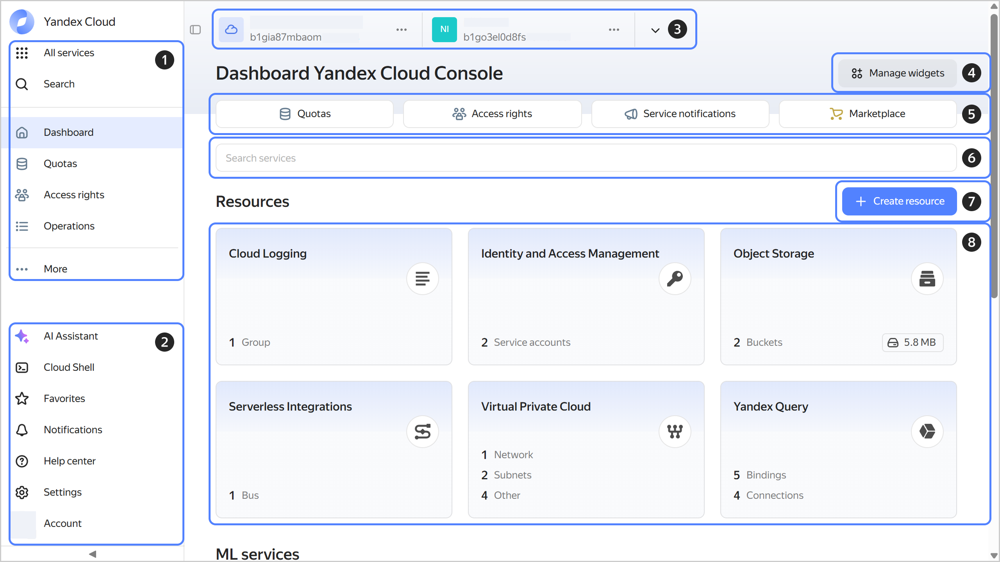

# Getting started with {{ console-full-name }}

{{ console-name }} is a UI you can use to manage your cloud, folder, and service resources, set up notifications, and contact support.

To get started with the management console:

1. Create a [Yandex ID]({{ link-yandex }}/support/passport/authorization/registration.html) account.

1. Log in to the [management console]({{ link-console-main }}).

   When you log in to the management console for the first time, the `cloud-<Yandex_ID>` [cloud](../../resource-manager/concepts/resources-hierarchy.md#cloud), `default` [folder](../../resource-manager/concepts/resources-hierarchy.md#folder), and `default` [network](../../vpc/concepts/network.md#network) are automatically created.

1. To view the account info, click **Account** in the bottom-left corner.
1. [Create a billing account](../../billing/operations/create-new-account.md). The `cloud-<Yandex_ID>` cloud will be linked to it automatically.

    When you create your first billing account, you get an [initial grant](../../getting-started/usage-grant.md) to get started with the platform.

1. Create your first resource, e.g., a [Linux VM](../../compute/quickstart/quick-create-linux.md).

## Management console UI {#interface}

1. Navigating {{ yandex-cloud }} services and searching though cloud resources.
1. Main pages for your selected service.
1. Additional management console features and settings:

   *  [**AI assistant**](../operations/ai-assistant.md): Your smart assistant for managing {{ yandex-cloud }} resources. You can use the assistant to:
     * Get advice on working with cloud services and resources.
     * Analyze your folder infrastructure and get optimization tips.
     * Create and delete resources based on plain-text instructions.
     * Deploy infrastructure from a description.

   
   *  [**{{ cloud-shell-name }}**](cloud-shell.md): Your environment with the main tools you need to manage {{ yandex-cloud }} resources. It is available directly in your browser without any additional setup or authentication. With {{ cloud-shell-name }}, you can:

      * Run commands to manage all cloud resources using the [{{ yandex-cloud }} CLI](../../cli/quickstart.md) and [Yandex Cloud Toolbox](/marketplace/products/yc/toolbox).
      * Install the apps you need using `apt`.
      * Create and run job automation scripts in `Node.js`, `Python`, or `Go`.

      For more on {{ cloud-shell-name }}, see [{#T}](../operations/cloud-shell-options.md).

   *  **Favorites**: Quick access to most-used resources.
   *  **Notifications**: User notification center:
     * System notifications
     * Technical support replies
     * Operation statuses
     * Announcements
   *  **Help center**: Get help with {{ yandex-cloud }} services:
     * Help docs
     * Release notes
     * Support
   *  **Settings**: Customize your management console [settings](../operations/update.md).
   * **Account**: Authentication management: switch between user accounts and organizations.

1. Navigating through available clouds and folders.
   To view all available spaces, click  or .
1. [{{ billing-name }}](../../billing/index.yaml) widget. Use it to view information about your billing account and costs, [top up your account](../../billing/operations/pay-the-bill.md) and [activate promo codes](../../billing/operations/activate-promocode.md).
To access the widget, you need a [role](../../billing/security/index.md#billing-accounts-viewer) with permissions to view the billing account data.
1. Viewing the latest news and event announcements.
1. Managing dashboard widget layout and visibility.
1. Main sections of your dashboard:

   * **{{ ui-key.yacloud.dashboard.label_quotas_gAtoT }}**: Organizational constraints you can change by contacting support.
   * **{{ ui-key.yacloud.dashboard.label_access_2bch9 }}**: Set up access permissions for your cloud and folder.
   * **{{ ui-key.yacloud.dashboard.label_notifications_uWDue }}**: Manage cloud user subscriptions for technical notifications from the services.
   * **{{ ui-key.yacloud.dashboard.DashboardPage.QuickActions.label_marketplace_1sDGx }}**: Navigation to [{{ marketplace-full-name }}]({{ link-cloud-marketplace }}).

1. Searching for the right service.
1. Resources available in the selected folder.

## What's next {#whats-next}

1. Check out the list of all [{{ yandex-cloud }} services](../../overview/concepts/services.md).

1. If you need to set up Single Sign-On (SSO) for corporate accounts, add a federation to [{{ org-full-name }}](../../organization/concepts/add-federation.md).

1. [Add](../../organization/operations/add-account.md) users to your [organization](../../overview/roles-and-resources.md) and [grant](../../iam/operations/roles/grant.md) them access to {{ yandex-cloud }} resources.
