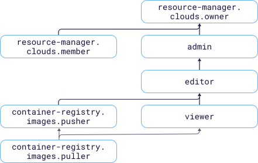

# Access management

In this section, you'll learn:

* [What resources you can assign roles to](#resources).
* [What roles exist in the service](#roles-list).
* [What roles are required](#choosing-roles) for particular actions.



## What resources you can assign roles to. {#resources}

You can assign a role for a [cloud](../../resource-manager/concepts/resources-hierarchy.md#cloud), [folder](../../resource-manager/concepts/resources-hierarchy.md#folder), [registry](../concepts/registry.md), or [repository](../concepts/repository.md). These roles also apply to nested resources.

## What roles exist in the service {#roles-list}

The diagram shows which roles are available in the service and how they inherit each other's permissions. For example, the `editor` role includes all `viewer` role permissions. A description of each role is given under the diagram.

Active roles in the service:

* Service roles:
    * 
    * 
    * 
    * 
* Primitive roles:
    * 
    * 
    * 

## What roles do I need {#choosing-roles}

The table below lists the roles needed to perform a given action. You can always assign a role granting more permissions than the role specified. For example, you can assign `editor` instead of `viewer`.

| Action | Methods | Required roles |
| ----- | ----- | ----- |
| **View data** |  |
| Get a list of [registries](../operations/registry/registry-list.md) | `list` | `container-registry.images.puller` for a folder |
| Get information about registries, [Docker images](../operations/docker-image/docker-image-list.md), and [repositories](../operations/repository/repository-list.md) | `get`, `list` | `container-registry.images.puller` for the registry containing the resource |
| [Pull a Docker image](../operations/docker-image/docker-image-pull.md) | — | `container-registry.images.puller` for the registry or repository |
| Get information about [lifecycle policies](../operations/lifecycle-policy/lifecycle-policy-list.md) and the results of their [dry runs](../operations/lifecycle-policy/lifecycle-policy-dry-run.md) | `get`, `list`, `getDryRunResult`, `listDryRunResults` | `viewer` for the registry or repository that the lifecycle policy was created for |
| **Manage resources** |  |
| [Create registries in a folder](../operations/registry/registry-create.md) | `create` | `editor` for the folder |
| [Update](../operations/registry/registry-update.md) and [delete](../operations/registry/registry-delete.md) registries | `update`, `delete` | `editor` for the registry |
| [Create Docker images](../operations/docker-image/docker-image-create.md) using basic Docker images from the registry | — | `container-registry.images.puller` for the registry or repository |
| [Create Docker images](../operations/docker-image/docker-image-create.md) without using basic Docker images from the registry | — | No roles required |
| [Push Docker images to the registry](../operations/docker-image/docker-image-push.md) | — | `container-registry.images.pusher` for the registry or repository |
| [Delete Docker images](../operations/docker-image/docker-image-delete.md) | `delete` | `editor` for a registry or repository containing a Docker image |
| [Create](../operations/lifecycle-policy/lifecycle-policy-create.md), [update](../operations/lifecycle-policy/lifecycle-policy-update.md), [delete](../operations/lifecycle-policy/lifecycle-policy-delete.md), and [dry run](../operations/lifecycle-policy/lifecycle-policy-dry-run.md) a lifecycle policy | `create`, `update`, `delete`, `dryRun` | `editor` for the registry or repository that the lifecycle policy was created for |
| **Manage resource access** |  |
| [Assign](../../iam/operations/roles/grant.md), [revoke](../../iam/operations/roles/revoke.md), and view roles granted for the folder, cloud, or registry | `setAccessBindings`, `updateAccessBindings`, `listAccessBindings` | `admin` for the resource |

#### What's next {what-is-next}

* [How to assign a role](../../iam/operations/roles/grant.md).
* [How to revoke a role](../../iam/operations/roles/revoke.md).
* [Learn more about access management in {{ yandex-cloud }}](../../iam/concepts/access-control/index.md).
* [More about role inheritance](../../resource-manager/concepts/resources-hierarchy.md#access-rights-inheritance).