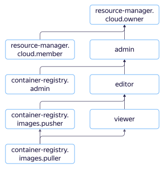

# Access management in {{ container-registry-name }}

In this section, you will learn:
* [Which resources you can assign roles to](#resources).
* [Which roles exist in the service](#roles-list).
* [Which roles are required](#choosing-roles) for particular actions.



## Which resources you can assign roles to {#resources}

You can assign a role to a [cloud](../../resource-manager/concepts/resources-hierarchy.md#cloud), a [folder](../../resource-manager/concepts/resources-hierarchy.md#folder), a [registry](../concepts/registry.md), or a [repository](../concepts/repository.md). These roles also apply to nested resources.

## Which roles exist in the service {#roles-list}



### Service roles {#service-roles}

| Role | Permissions |
--- | ---
| `container-registry.viewer` | Allows you to read information about registries, [Docker images](../concepts/docker-image.md), and repositories. |
| `container-registry.editor` | Allows you to create, edit, and delete registries, Docker images, and repositories. It includes all permissions granted by the `{{ roles-cr-viewer }}` role. |
| `container-registry.admin` | Allows you to manage access to registries, Docker images, and repositories. It includes all permissions granted by the `{{ roles-cr-viewer }}` and `{{ roles-cr-editor }}`roles. |
| `container-registry.images.pusher` | Allows you to manage Docker images and view information about service resources (registries, Docker images, and repositories). |
| `container-registry.images.puller` | Allows you to download Docker images and view information about service resources (registries, Docker images, and repositories). |
| `container-registry.images.scanner` | Allows you to scan Docker images for vulnerabilities and view information about service resources (registries, Docker images, and repositories). |
| `resource-manager.clouds.owner` | Grants you full access to a cloud and the resources in it. You can only assign this role for a cloud. |
| `resource-manager.clouds.member` | Role everyone requires to access cloud resources, except for [cloud owners](../../resource-manager/concepts/resources-hierarchy.md#owner) and [service accounts](../../iam/concepts/users/service-accounts.md). |

For more information about service roles, see [{#T}](../../iam/concepts/access-control/roles.md) in the {{ iam-full-name }} service documentation.

### Primitive roles {#primitive-roles}



## What roles do I need {#choosing-roles}

The table below lists the roles needed to perform a particular action. You can always assign a role granting more permissions than the role specified. For example, you can assign the `editor` role instead of the `viewer` one.

| Action | Methods | Required roles |
--- | --- | ---
| **View data** |
| [Get a list of registries](../operations/registry/registry-list.md). | `list` | `container-registry.viewer` for a folder. |
| Get information about registries, [Docker images](../operations/docker-image/docker-image-list.md), and [repositories](../operations/repository/repository-list.md). | `get`, `list` | `container-registry.viewer` for the registry containing the resource. |
| [Pulling a Docker image](../operations/docker-image/docker-image-pull.md). | `pull` | `container-registry.images.puller` for the registry or repository. |
| Getting information on [lifecycle policies](../operations/lifecycle-policy/lifecycle-policy-list.md) and the outcomes of their [dry runs](../operations/lifecycle-policy/lifecycle-policy-dry-run.md). | `get`, `list`, `getDryRunResult`, `listDryRunResults` | `container-registry.viewer` for the registry or repository that the lifecycle policy was created for. |
| **Manage resources** |
| [Create registries in a folder](../operations/registry/registry-create.md). | `create` | `container-registry.editor` for a folder. |
| [Update](../operations/registry/registry-update.md) and [delete](../operations/registry/registry-delete.md) registries | `update`, `delete` | `container-registry.editor` for the specified registry. |
| [Create Docker images](../operations/docker-image/docker-image-create.md) using basic Docker images from the registry | N/A | `container-registry.images.puller` for the registry or repository. |
| [Create Docker images](../operations/docker-image/docker-image-create.md) without using basic Docker images from the registry. | N/A | No roles required. |
| [Push Docker images to the registry](../operations/docker-image/docker-image-push.md). | `push` | `container-registry.images.pusher` for the registry or repository. |
| [Delete Docker images](../operations/docker-image/docker-image-delete.md). | `delete` | `container-registry.images.pusher` for a registry or repository containing a Docker image. |
| [Creating](../operations/lifecycle-policy/lifecycle-policy-create.md), [editing](../operations/lifecycle-policy/lifecycle-policy-update.md), [deleting](../operations/lifecycle-policy/lifecycle-policy-delete.md), and performing a [dry run](../operations/lifecycle-policy/lifecycle-policy-dry-run.md) of a lifecycle policy. | `create`, `update`, `delete`, `dryRun` | `container-registry.editor` for the registry or repository that the lifecycle policy was created for. |
| **Manage resource access** |
| [Granting a role](../../iam/operations/roles/grant.md), [revoking a role](../../iam/operations/roles/revoke.md), and viewing the roles assigned to a folder, a cloud, or a registry. | `setAccessBindings`, `updateAccessBindings`, `listAccessBindings` | `admin` for the resource. |
| **Scanning for vulnerabilities** |
| [Scanning](../operations/scanning-docker-image.md) a Docker image. | `scan` | `container-registry.images.scanner` for a registry or repository containing a Docker image. |
| Getting the results of a Docker image scan. | `get`, `getLast`, `list`, `listVulnerabilities` | `container-registry.images.scanner` for a registry or repository containing a Docker image. |

#### What's next {what-is-next}

* [Assigning a role](../operations/roles/grant.md).
* [Viewing assigned roles](../operations/roles/get-assigned-roles.md).
* [Revoking a role](../operations/roles/revoke.md).
* [Learn more about access management in {{ yandex-cloud }}](../../iam/concepts/access-control/index.md).
* [Learn more about inheriting roles](../../resource-manager/concepts/resources-hierarchy.md#access-rights-inheritance).