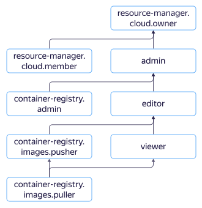

# Access management in {{ container-registry-name }}

In this section, you will learn about:
* [Resources you can assign a role for](#resources).
* [Roles this service has](#roles-list).
* [Roles required](#choosing-roles) for specific actions.



To assign a role for a resource, you need the `container-registry.admin` role or one of the following roles for that resource:



## Resources you can assign a role for {#resources}



You can also assign roles for individual resources within the service:



- Management console {#console}

  You can use the [management console]({{ link-console-main }}) to assign roles for a [registry](../concepts/registry.md).

- CLI {#cli}

  You can use the [{{ yandex-cloud }} CLI](../../cli/cli-ref/container/cli-ref/index.md) to assign roles for the following resources:

  * [Registry](../concepts/registry.md)
  * [Repository](../concepts/repository.md)

- {{ TF }} {#tf}

  You can use [{{ TF }}]({{ tf-provider-link }}) to assign roles for the following resources:

  * [Registry](../concepts/registry.md)
  * [Repository](../concepts/repository.md)

- API {#api}

  You can use the [{{ yandex-cloud }} API](../api-ref/authentication.md) to assign roles for the following resources:

  * [Registry](../concepts/registry.md)
  * [Repository](../concepts/repository.md)



## Roles this service has {#roles-list}



### Service roles {#service-roles}

#### container-registry.viewer {#container-registry.viewer}



#### container-registry.editor {#container-registry.editor}



#### container-registry.admin {#container-registry.admin}



#### container-registry.images.pusher {#container-registry-images-pusher}



#### container-registry.images.puller {#container-registry-images-puller}



#### container-registry.images.scanner {#container-registry-images-scanner}



To learn more about service roles, see [{#T}](../../iam/concepts/access-control/roles.md) in the {{ iam-full-name }} guides.

### Primitive roles {#primitive-roles}





## Required roles {#choosing-roles}

The table below lists the roles required for specific actions. You can always assign a role with more permissions, e.g., `editor` instead of `viewer`.

Action | Methods | Required roles
--- | --- | ---
**Viewing data** |
[Getting a list of registries](../operations/registry/registry-list.md) | `list` | `container-registry.viewer` for the folder
Getting information about registries, [Docker images](../operations/docker-image/docker-image-list.md), and [repositories](../operations/repository/repository-list.md) | `get`, `list` | `container-registry.viewer` for the registry containing the resource
[Pulling a Docker image](../operations/docker-image/docker-image-pull.md) | `pull` | `container-registry.images.puller` for the registry or repository
Getting information about [lifecycle policies](../operations/lifecycle-policy/lifecycle-policy-list.md) and results of their [dry runs](../operations/lifecycle-policy/lifecycle-policy-dry-run.md) | `get`, `list`, `getDryRunResult`, `listDryRunResults`| `container-registry.viewer` for the registry or repository for which the lifecycle policy was created
**Managing resources** |
[Creating registries in a folder](../operations/registry/registry-create.md) | `create` | `container-registry.editor` for the folder
[Updating](../operations/registry/registry-update.md) and [deleting](../operations/registry/registry-delete.md) registries | `update`, `delete` | `container-registry.editor` for the registry
[Creating Docker images](../operations/docker-image/docker-image-create.md) using base Docker images from the registry | — | `container-registry.images.puller` for the registry or repository
[Creating Docker images](../operations/docker-image/docker-image-create.md) without using base Docker images from the registry | — | No roles required
[Pushing Docker images to a registry](../operations/docker-image/docker-image-push.md) | `push` | `container-registry.images.pusher` for the registry or repository
[Deleting Docker images](../operations/docker-image/docker-image-delete.md) | `delete` | `container-registry.images.pusher` for the registry or repository containing the Docker image
[Creating](../operations/lifecycle-policy/lifecycle-policy-create.md), [editing](../operations/lifecycle-policy/lifecycle-policy-update.md), [deleting](../operations/lifecycle-policy/lifecycle-policy-delete.md), and performing a [dry run](../operations/lifecycle-policy/lifecycle-policy-dry-run.md) of a lifecycle policy | `create`, `update`, `delete`, `dryRun` | `container-registry.editor` for the registry or repository for which the lifecycle policy was created
**Managing resource access** |
[Assigning a role](../../iam/operations/roles/grant.md), [revoking a role](../../iam/operations/roles/revoke.md), and viewing the roles assigned for a folder, cloud, or registry | `setAccessBindings`, `updateAccessBindings`, `listAccessBindings` | `admin` for the resource
**Scanning for vulnerabilities** |
[Scanning](../operations/scanning-docker-image.md) a Docker image | `scan` | `container-registry.images.scanner` for the registry or repository containing the Docker image
Getting the results of a Docker image scan | `get`, `getLast`, `list`, `listVulnerabilities` | `container-registry.images.scanner` for the registry or repository containing the Docker image

#### What's next {what-is-next}

* [Assigning a role](../operations/roles/grant.md).
* [Viewing assigned roles](../operations/roles/get-assigned-roles.md).
* [Revoking a role](../operations/roles/revoke.md).
* [Learn more about access management in {{ yandex-cloud }}](../../iam/concepts/access-control/index.md).
* [Learn more about role inheritance](../../resource-manager/concepts/resources-hierarchy.md#access-rights-inheritance).