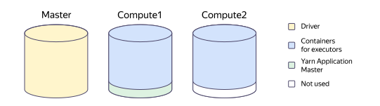
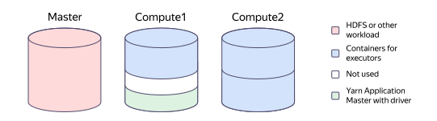

# Spark jobs

{{ dataproc-name }} supports [Spark](https://spark.apache.org/docs/latest/sql-programming-guide.html) job run in Spark _applications_. When running Spark jobs, resource allocation is handled by [Apache Hadoop YARN](https://hadoop.apache.org/docs/stable/hadoop-yarn/hadoop-yarn-site/YARN.html).

## Application management {#applications}

A single cluster may run multiple applications concurrently. A running application is orchestrated by Spark _driver_. To learn how Spark drivers work, see the [Resource allocation](#resource-management) section.

An application can either be in standby mode or run _jobs_. By default, jobs within an application are run on the first in first out (_FIFO_) basis. This method does not require any additional setup.

To enable concurrent jobs, switch the scheduler to the _FAIR_ mode and additionally set up the system and specific jobs. To learn how to do this, see the [Apache Spark documentation](https://spark.apache.org/docs/latest/job-scheduling.html#scheduling-within-an-application).



To run concurrent jobs with no FAIR scheduling, you can run them in different Spark applications in the FIFO mode.



## Task management {#tasks}

Each Spark job consists of multiple _tasks_ run by specific processes called _executors_. Each executor is run on a single cluster host and consumes a certain amount of computing resources, such as CPU and RAM.

Depending on the execution plan, tasks can be run either one by one or concurrently. Concurrent tasks are grouped into _stages_. The number of tasks that can be running concurrently depends on requests and available cluster resources.

If you use standard {{ dataproc-name }} settings, computing resources required to run Spark jobs are allocated dynamically.

## Resource allocation {#resource-management}

Resources are allocated between the driver and the executors based on the Spark [component properties](./settings-list.md). The key properties and their default values are determined by the driver deployment mode set in the `spark:spark.submit.deployMode` property:

* `deployMode=client`: Deploy the driver on the cluster's `master` host. This is the default mode if the cluster meets the [lightweight cluster](./index.md#light-weight-clusters) requirements.
* `deployMode=cluster`: Deploy the cluster on one of the cluster's `compute` hosts. This is the default mode if the cluster does not meet the [lightweight cluster](./index.md#light-weight-clusters) requirements.

The tables below list the key properties that determine resource allocation in various driver deployment modes.

These tables use the following abbreviations:

* `allCPU`: Number of host cores. This property is determined by the host class selected while creating the subcluster.
* `nmMem`: Amount of the host RAM available to YARN NodeManager. This property is calculated using the following formula:

   `total host RAM` × `fraction of RAM allocated for YARN NodeManager`

   * The total host RAM is determined by the host class selected while creating the subcluster.
   * The fraction of RAM allocated for YARN NodeManager can be set in the `dataproc:nodemanager_available_memory_ratio` property. By default, it is set to `0.8`. The remaining RAM is reserved for auxiliary load (sending logs, metrics, etc.).

In the tables, results of arithmetic operations are rounded:

* For CPU, results are rounded down to the nearest integer. If the result of a division is less than 1, it is rounded up to 1.
* For RAM, results are rounded down to the nearest multiple of 1 GB.



- deployMode=client

   In this mode, the driver runs on the cluster's master host separately from the YARN Application Master and can access all resources of the master host. On compute hosts, only a minimum amount of resources is reserved for the YARN Application Master.

   #|
   || **Parameter (abbreviation)**                    | **Description**                                                       | **Default value**        ||
   || `dataproc:spark_executors_per_vm` (`numCon`) | Maximum number of containers per compute host  | `1`                              ||
   || `spark:spark.yarn.am.cores` (`yamCPU`)       | Number of processor cores allocated for the YARN Application Master | `1`                              ||
   || `spark:spark.yarn.am.memory` (`yamMem`)      | Amount of RAM (MB) allocated for the YARN Application Master          | `1024`                           ||
   || `spark:spark.executor.cores` (`exCPU`)       | Number of processor cores allocated to each executor     | (`allCPU` − `yamCPU`) / `numCon` ||
   || `spark:spark.executor.memory` (`exMem`)      | Amount of RAM (MB) allocated to each executor               | (`nmMem` − `yamMem`) / `numCon`  ||
   |#

   Since `yamCPU` and `yamMem` are subtracted from the total CPU and RAM, respectively, the YARN Application Master consumes less resources than a standard container, and the amount of resources for the executor increases.

- deployMode=cluster

   This mode assumes that a resource-intensive program, such as HDFS, is running on the cluster's master host. Consequently, the drivers run on compute hosts within the YARN Application Master and are allocated a substantial amount of resources.

   #|
   || **Property (abbreviation)**                          | **Description**                                                        | **Default value**     ||
   || `dataproc:spark_driver_memory_fraction` (`drMemF`) | Fraction of compute host RAM reserved for the driver       | `0.25`                        ||
   || `dataproc:spark_executors_per_vm` (`numCon`)       | Maximum number of containers per compute host   | `2`                           ||
   || `spark:spark.executor.cores` (`exCPU`)             | Number of processor cores allocated to each executor      | `allCPU` / `numCon`           ||
   || `spark:spark.executor.memory` (`exMem`)            | Amount of RAM (MB) allocated to each executor                | `nmMem` / `numCon`            ||
   || `spark:spark.driver.cores` (`drCPU`)               | Number of processor cores allocated for the YARN Application Master  | `allCPU` / `numCon`           ||
   || `spark:spark.driver.memory` (`drMem`)              | Amount of RAM (MB) allocated for the YARN Application Master           | `drMemF` × `nmMem` / `numCon` ||
   |#



The default values set in the service are optimal for running a single app. To optimize resource allocation for your needs, change the driver deployment mode and other component properties:

* For all new jobs in a cluster:

   * When [creating a cluster](../operations/cluster-create.md).
   * When [modifying a cluster](../operations/cluster-update.md).

* For an individual job, during its [creation](../operations/jobs-spark.md#create).

### Examples {#examples}

A single app runs on a cluster with default settings and two compute hosts. In this case:



- deployMode=client

   * The driver can use all resources of the master host.
   * The amount of resources available for executors on all compute hosts will be reduced by the amount reserved for YARN Application Master.
   * The resources reserved for the YARN Application Master on the second host will remain unused.

   

- deployMode=cluster

   * The master host may be running HDFS or another resource-intensive program.
   * YARN Application Master and the driver will take up a substantial portion of the resources on one of the compute hosts, but no more than the size of the container for the executors. Because of this, some resources may remain unused.
   * On the second compute host, both containers will be allocated to the executors.

   



## Useful links {#see-also}

The Apache Spark documentation provides detailed information about:

* [Spark application configuration](https://spark.apache.org/docs/latest/configuration.html)
* [Spark driver operation modes](https://spark.apache.org/docs/latest/running-on-yarn.html#launching-spark-on-yarn)
* [Spark application resource allocation](https://spark.apache.org/docs/latest/running-on-yarn.html#resource-allocation-and-configuration-overview)

To check how Spark applications are running in a {{ dataproc-name }} cluster, [run Spark application monitoring](../operations/spark-monitoring.md).

If a Spark application is slow, run [primary performance diagnostics](../operations/spark-diagnostics.md#diagnostics).
