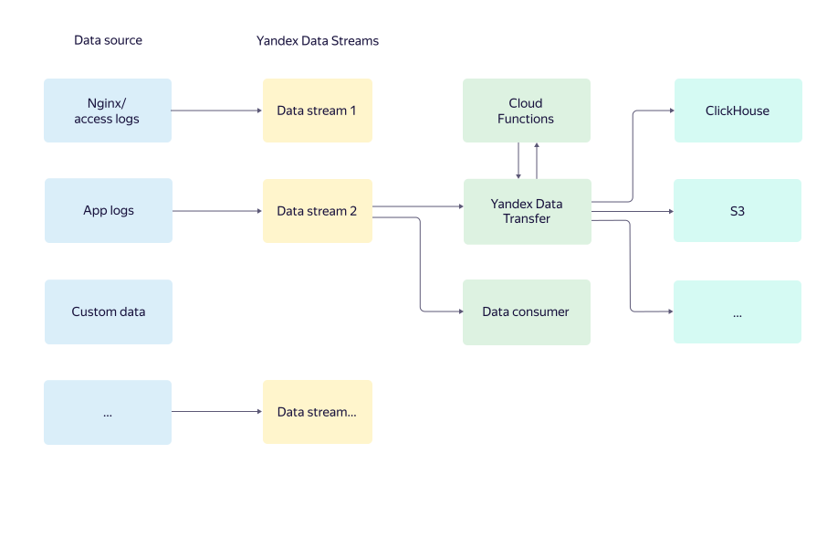

# Overview the service {{ yds-name }}

Applications generate data that needs to be saved for further analysis or processing. Some of the data needs to be stored for a long time in <q>cold</q> storage that is rarely accessed, while other data should be stored in analytical databases for hot data processing.

{{ yds-full-name }} makes it easier to transfer user application data to {{ yandex-cloud }} storage systems.

The data is received in {{ yds-name }} as in a data bus that stores it in a fault-tolerant way across availability zones and is scaled based on the transferred amount of data. You can send the data to the bus using the Fluentd, Logstash, log4j/log4net, and other data streaming systems, as well as via HTTP over a protocol compatible with the Amazon Kinesis Data Streams API.

The data that is transferred via the bus can then, using [{{ data-transfer-full-name }}](../../data-transfer/concepts/index.md) be saved to target systems, such as S3, {{ CH }}, and others. You can set up the transfer parameters in the {{ yandex-cloud }} management console or via the API.

If, while saving the data, you need to change either the data itself or its format, or handle it in any other way (for example, delete sensitive information), you can do this using [{{ sf-full-name }}](../../functions/concepts/index.md) functions. {{ sf-short-name }} supports a variety of programming languages such as Python, Java, PHP, and more.

## Benefits {#advantages}

* Support for a large number of targets, extensive customization options for streaming data.
* The solution is fully integrated into the {{ yandex-cloud }} ecosystem and lets you centrally manage data streams using both the {{ yandex-cloud }} management console and API.
* All components are fully managed, that is, they require no administration or a special team of DevOps engineers.

