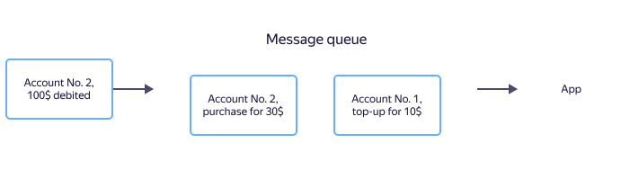
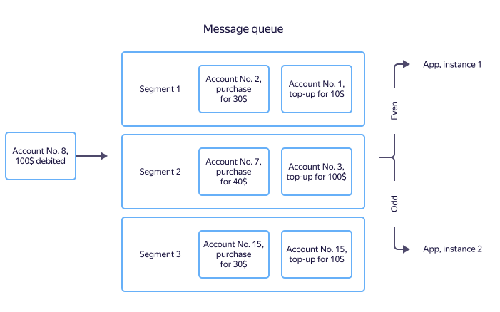

# Partitions and partition keys

The following examples illustrate the concepts of [partitions](glossary.md#hard) and [partition keys](glossary.md#partition-key).

## When the message processing order is important {#order}

Let's consider a financial application that calculates the user's account balance and either allows or denies debiting the funds.

You can approach such tasks using a [message queue](https://en.wikipedia.org/wiki/Message_queue). When you top up your account, debit funds, or make a purchase, a message with the account ID, amount, and transaction type is registered in the queue. The application processes incoming messages and calculates the balance.

To accurately calculate the balance, the message processing order is crucial. If a user first tops up their account and then makes a purchase, messages with details about these transactions must be processed by the app in the same order. Otherwise there may be an error in the business logic and the app will reject the purchase as a result of insufficient funds. There are guaranteed delivery order mechanisms, but they cannot ensure a message order within a single queue on an arbitrary data amount.

{{ yds-short-name }} uses the following approach: instead of guaranteeing a message order within a queue of any size, a queue is made up of small independent partitions, where the message order is guaranteed. There can be an infinite number of such partitions within a stream. This ensures a strict sequence of even processing with unlimited scaling.

By increasing the number of partitions, you can indefinitely raise the streaming rate. If application performance isn't enough to process the stream, you can deploy the necessary number of additional application instances.

When several application instances read messages from a stream, a message about account top-ups can be received by one instance and a message about debiting by another. In this case, there's no guaranteed instance with accurate balance information. To avoid this issue, you can, for example, save data in the DBMS, share information between application instances, and implement a distributed cache.

{{ yds-short-name }} can write data so that messages from one source (for example, about transactions from one account) arrive at the same application instance. The message source is determined by a partition key (PartitionKey). The ID of the account whose balance is changing can be used as the partition key. When writing an event, {{ yds-short-name }} determines the partition index using key [hashing](https://en.wikipedia.org/wiki/Hash_function) and writes incoming data there. As a result, transaction messages for a given account will always arrive at the same partition and be processed by the application instance linked to this partition. Each of the instances processes its own subset of partitions and there's no need to synchronize the instances.

In the example below, all transactions for accounts with even IDs are passed to the first application instance and those with odd IDs to the second one.

## When the processing order is unimportant {#not-order}

For some tasks, the message processing order is not critical. For example, when you [enter data into a storage system](../tutorials/data-ingestion.md), it's important to deliver data and the storage system will organize it.

In this case, the partition key can be a random value. The key determines the partition where a message will be saved, so identical keys for all messages will cause data to be sent to the same partition with the resulting partition overload. To avoid this, a message checksum is used as the key. The exceptional checksum uniqueness allows data to be uniformly written across all partitions. You can also use any unique ID as the partition key.
