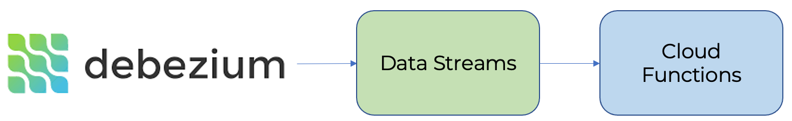

# Processing CDC Debezium streams

[Debezium](https://debezium.io) is a change data capture service for streaming DB changes to other systems for processing. With {{ yds-full-name }}, you can capture these changes and send them to {{ sf-name }}.

Below is the architecture of the solution:

## Setup {#setup}
To get a data stream:
1. [Create a {{ yds-full-name }} stream](#create_stream).
1. [Set {{ yds-full-name }} connection parameters](#credentials).
1. [Set up and start](#debezium_server) the Debezium Server.
1. [Set up a trigger](#sftrigger) in {{ sf-name }} for processing data.

### Creating a stream {#create_stream}

Create a {{ yds-full-name }} stream named `debezium`. For detailed information about creating streams, see the [{{ yds-full-name }} documentation](../../data-streams/operations/manage-streams.md).

### Setting {{ yds-full-name }} connection parameters {#credentials}



### Setting up Debezium Server {#debezium_server}

This use case shows how Debezium works with {{ PG }}. Let's assume that Debezium is installed on the server where {{ PG }} is running.



## Setting up a trigger in {{ sf-name }} {#sftrigger}

Create a trigger in {{ sf-name }} to the {{ yds-full-name }} `debezium` stream you created earlier.

For detailed information about creating triggers, see the [{{ sf-name }} documentation](../../functions/concepts/trigger/data-streams-trigger.md).

{{ sf-name }} will send notifications about any DB changes to the trigger. In the trigger code, you can handle these changes by implementing any required software processing.

