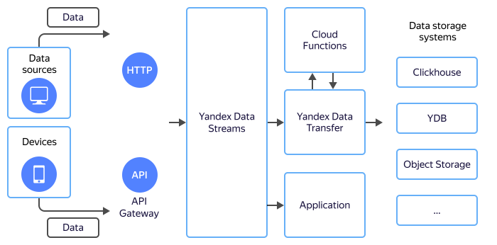

# Entering data into storage systems

Mobile phones, various smart devices, and external services are increasingly replacing application components as data sources.

Data from these sources is received in a great number of small batches. Often, slow communication channels are used for data transmission, while the communication time is limited. Under these conditions, it's important to promptly save the data received. Processing of this data can be performed later. Therefore, data is first sent to data streaming buses and then taken for processing from there.

As a data streaming bus, {{ yds-full-name }} provides optimal operation modes for sources and targets:

* Accepts incoming data with high frequency and speed without blocking the sources.
* Saves the received data in its own storage.
* Generates data batches and sends them to target systems reducing the load on them.

## Benefits {#advantages}

When working with external devices or services, it's important to promptly save the data received. The saved data can be fetched from {{ yds-short-name }} through direct reads or by setting up data delivery to {{ yandex-cloud }} storage systems using {{ data-transfer-full-name }}.

### Receiving data {#receiving}

Data is transmitted to {{ yds-short-name }} over [HTTP](../kinesisapi/api-ref.md). Using [{{ api-gw-full-name}}](https://cloud.yandex.ru/services/api-gateway)(https://cloud.yandex.com/services/api-gateway), you can implement any protocol for incoming data. Data received in {{ api-gw-name }} can be forwarded to {{ yds-short-name }} as well.

{{ yds-short-name }} provides high scalability and can accept data from thousands of data sources at the same time.

### Reliability {#reliability}

A data streaming bus is an important infrastructure component. It's tolerant to any type of {{ yandex-cloud }} failures. Data input in {{ yds-short-name }} is saved to at least three {{ yandex-cloud }} availability zones.

### Batching {#batching}

Data storage and processing systems are most efficient if data is written to them in batches. The most efficient place for generating batches is a single entry point where all data arrives. This function is fulfilled by data buses.

### Rewinding data {#rewind}

Unlike message queues, data buses store data until the retention period expires without deleting the data after it's read. This lets you move across the stored data in any direction: from the oldest to the most recent. For example, if a new data format appears and it's written to a target system incorrectly, you can rewind the data stored in a bus to the beginning and then reread and rewrite it correctly to the target system.

### Multiple storage systems {#multiple}

The same data is often stored in multiple storage systems at once: in {{ CH }} for fast [analysis](../../glossary/data-analytics.md)analysis and in {{ objstorage-name }} for long-term storage. With data buses, you can easily handle this: as different apps can read data concurrently, you can set up sending the same data to both storage systems: {{ CH }} and {{ objstorage-name }}. This solution will also let you add a third storage system, such as {{ GP }} or {{ ES }}, at any time.

The approach using multiple storage systems is very convenient to ensure compliance with Federal Law No. 152-FZ, PCI DSS, and other standards that stipulate that data shall be stored for at least a year. In this case, data for the past month can be sent to one storage system so that it can be accessed whenever required, while data to be stored for a long term can be sent to {{ objstorage-name }} cold storage.

### Masking data and processing logs {#mask}

Some data is not accessible to all employees. For example, data with users' personal data access to which must be limited.

Transmitted data can be sent for processing to {{ sf-name }} where it can be masked or handled in any other way.

Once processed, the data can be sent to multiple target systems at once: access to the data containing masked personal data can be granted to all employees while access to the full data to administrators only.

### Reading data {#read}

Data stored in {{ yds-short-name }} can be processed programmatically. {{ yds-short-name }} is compatible with the Amazon Kinesis Data Streams API, which lets you use SDKs for different programming languages such as C++, Java, Go, and Python.

## Setup {#setup}

To set up data input to storage systems:

1. [Create a data stream](../quickstart/create-stream.md) {{ yds-short-name }}.
1. [Set up](../quickstart/index.md) the AWS SDK.
1. Set up {{ data-transfer-full-name }} to transfer data to the selected storage system.

   An example of setting up data delivery from {{ yds-short-name }} is given in the [tutorial on how to save data to {{ CH }}](send-to-clickhouse.md).
1. Connect an arbitrary data processing function to {{ data-transfer-full-name }}. See the function code in the [example](https://github.com/yandex-cloud/examples/tree/master/ydt/nginx-logs) or use SDKs to directly read data from {{ yds-short-name }}:
   * [Go](https://docs.aws.amazon.com/sdk-for-go/api/service/kinesis/).
   * [C++](https://sdk.amazonaws.com/cpp/api/LATEST/class_aws_1_1_kinesis_1_1_kinesis_client.html).
   * [Java](https://docs.aws.amazon.com/AWSJavaSDK/latest/javadoc/com/amazonaws/services/kinesis/AmazonKinesisClient.html).
   * [JavaScript](https://docs.aws.amazon.com/AWSJavaScriptSDK/v3/latest/clients/client-kinesis/index.html).
   * [Python](https://boto3.amazonaws.com/v1/documentation/api/latest/reference/services/kinesis.html).
   * [HTTP Kinesis Data Streams API](../kinesisapi/api-ref.md).
