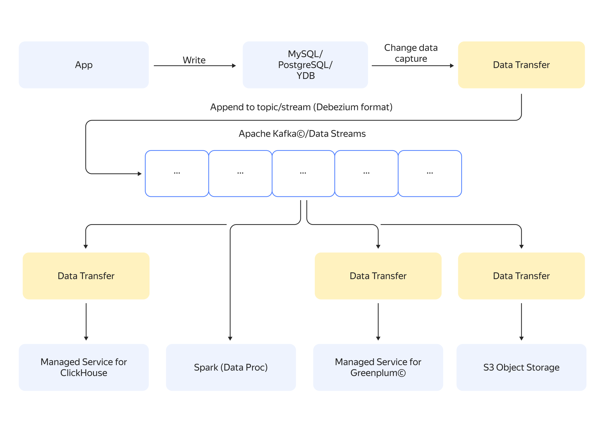

# Change data capture

CDC ([change data capture](https://en.wikipedia.org/wiki/Change_data_capture)) is a process of tracking changes in a database and delivering them to consumers in near real-time. CDC can be used to:

* Create applications that respond to data changes in real time.
* Deliver data from a centralized storage to microservices.
* Collect and deliver data from a production environment to internal data stores for processing and analysis.

In {{ yandex-cloud }}, one way CDC can be implemented is with a transfer from the database to the message broker. All database updates are tracked by the transfer and sent to the message broker, and consumers are connected to the broker and read the incoming messages.

{{ data-transfer-name }} supports CDC for transfers from {{ PG }}, {{ MY }}, and {{ ydb-short-name }} databases to {{ KF }} and {{ yds-full-name }}^1^. Data is sent to the target in [Debezium](https://debezium.io/) format.





^1^ This feature is at the Preview stage.
Implementation maturity may vary for different {{ data-transfer-full-name }} installation types. Transfers between a {{ MG }} source and an {{ KF }} target are not supported yet. See the [list of available transfers](../transfer-matrix.md).

## Use cases {#examples}

* [{#T}](../tutorials/cdc-mmy.md)
* [{#T}](../tutorials/cdc-mpg.md)
* [{#T}](../tutorials/cdc-ydb.md)
* [{#T}](../tutorials/ydb-to-yds.md)
* [{#T}](../tutorials/mpg-to-yds.md)
* [{#T}](../tutorials/mmy-to-yds.md)
