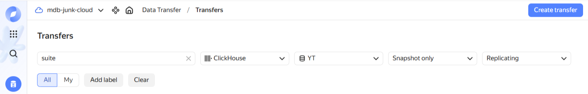

<!-- Changelog begin -->


```
date: 2025-12
index: 2
```

### Convenient transfer filtering



Your list of transfers is too long? Filter only the ones you need based on available parameters:
* Endpoint or transfer name
* Source and target database type
* Transfer type
* Transfer stage




```
date: 2025-11
index: 1
```

### Data transfer from {{ ydb-name }} to {{ PG }}

Use a new combination of endpoints to transfer data from {{ ydb-name }} to {{ PG }}. For details about supported data source-target pairs, see the [transfer matrix](../transfer-matrix.md).



<!-- Changelog end -->


# {{ data-transfer-name }} release notes

- [December 2025](2512.md)
- [November 2025](2511.md)
- [October 2025](2510.md)
- [September 2025](2509.md)
- [August 2025](2508.md)
- [July 2025](2507.md)
- [June 2025](2506.md)
- [May 2025](2505.md)
- [April 2025](2504.md)
- [March 2025](2503.md)
- [February 2025](2502.md)
- [January 2025](2501.md)

{#2024}

- [December 2024](2412.md)
- [November 2024](2411.md)
- [October 2024](2410.md)
- [September 2024](2409.md)
- [August 2024](2408.md)
- [July 2024](2407.md)
- [June 2024](2406.md)
- [May 2024](2405.md)
- [April 2024](2404.md)
- [March 2024](2403.md)
- [February 2024](2402.md)
- [January 2024](2401.md)



{#2023}

- [December 2023](2312.md)
- [November 2023](2311.md)
- [October 2023](2310.md)
- [September 2023](2309.md)
- [August 2023](2308.md)



