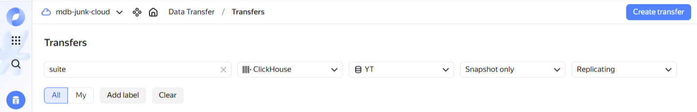

<!-- Changelog begin -->


```
date: 2025-12
index: 2
```

### Convenient transfer filtering



Your list of transfers is too long? Filter only the ones you need based on available parameters:
* Endpoint or transfer name
* Source and target database type
* Transfer type
* Transfer stage




```
date: 2025-11
index: 1
```

### Data transfer from {{ ydb-name }} to {{ PG }}

Use a new combination of endpoints to transfer data from {{ ydb-name }} to {{ PG }}. For details about supported data source-target pairs, see the [transfer matrix](../transfer-matrix.md).



<!-- Changelog end -->


# {{ data-transfer-name }} release notes

## 2026 {#2026}

### February {#feb26}

#### New features {#new-features-feb26}

* Significantly improved the speed of [{{ PG }}](../operations/endpoint/source/postgresql.md)-to-[{{ PG }}](../operations/endpoint/target/postgresql.md) data transfers.
* Improved database schema migration for [{{ PG }}](../operations/endpoint/source/postgresql.md)-to-[{{ PG }}](../operations/endpoint/target/postgresql.md) transfers. Entities are now migrated sequentially based on dependencies between them.


* Number of VMs allocated for the copy stage will be limited to 64.


#### Fixed issues {#problems-solved-feb26}

* Improved transfer stability for [{{ KF }} sources](../operations/endpoint/source/kafka.md).
* Fixed sending metric to {{ monitoring-name }} from the [Oracle source](../operations/endpoint/source/oracle.md).
* Fixed the issue with [{{ PG }}](../operations/endpoint/source/postgresql.md)-to-[{{ PG }}](../operations/endpoint/target/postgresql.md) data transfers, where defining the table list at the transfer level (rather than the endpoint) caused the transfer of the entire schema.
* Fixed an issue where simultaneous updates to endpoint and transfer settings via the API and {{ TF }} triggered multiple transfer restarts.
* Fixed the table vacuuming issue for the [{{ ydb-name }} target](../operations/endpoint/target/yandex-database.md).
* Fixed freezes and duplicate delivery of large data volumes during replications from [{{ ydb-name }}](../operations/endpoint/source/ydb.md).
* Fixed an issue where deletions failed to propagate to {{ CH }} if columns contained certain types, e.g., UUID.


### January {#jan26}

 You can now configure [{{ KF }} connections](../operations/endpoint/source/kafka.md) and [{{ yds-name }}](../operations/endpoint/source/data-streams.md) in the [{{ schema-registry-name }}](../../metadata-hub/concepts/schema-registry.md) data source settings.

{#2025}

- [December 2025](2512.md)
- [November 2025](2511.md)
- [October 2025](2510.md)
- [September 2025](2509.md)
- [August 2025](2508.md)
- [July 2025](2507.md)
- [June 2025](2506.md)
- [May 2025](2505.md)
- [April 2025](2504.md)
- [March 2025](2503.md)
- [February 2025](2502.md)
- [January 2025](2501.md)



{#2024}

- [December 2024](2412.md)
- [November 2024](2411.md)
- [October 2024](2410.md)
- [September 2024](2409.md)
- [August 2024](2408.md)
- [July 2024](2407.md)
- [June 2024](2406.md)
- [May 2024](2405.md)
- [April 2024](2404.md)
- [March 2024](2403.md)
- [February 2024](2402.md)
- [January 2024](2401.md)



{#2023}

- [December 2023](2312.md)
- [November 2023](2311.md)
- [October 2023](2310.md)
- [September 2023](2309.md)
- [August 2023](2308.md)



