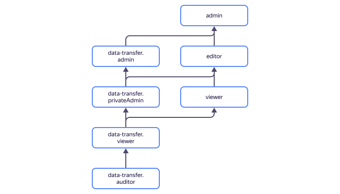

# Access management in {{ data-transfer-name }}

In this section, you will learn:

* [Which resources you can assign a role for](#resources).
* [Which roles exist in the service](#roles-list).
* [Which roles are required](#required-roles) for particular actions.

To use the service, log in to the management console with a [Yandex account](../../iam/concepts/users/accounts.md#passport) or [federated account](../../iam/concepts/users/accounts.md#saml-federation).





## Which resources you can assign a role for {#resources}

You can assign a role for a [cloud](../../resource-manager/concepts/resources-hierarchy.md#cloud) or [folder](../../resource-manager/concepts/resources-hierarchy.md#folder). Cloud roles also apply to nested folders.

## Which roles exist in the service {#roles-list}



### Service roles {#service-roles}

#### data-transfer.auditor {#data-transfer-auditor}



#### data-transfer.viewer {#data-transfer-viewer}



#### data-transfer.privateAdmin {#data-transfer-privateadmin}



#### data-transfer.admin {#data-transfer-admin}



### Primitive roles {#primitive-roles}

#### {{ roles-viewer }} {#viewer}



#### {{ roles-editor }} {#editor}



#### {{ roles-admin }} {#admin}



## Roles required {#required-roles}

To use the service, you need the `editor` [role](../../iam/concepts/access-control/roles.md) or higher to the folder that projects are being created in. With the `viewer` role, you can only view the list of projects and the contents of files that were downloaded.

To create or edit an endpoint of a managed database, you need the service or primitive [`viewer` role](../../iam/roles-reference.md#viewer) assigned for the folder hosting a cluster of this managed database.

You can always assign a role granting more permissions than the role specified. For example, assign the `admin` role instead of `editor`.

## What's next {#whats-next}

* [How to assign a role](../../iam/operations/roles/grant.md).
* [How to revoke a role](../../iam/operations/roles/revoke.md).
* [Learn more about access management in {{ yandex-cloud }}](../../iam/concepts/access-control/index.md).
* [Learn more about inheriting roles](../../resource-manager/concepts/resources-hierarchy.md#access-rights-inheritance).

