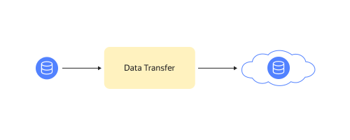
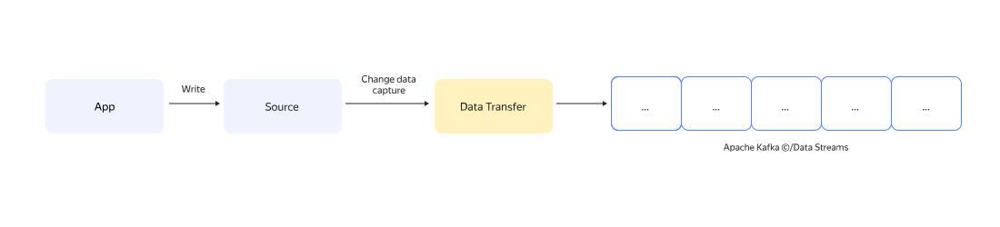
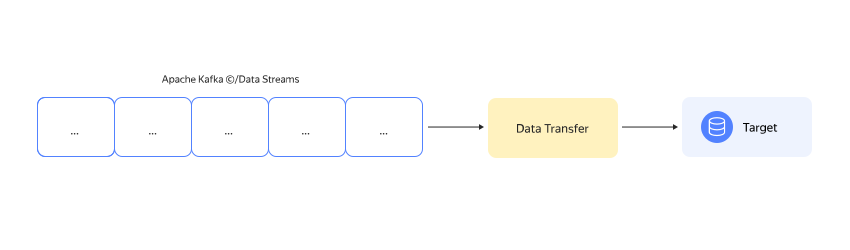
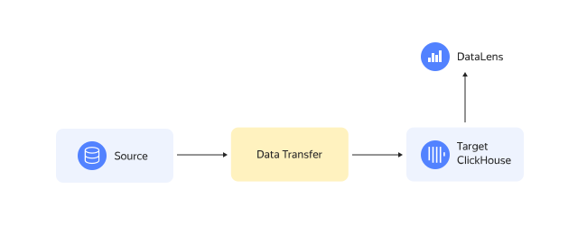
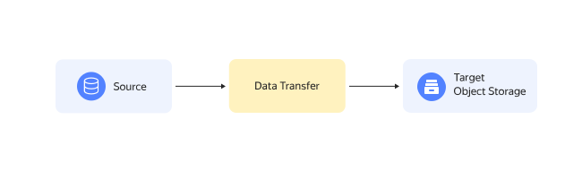

# {{ data-transfer-name }} tutorials

Using {{ data-transfer-name }}, you can implement a variety of scenarios for migrating data, capturing data changes, delivering data from queues, uploading data to data marts, and mirroring and uploading data to scalable storage.

## Data migration {#migration}
Migration is a task that involves transferring data from one data storage to another. In {{ data-transfer-name }}, migration often means migrating a database from obsolete local databases to managed cloud ones.

* [Migrating {{ PG }} clusters](managed-postgresql.md)
* [Migrating {{ MY }} clusters](managed-mysql-to-mysql.md)
* [Migrating {{ CH }} clusters](managed-clickhouse.md)
* [Migrating {{ GP }} clusters](managed-greenplum.md)
* [Migrating {{ MG }} clusters](managed-mongodb.md)

Mirroring data across queues is a separate migration task.

* [{{ KF }} mirroring](mkf-to-mkf.md)

Migration with data storage type changed.

* [{{ MY }} to {{ ydb-short-name }}](managed-mysql-to-ydb.md)
* [{{ PG }} to {{ ydb-short-name }}](mpg-to-ydb.md)

## Change data capture {#cdc}

[Change Data Capture](../concepts/cdc.md) (CDC) is a process of tracking changes in a database and delivering them to consumers with public serialization format supported when writing data to a Debezium queue.
СDC is used for creating apps that are sensitive to real-time data changes, exchanging data between different services, including those with different levels of availability, and collecting and delivering data from the production environment to internal data storage for processing and analysis.

* {{ MY }} change data capture and delivery to
   * [{{ KF }}](cdc-mmy.md)
   * [{{ DS }}](mmy-to-yds.md)
* {{ PG }} change data capture and delivery to
   * [{{ KF }}](cdc-mpg.md)
   * [{{ DS }}](mpg-to-yds.md)
* {{ ydb-short-name }} change data capture and delivery to
   * [{{ KF }}](cdc-ydb.md)
   * [{{ DS }}](ydb-to-yds.md)

## Delivering data from queues {#delivery-to-queue}

Data delivery is a process of delivering arbitrary data to target storage. It includes data retrieval from a queue and its deserialization with subsequent transformation to target storage format.

* [{{ KF }} to {{ CH }}](mkf-to-mch.md)
* [{{ KF }} to {{ PG }}](mkf-to-mpg.md)* [{{ KF }} to {{ GP }}](managed-kafka-to-greenplum.md)
* [{{ KF }} to {{ ES }}](mkf-to-mes.md)
* [{{ KF }} to {{ MG }}](mkf-to-mmg.md)
* [{{ KF }} to {{ MY }}](mkf-to-mmy.md)
* [{{ KF }} to {{ OS }}](mkf-to-mos.md)
* [{{ KF }} to {{ ydb-short-name }}](mkf-to-ydb.md)
* [{{ KF }} to {{ DS }}](mkf-to-yds.md)
* [{{ DS }} to {{ CH }}](yds-to-clickhouse.md)
* [{{ DS }} to {{ objstorage-name }}](yds-to-objstorage.md)
* [{{ at-name }} log from {{ DS }} to {{ OS }}](trails-to-os.md)

## Uploading data to data marts {#upload-to-data-mart}

Uploading data to data marts is a transfer of preset data to storage for its subsequent visualization. Sources are data stores used for massively parallel processing of data. Targets are data stores that can quickly deliver data.

* [{{ GP }} to {{ CH }}](greenplum-to-clickhouse.md)
* [{{ MY }} to {{ CH }}](mysql-to-clickhouse.md)
* [{{ metrika }} to {{ CH }}](metrika-to-clickhouse.md)
* [{{ PG }} to {{ CH }}](rdbms-to-clickhouse.md)
* [{{ GP }} to {{ PG }}](greenplum-to-postgresql.md)

## Importing data to {{ objstorage-name }} {#upload-to-storage}

Uploading data to scalable {{ objstorage-name }} storage allows you to save on data storage and simplifies the exchange with contractors.

* [{{ MY }} to {{ objstorage-name }}](mmy-objs-migration.md)
* [{{ PG }} to {{ objstorage-name }}](mpg-to-objstorage.md)


