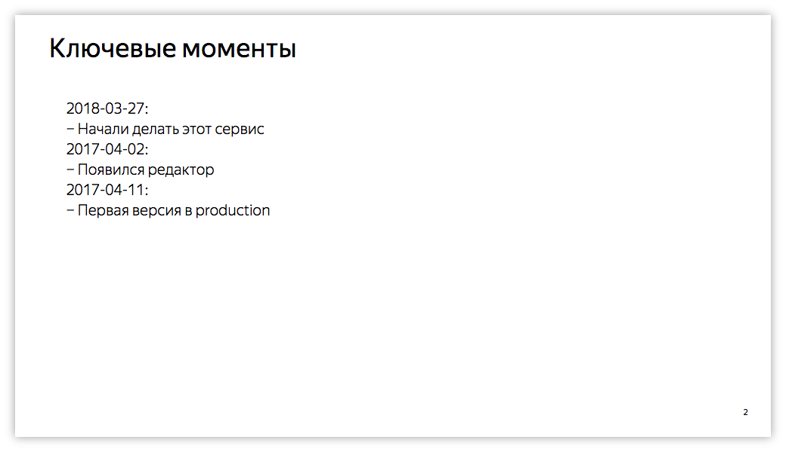
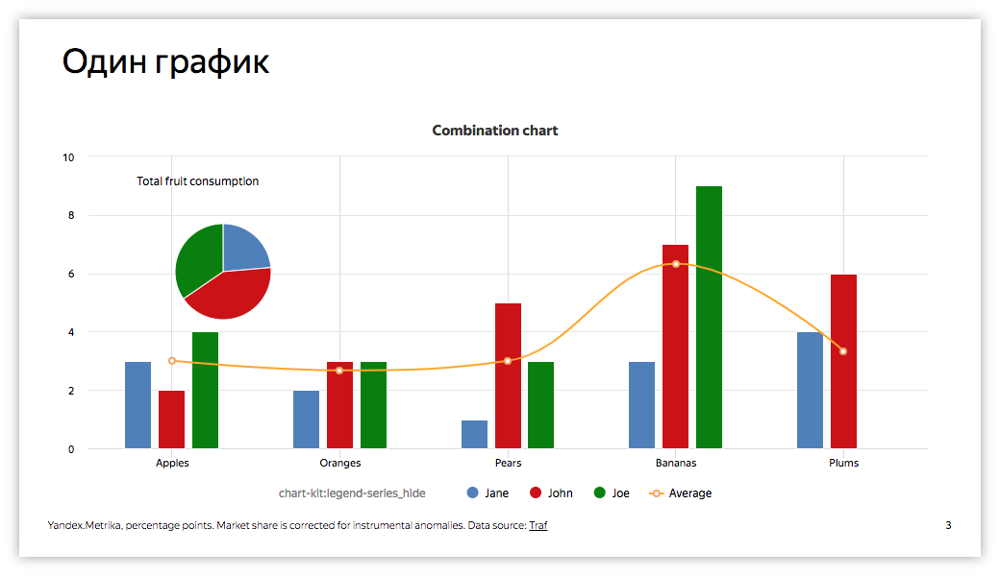
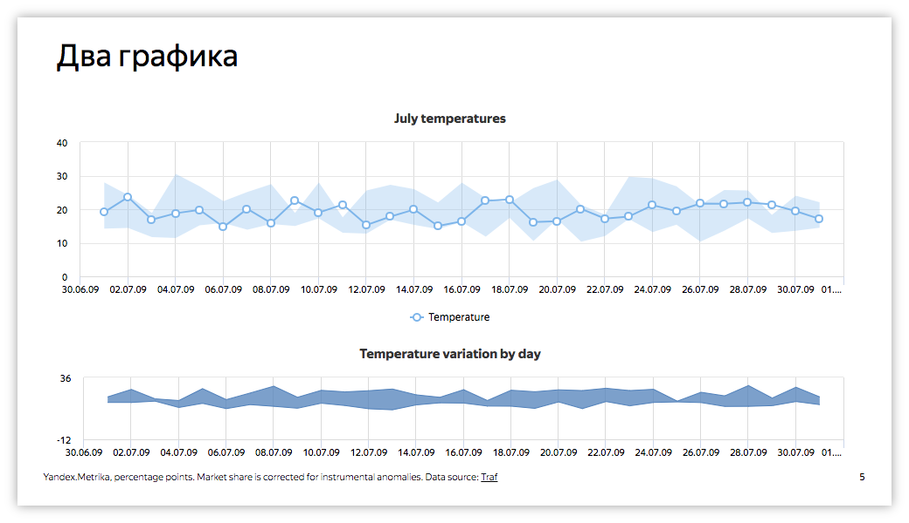
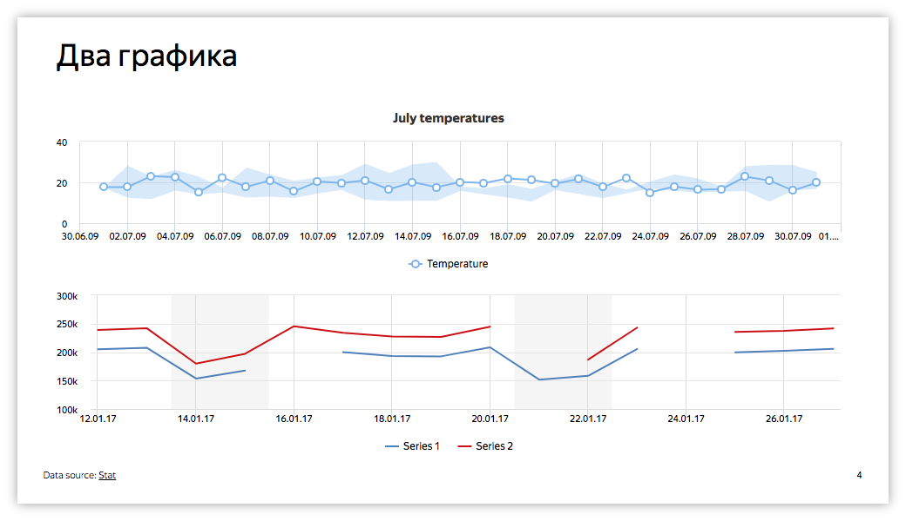
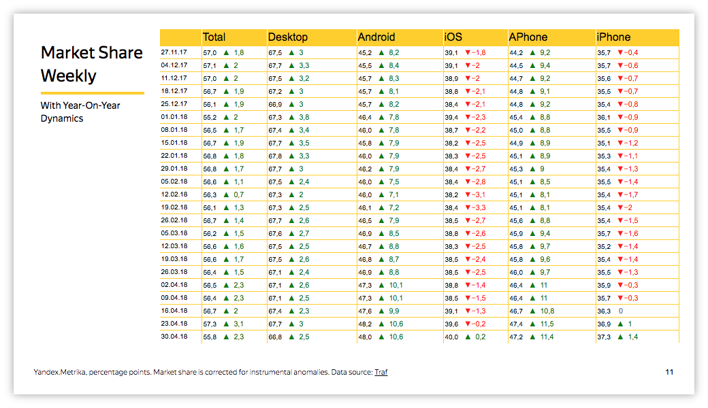

# Templates

A template is an object with the data needed to render a presentation.
It has common fields, for example, the creator's name or username. The most important thing is the template code. It's JSON code
used to render the presentation. You can create **public** or **private** templates.

#### Public {#public}

**Public** templates are visible to all users. Anyone can edit its text and render it. However, only the creator can edit the template name, delete it, or change it to **private**.

#### Private {#private}

Only the creator can see a **Private** template. That's why only the creator can do all the manipulations with such a template.

### Slides {#slides}

Templates consist of slides. Template code looks like this:
```json
{
  "slides": [
    ...
  ]
}
```

Slides are numbered automatically.

Each element in the `slides` array describes a slide. Below are the existing slide types.
If you need a new slide type, tell the developer about this.

### Title {#title}

A title is used to generate the title page of your presentation. It's not numbered.

| Parameter | Type | Description |
|:---|:---|:---
| title* | String | Displayed text |

\*: Required parameters

Example:
```json
{
    "type": "Title",
    "props": {
      "title": "Example"
    }
}
```


### Comments {#comments}

Comments are used to generate a page with comments to the presentation.

| Parameter | Type | Description |
|:---|:---|:---
| title* | String | Slide title |
| comments* | Array or String | If it's an array, it includes the displayed text, line by line. If it's a string, it includes a path to the ChartKit textual widget the text from which will be shown. |

\*: Required parameters

Example:
```json
{
  "type": "Comment",
  "props": {
    "title": "Key points",
    "comments": [
      "2018-03-27:",
      "− We started this service",
      "2017-04-02:",
      "− Made an editor",
      "2017-04-11:",
      "− First version in production"
    ]
  }
}
```


### OneChart {#oneChart}

OneChart is designed to generate a page with a single full-page chart.

| Parameter | Type | Description |
|:---|:---|:---
| title* | String | Slide title |
| source* | String | The path to the chart |
| footer | String | Footer content |

\*: Required parameters

Example:
```json
{
    "type": "OneChart",
    "props": {
      "title": "One chart",
      "source": "/preview/editor/Examples/visual-types/combo-chart"
    }
}
```


### TwoCharts {#twoCharts}

TwoCharts is designed to generate a page with two charts (one under another).

| Parameter | Type | Description |
|:---|:---|:---
| title* | String | Slide title |
| upperSource* | String | Path to the upper chart |
| lowerSource* | String | Path to the lower chart |
| upperHeight | Number | Height of the upper chart, in pixels |
| lowerHeight | Number | Height of the lower chart, in pixels |
| footer | String | Footer content |

\*: Required parameters

Example:
```json
{
  "type": "TwoCharts",
  "props": {
    "title": "Two charts",
    "upperSource": "/preview/editor/Examples/visual-types/area-range-line",
    "lowerSource": "/preview/editor/Examples/visual-types/area-range"
  }
}
```


Example with additional options:
```json
{
  "type": "TwoCharts",
  "props": {
    "title": "Two charts",
    "upperSource": "/preview/editor/Examples/visual-types/area-range-line",
    "lowerSource": "/preview/editor/Examples/line-connect-nulls-false",
    "upperHeight": 210,
    "lowerHeight": 210,
    "footer": "Data source: <a href='https://stat.yandex-team.ru'>Stat</a>"
  }
}
```


### Table {#table}

A table is designed to generate a page with a table.

| Parameter | Type | Description |
|:---|:---|:---
| title* | String | Slide title |
| footer | String | Footer content |

\*: Required parameters

Example:
```json
{
  "type": "Table",
  "props": {
    "title": "Market Share Weekly",
    "source": "/preview/editor/dalamar/share_table?scale=w",
    "text": "With Year-On-Year Dynamics"
  }
}
```

