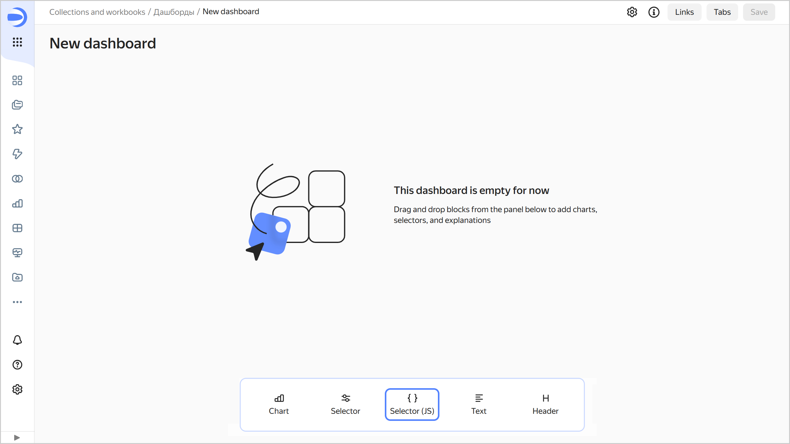
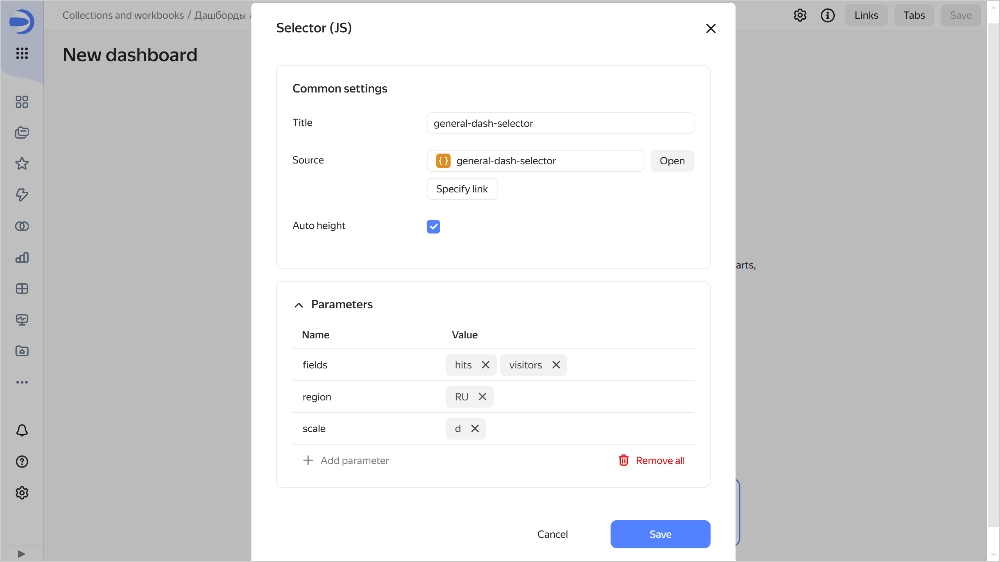

# Adding a JS selector to a dashboard



Before adding a selector, make sure you have the `{{ permission-write }}` or `{{ permission-admin }}` permission for the dashboard. For more information, see [{#T}](../../security/manage-access.md).

To add a [selector](./widgets/controls.md) to a dashboard:

1. In the left-hand panel, click  **Dashboards** and select the dashboard you need.
1. At the top of the page, click **Edit**.
1. In the panel at the bottom of the page, choose **Selector (JS)**.

   

1. Specify the selector parameters:

   * **Header**: Used to pick a selector when establishing a link with other widgets.
   * **Source**: Sets the selector created in Editor. Choose a selector:

     

     - From the list of objects

       Click **Select** and choose a selector from the list of objects. If you have already done so, you can proceed to edit the selector. To do this, click **Open** to the right of the selector.

     - Via a link

       Click **Specify link**. Paste the selector URL into the input field and click **OK** below.

     

   * **Auto height**: Sets the automatic height for a widget on the dashboard.
   * **Parameters**: Sets a list of selector parameters and their default values. For the widget to work correctly, specify here the selector parameters listed on the [Params](./tabs.md#params) tab.

     

1. Click **Add**. The widget will be displayed on the dashboard.
