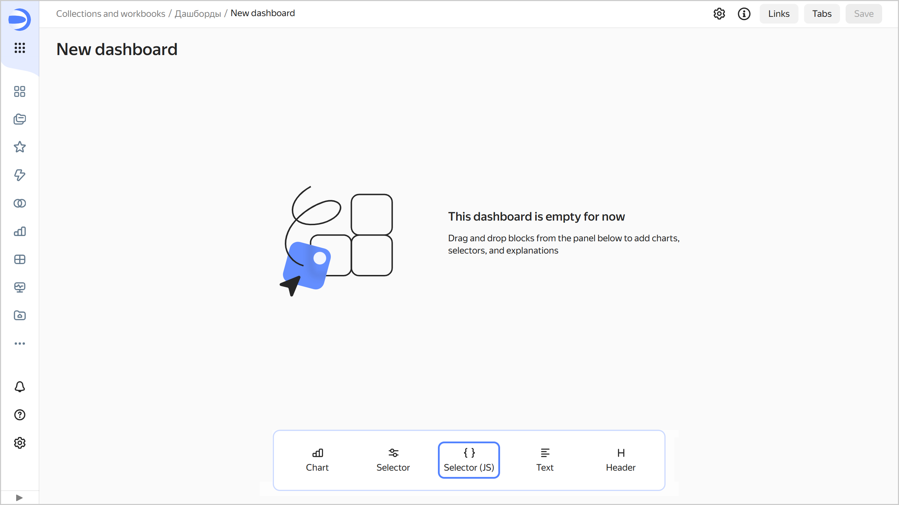
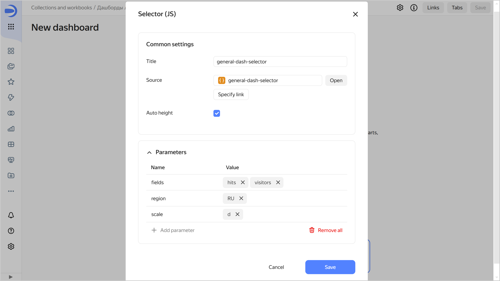

# Adding a JS selector to a dashboard

Before adding a selector, make sure you have the `{{ permission-write }}` or `{{ permission-admin }}` permission for the dashboard. For more information, see [{#T}](../../security/manage-access.md).

To add a [selector](./widgets/controls.md) to a dashboard:

1. In the left-hand panel, click  **Dashboards** and select the dashboard you need.
1. At the top of the page, click **Edit**.
1. In the panel at the bottom of the page, choose **Selector (JS)**.

   

1. Specify the selector parameters:

   * **Header**: To choose the selector for linking with other widgets.
   * **Source**: Sets the selector created in Editor. Choose the selector:

     

     - From the list of objects

       Click **Select** and choose a selector from the list of objects. If you have already chosen the selector, you can proceed to edit it To do this, click **Open** to the right of the selector.

     - Using a link

       Click **Specify link**. Enter the selector URL into the input field and click **OK** below.

     

   
   * **Show in tabs**: Select how to display the selector on the dashboard:

     * `Current tab <tab_name>`: Display on selected tab. This is the default option.
     * `Selected tabs`: Select one or more tabs to display the selector on. By default, the current tab is selected.
     * `All tabs`: Display on all tabs.

   
   * **Background**: Widget background color and opacity separately for the light and dark theme.
   * **Rounding**: Widget corner rounding.

   * **Auto height**: Automatic widget height on the dashboard.
   * **Parameters**: Sets a list of selector parameters and their default values. For the widget to work correctly, specify the selector parameters listed on the [Params](./tabs.md#params) tab.

     

1. Click **Save**. The widget will appear on the dashboard.
