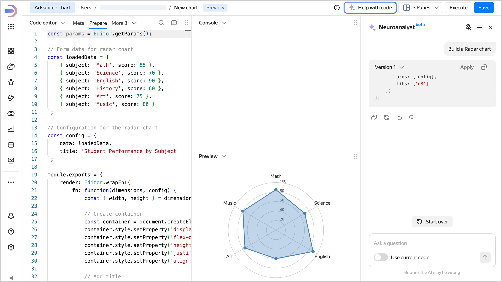

# Neuroanalyst in Editor



This feature is at the Beta testing stage.



Neuroanalyst streamlines the creation and editing of visualizations in Editor. Available for three visualization types: [Table](./widgets/table.md), [Markdown](./widgets/markdown.md), and [Advanced chart](./widgets/advanced.md). Neuroanalyst only works with the **Prepare** tab.

To activate Neuroanalyst, click **Help me code** at the top in Editor to open the **Neuroanalyst** tab on the right.





The AI assistant in Editor will help you create charts from scratch, optimize their structure, and correct errors. Simply give a detailed description of the chart you want to get, and the AI will help you implement it in code.

Use the following options:

* At the bottom of the tab, enable **Consider code**: the helper will analyze your current code in the [Prepare](./tabs.md#prepare) tab and suggest contextual edits.
* At the bottom of the tab, click **Apply** to replace the contents of the **Prepare** tab with AI-generated code. You will immediately see the difference between the current changes and your saved version.



Changes introduced via the Neuroanalyst are not yet saved to the local Editor history. Save your draft versions often to avoid losing your progress.

