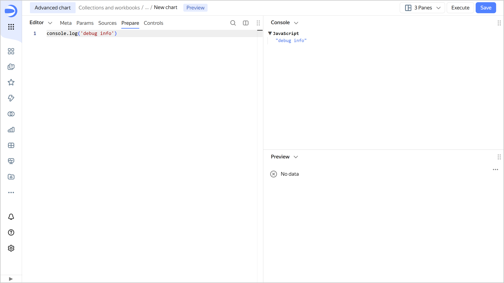

# Chart debugging in Editor

You can find debug information and chart execution errors on the **Console** panel.

To display additional information in a particular place in the code, use the `console.log(value)` function. Code within functions wrapped in `Editor.wrapFn` runs on the client side. When using `console.log` inside these functions, logs will be output to the browser console.
