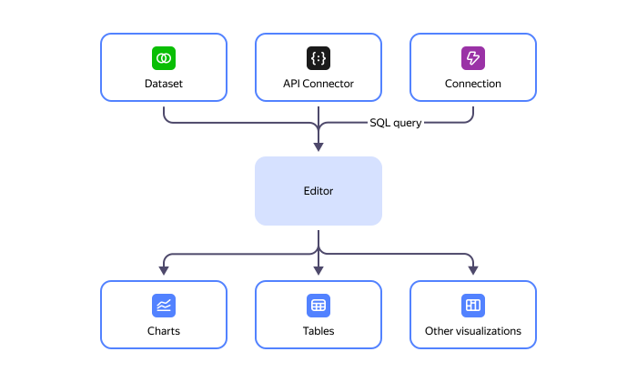
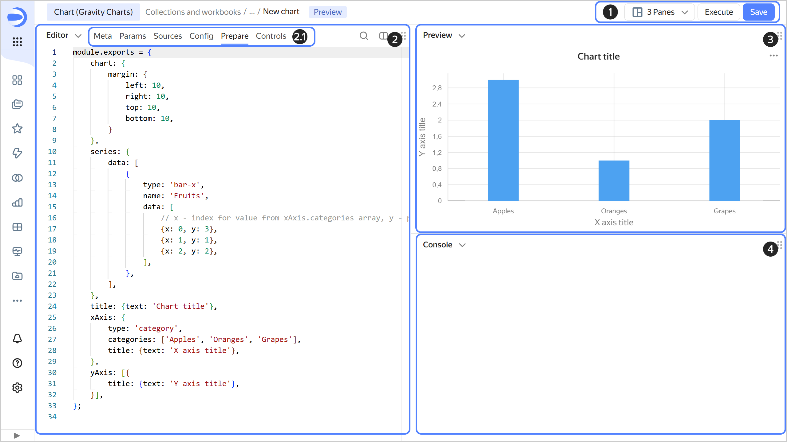

# Charts in Editor



**Editor** is a JavaScript-based data and selector visualization tool. With Editor, you can upload data from one or more sources, manage chart parameters, and configure visualizations. You can use datasets and connections as data sources.

## Interface {#interface}

The chart creation page user interface consists of the following sections:

1. Controls:

   * Managing interface panels: You can select the number and location of your interface panels. Each one can display **CodeEditor**, **Preview**, or **Console**.
   * Chart preview refresh: After each chart code update, click **Run** or press `Ctrl`(`Cmd`) + `Enter` to view the result. This action does not save the chart.
   * Saving the chart: You can save your chart the usual way or create a draft version.

1. **CodeEditor** panel to view and edit the contents of the chart's tabs. To learn more about tabs (2.1 on the screenshot), see [{#T}](./tabs.md).

1. Chart **Preview** panel.
1. **Console** panel for additional debugging information.

#### What's next {#see-also}

* [{#T}](./quickstart/index.md)
