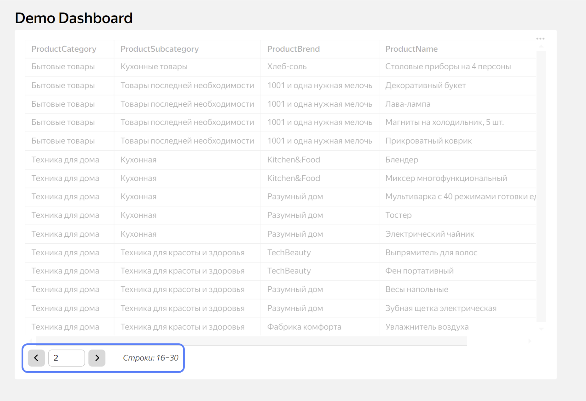
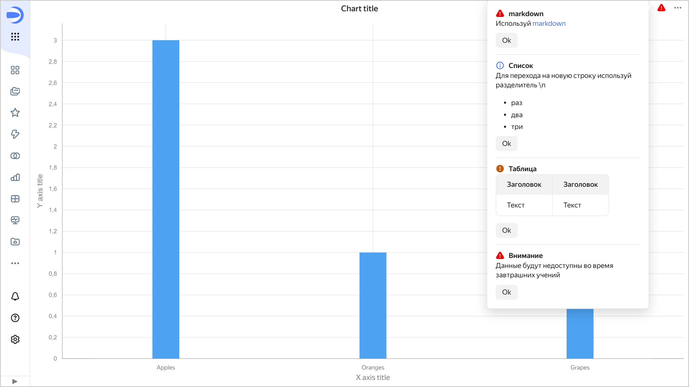

# Methods available in Editor



The supported methods include:

* [Editor.generateHtml(arg)](#gen-html)
* [Editor.getActionParams()](#get-action-params)
* [Editor.getCurrentPage()](#get-current-page)
* [Editor.getId(arg)](#get-id)
* [Editor.getLoadedData()](#get-loaded-data)
* [Editor.getParam(name)](#get-param)
* [Editor.getParams()](#get-params)
* [Editor.getWidgetConfig()](#get-widget-config)
* [Editor.resolveInterval(arg)](#resolve-interval)
* [Editor.resolveOperation(args)](#resolve-oper)
* [Editor.resolveRelative(arg)](#resolve-relative)
* [Editor.setChartsInsights(args)](#set-insights)
* [Editor.updateActionParams()](#update-action-params)
* [Editor.updateParams(params)](#update-params)
* [Editor.wrapFn(conf)](#wrap)

## Editor.generateHtml(arg) {#gen-html}

Generates secure HTML markup in a chart.



* `a`
* `abbr`
* `b`
* `br`
* `button`
* `caption`
* `circle`
* `clipPath`
* `code`
* `dd`
* `defs`
* `div`
* `dl`
* `dt`
* `ellipse`
* `em`
* `feComponentTransfer`
* `feDropShadow`
* `feFuncA`
* `feFuncB`
* `feFuncG`
* `feFuncR`
* `feGaussianBlur`
* `feOffset`
* `feMerge`
* `feMergeNode`
* `filter`
* `g`
* `h1`
* `h2`
* `h3`
* `h4`
* `h5`
* `h6`
* `hr`
* `i`
* `img`
* `li`
* `line`
* `linearGradient`
* `marker`
* `ol`
* `p`
* `path`
* `pattern`
* `polyline`
* `polygon`
* `pre`
* `rect`
* `small`
* `span`
* `stop`
* `strong`
* `sub`
* `sup`
* `svg`
* `table`
* `text`
* `textPath`
* `thead`
* `title`
* `tbody`
* `tspan`
* `td`
* `th`
* `tr`
* `u`
* `ul`





* `alt`
* `aria-controls`
* `aria-describedby`
* `aria-expanded`
* `aria-haspopup`
* `aria-hidden`
* `aria-label`
* `aria-labelledby`
* `aria-live`
* `aria-pressed`
* `aria-readonly`
* `aria-roledescription`
* `aria-selected`
* `clip-path`
* `clip-rule`
* `color`
* `colspan`
* `cx`
* `cy`
* `d`
* `dx`
* `dy`
* `disabled`
* `fill`
* `fill-rule`
* `filterUnits`
* `flood-color`
* `flood-opacity`
* `height`
* `href`
* `in`
* `mask`
* `offset`
* `opacity`
* `orient`
* `padding`
* `points`
* `r`
* `refX`
* `refY`
* `role`
* `rx`
* `ry`
* `scope`
* `slope`
* `src`
* `stroke`
* `stroke-linecap`
* `stroke-linejoin`
* `stroke-width`
* `result`
* `rowspan`
* `summary`
* `target`
* `tabindex`
* `text-align`
* `text-anchor`
* `title`
* `transform`
* `type`
* `valign`
* `viewBox`
* `width`
* `x`
* `x1`
* `x2`
* `xlink:href`
* `xmlns`
* `y`
* `y1`
* `y2`
* `zIndex`
* `data-tooltip-content`
* `data-tooltip-placement`

^1^ To avoid incompatibility in future updates, do not use service classes in the `class` attribute.



#### Supported chart types {#gen-html-charts}

* [Chart (Gravity Charts)](./widgets/chart.md)
* [Table](./widgets/table.md)
* [Advanced chart](./widgets/advanced.md)

#### Arguments {#gen-html-args}

`arg`: String or JSON object in the following format:

```json
{
  "tag": "<string>",
  "style": "<object>",
  "content": "<string> / <object> / <array_of_objects>"
}
```

Where:

* `tag` (_string_): HTML tag type, required field.
* `style` (_JSON object_): Description of CSS properties in the following format:

  ```json
  {
    "key": "value"
  }
  ```

  Where:

  * `key` (_string_): CSS property name.
  * `value` (_string_): CSS property value.

* `content` (_string_, _JSON object_, _array of objects_): String, JSON object, or array of objects in the following format:

  ```json
  {
    "tag": "<string>",
    "style": "<object>",
    "content": "<string> / <object> / <array_of_objects>"
  }
  ```

#### Displaying a tooltip on hover {#dl-tooltip}

In the markup, you can use the special `dl-tooltip` tag with the following attributes:

* `data-tooltip-content` (_string_, _JSON object_): Tooltip content. It is specified as a string or in the same way as the `arg` [argument](#gen-html-args).
* `data-tooltip-placement` (_string_): Tooltip location:

  * `top`: Above the content.
  * `bottom`: Under the content.
  * `left`: To the left of the content.
  * `right`: To the right of the content.

* `data-tooltip-open-delay` (_integer_): Tooltip display delay, milliseconds.
* `data-tooltip-hide-delay` (_integer_): Tooltip hide delay, milliseconds.

#### Styles for color themes {#css}

CSS variables for each of the four color schemes are supported:

* Each variable must be defined for both the `light` and `dark` themes.
* If their values are not defined for `light-hc` contrast and/or `dark-hc` contrast themes, the values from the matching non-contrast themes will be used.
* The variable name should start with the `--ce-theme` prefix to avoid overriding the {{ datalens-short-name }} system variables and variables used in [Gravity UI](https://gravity-ui.com/).
* A variable only applies to the element inside which it is defined and its descendants.

#### Examples {#gen-html-example}



```js
const result = {
    tag: 'div',
    style: {
        display: 'flex',
        'flex-direction': 'row',
    },
    content: [
        {
            tag: 'a',
            style: {
                display: 'inline-block',
                'vertical-align': 'baseline',
                width: '10px',
                'margin-right': '10px',
            },
            attributes: {
                href: 'https://ya.ru',
                target: '_blank',
            },
            content: {
                tag: 'img',
                attributes: {
                    src: 'https://storage.yandexcloud.net/datalens-public-demo-assets/logo-new.svg',
                    width: '238',
                    height: '32',
                },
                styles: {
                    display: 'block',
                },
            },
        },
        {
            tag: 'span',
            style: {
                'font-style': 'italic',
                color: 'var(--g-color-text-info)',
                'line-height': '1',
                'margin-right': '10px',
            },
         content: 'some text',
        },
        {
            tag: 'svg',
            attributes: {
                'xmlns': 'http://www.w3.org/2000/svg',
                width: 16,
                height: 16,
                fill: 'var(--g-color-text-complementary)',
                viewBox: '0 0 16 16',
            },
            content: {
                tag: 'path',
                attributes: {
                    d: 'M4.355.522a.5.5 0 0 1 .623.333l.291.956A4.979 4.979 0 0 1 8 1c1.007 0 1.946.298 2.731.811l.29-.956a.5.5 0 1 1 .957.29l-.41 1.352A4.985 4.985 0 0 1 13 6h.5a.5.5 0 0 0 .5-.5V5a.5.5 0 0 1 1 0v.5A1.5 1.5 0 0 1 13.5 7H13v1h1.5a.5.5 0 0 1 0 1H13v1h.5a1.5 1.5 0 0 1 1.5 1.5v.5a.5.5 0 1 1-1 0v-.5a.5.5 0 0 0-.5-.5H13a5 5 0 0 1-10 0h-.5a.5.5 0 0 0-.5.5v.5a.5.5 0 1 1-1 0v-.5A1.5 1.5 0 0 1 2.5 10H3V9H1.5a.5.5 0 0 1 0-1H3V7h-.5A1.5 1.5 0 0 1 1 5.5V5a.5.5 0 0 1 1 0v.5a.5.5 0 0 0 .5.5H3c0-1.364.547-2.601 1.432-3.503l-.41-1.352a.5.5 0 0 1 .333-.623zM4 7v4a4 4 0 0 0 3.5 3.97V7H4zm4.5 0v7.97A4 4 0 0 0 12 11V7H8.5zM12 6a3.989 3.989 0 0 0-1.334-2.982A3.983 3.983 0 0 0 8 2a3.983 3.983 0 0 0-2.667 1.018A3.989 3.989 0 0 0 4 6h8z',
                },
            },
        },
    ],
};
...
title: Editor.generateHtml(result),
...
```





```js
...
dataLabelsFormat: Editor.generateHtml({
    tag: 'i',
    content: '{point.yLabel}'
}),
...
```





```js
...
text: Editor.generateHtml({
    tag: 'div',
    content: [
        {
            tag: 'dl-tooltip',
            content: 'Tooltip trigger 1',
            attributes: {
                'data-tooltip-content': {
                    tag: 'i',
                    content: 'Italic content',
                },
                'data-tooltip-placement': ['top']
            }
        },
        {
            tag: 'dl-tooltip',
            content: 'Tooltip trigger 2',
            style: { 'font-weight': 'normal' },
            attributes: {
                'data-tooltip-content': 'Hey!',
                'data-tooltip-placement': 'right'
            }
        },
        {
            tag: 'div',
            content: 'Without tooltip',
        },
        {
            tag: 'dl-tooltip',
            content: {
                tag: 'img',
                attributes: {
                    src: 'https://storage.yandexcloud.net/datalens-public-demo-assets/logo-new.svg',
                    width: 238,
                    height: 32,
                },
                style: {
                    'display': 'inline-block',
                    'vertical-align': 'middle',
                },
            },
            attributes: {
                'data-tooltip-content': {
                    tag: 'a',
                    attributes: {
                        href: 'https://ya.ru',
                    },
                    content: 'go to link',
                    style: {
                        'display': 'inline-block',
                        'vertical-align': 'middle',
                    },
                },
                'data-tooltip-placement': 'bottom'
            },
            style: {
                'display': 'inline-block',
                'vertical-align': 'middle',
            },
        },
        {
            tag: 'dl-tooltip',
            content: {
                tag: 'a',
                attributes: {
                    href: 'https://ya.ru',
                },
                style: {
                    'display': 'inline-block',
                    'vertical-align': 'middle',
                },
                content: [{
                    tag: 'img',
                    attributes: {
                        src: 'https://storage.yandexcloud.net/datalens-public-demo-assets/logo-new.svg',
                        width: 238,
                        height: 32,
                    },
                    style: {
                        'display': 'inline-block',
                        'vertical-align': 'middle',
                    },
                }],
            },
            style: {
                'display': 'inline-block',
                'vertical-align': 'middle',
                'margin-left': '20px',
            },
            attributes: {
                'data-tooltip-content': {
                    tag: 'img',
                    attributes: {
                        src: 'https://storage.yandexcloud.net/datalens-public-demo-assets/logo-new.svg',
                    },
                    content: 'some image desc',
                },
                'data-tooltip-placement': 'bottom'
            }
        },
    ]
}),
...
```





```js
module.exports = {
    title: {
        text: Editor.generateHtml({
            tag: 'div',
            content: [
                {
                    tag: 'div',
                    theme: {
                        dark: {
                            '--ce-theme-bg': 'purple',
                            '--ce-theme-text': 'yellow',
                        },
                        light: {
                            '--ce-theme-bg': 'pink',
                            '--ce-theme-text': 'orange',
                        },
                    },
                    style: {
                        'background-color': 'var(--ce-theme-bg)',
                    },
                    content: {
                        tag: 'div',
                        style: {
                            color: 'var(--ce-theme-text)',
                        },
                        content: 'I can use --ce-theme-text variable',
                    },
                },
                {
                    tag: 'div',
                    style: {
                        color: 'var(--ce-theme-text)',
                    },
                    content: 'I cannot use --ce-theme-text variable',
                },
            ]
        }),
    },
};
```





```js
module.exports = {
    title: {
        text: Editor.generateHtml({
            tag: 'div',
            style: {
                'display': 'flex',
                'flex-direction': 'column',
                'align-items': 'center'
            },
            theme: {
                dark: {
                    '--ce-theme-bg': '#BF90EE',
                    '--ce-theme-text': '#F5D629',
                },
                light: {
                    '--ce-theme-bg': '#9658D5',
                    '--ce-theme-text': '#26FFD9',
                },
            },
            content: [
                {
                    tag: 'div',
                    style: {
                        'margin-bottom': '10px',
                    },
                    content: 'Use settings to switch the theme',
                },
                {
                    tag: 'div',
                    style: {
                        'width': '100%',
                        'height': '300px',
                        'background-color': 'var(--ce-theme-bg)',
                        'color': 'var(--ce-theme-text)',
                        'text-align': 'center',
                        'display': 'flex',
                        'justify-content': 'center',
                        'align-items': 'center',
                    },
                    content: 'Some text',
                },
            ]
        }),
    },
};
```



## Editor.getActionParams() {#get-action-params}

Returns an object with normalized [filtering (action) parameters](./cross-filtration.md).

#### Supported chart types {#get-action-params-charts}

* [Chart (Gravity Charts)](./widgets/chart.md)
* [Table](./widgets/table.md)
* [Advanced chart](./widgets/advanced.md)

#### Arguments {#get-action-params-args}

None.

#### Returned result {#get-action-params-result}

JSON object in the following format:

```json
{
  "key": "value"
}
```

Where:

* `key` (_string_): Parameter name.
* `value` (_array of strings_): Values of parameters used by the current chart for filtering.









To enable debugging in filtering parameters mode, add the `_action_params` parameter set to `1` to the page URL.



#### Example {#get-action-params-example}



- Applied parameters

  Filtering parameters were applied to the chart: the filtering element was clicked, or a parameter was specified in the chart URL with the following prefix:

  ```js
  _ap_City=Moscow
  ```

- Params tab

  [Params](./tabs.md#params) tab contents:

  ```js
  module.exports = {
      "Year": "2024",
      "City": ["Moscow", "Sochi"]
  };
  ```

- Prepare tab

  [Prepare](./tabs.md#prepare) tab contents:

  ```js
  const actionParams = Editor.getActionParams();
  ```

- Result

  Value of the `actionParams` variable after running the **Prepare** tab:

  ```json
  {
    "City": ["Moscow"]
  }
  ```



#### Chart examples {#get-action-params-chart-examples}

[Example of cross-filtering](https://datalens.yandex/nvkfwnekf9xy9#Editor.getActionParams()%2C%20Editor.updateActionParams(args)%2C%20Editor.getParam(args)): Clicking the advanced chart on the left filters Markdown on the right.

## Editor.getCurrentPage() {#get-current-page}

Returns the current page number value in a table with pagination enabled.

#### Supported chart types {#get-current-page-charts}

[Table](./widgets/table.md).

#### Arguments {#get-current-page-args}

No.

#### Returned result {#get-current-page-result}

Number corresponding to page number.

#### Example {#get-current-page-example}



- Config tab

  [Config](./tabs.md#config) tab contents:

  ```js
  module.exports = {
      paginator: {
          enabled: true,
          limit: 5
      }
  };
  ```

- Prepare tab

  [Prepare](./tabs.md#prepare) tab contents:

  ```js
  const page = Editor.getCurrentPage();
  ```

- Result

  



## Editor.getId(arg) {#get-id}

Returns the object `id` from the `links` field in the [Meta](./tabs.md#meta) tab.

#### Supported chart types {#get-id-charts}

All.

#### Arguments {#get-action-params-args}

`arg` (_string_): String with the key name (alias) in the `links` object on the **Meta** tab.

#### Returned result {#get-id-result}

String with the `id` value.

#### Example {#get-id-example}



- Meta tab

  [Params](./tabs.md#params) tab contents:

  ```js
  module.exports = {
    "links": {
        "myBestDataset": "tlzr1t5kto9cg"
    }
  };
  ```

- Sources tab

  [Sources](./tabs.md#sources) tab contents, where a value is obtained from the **Meta** tab:

  ```js
  module.exports = {
    'myDatasetSource': {
        datasetId: Editor.getId('myBestDataset'),
        data: {
            fields: [
                {
                    ref: {
                        type: "title",
                        title: "PaymentType",
                    },
                },
		        {
                    ref: {
                        type: "title",
                        title: "OrderYear",
                    },
                },
		        {
                    ref: {
                        type: "title",
                        title: "OrderMonth",
                    },
                },
            ],
        },
    },
  };
  ```



## Editor.getLoadedData() {#get-loaded-data}

Returns an object with data requested on the [Sources](./tabs.md#sources) tab.

#### Supported chart types {#get-loaded-data-charts}

All.

#### Arguments {#get-loaded-data-args}

No.

#### Returned result {#get-loaded-data-result}

Depends on data source and visualization type.

#### Example {#get-loaded-data-example}

Example for the table with source based on a dataset.



- Sources tab

  [Sources](./tabs.md#sources) tab contents:

  ```js
  const {buildSource} = require('libs/dataset/v2');
  const datasetId = Editor.getId('myDatasetKeyName');
  module.exports = {
      'myChartDataSource': buildSource({
          id: datasetId,
          columns: ['Year', 'Country', 'City'],
          where,
          order_by: [{
              direction: 'ASC',
              column: 'Year',
          }],
      }),
  };
  ```

- Prepare tab

  [Prepare](./tabs.md#prepare) tab contents:

  ```js
  const data = Editor.getLoadedData();
  ```

- Result

  Value of the `data` variable after running the **Prepare** tab:

  ```json
  {
      "travelSet": {
          "result": {
              "data": {
                  "Data": [
                      [
                          "2013",
                          "Russia",
                          "Moscow"
                      ],
                      [
                          "2014",
                          "Russia",
                          "Sochi"
                      ]
                  ],
                  "Type": [
                      "ListType",
                      [
                          "StructType",
                          [
                              [
                                  "Year",
                                  [
                                      "OptionalType",
                                      [
                                          "DataType",
                                          "Int64"
                                      ]
                                  ]
                              ],
                              [
                                  "Country",
                                  [
                                      "OptionalType",
                                      [
                                          "DataType",
                                          "String"
                                      ]
                                  ]
                              ],
                              [
                                  "City",
                                  [
                                      "OptionalType",
                                      [
                                          "DataType",
                                          "String"
                                      ]
                                  ]
                              ]
                          ]
                      ]
                  ]
              },
              "query": "SELECT `A`, `D`, `C`\n LIMIT 1000001",
              "data_export_forbidden": false,
              "fields": [
                  {
                      "guid": "34ca4a89-f609-4e00-83af-4ae0********",
                      "title": "DateStart",
                      "data_type": "date",
                      "calc_mode": "direct"
                  },
                  {
                      "guid": "50927ab0-3a7e-11ec-965f-71d2********",
                      "title": "Year",
                      "data_type": "integer",
                      "calc_mode": "formula"
                  },
                  {
                      "guid": "13dbfc8f-b649-4201-b3d0-fb8b********",
                      "title": "City",
                      "data_type": "string",
                      "calc_mode": "direct"
                  },
                  {
                      "guid": "d079937f-6bc4-4133-9171-4009********",
                      "title": "Country",
                      "data_type": "string",
                      "calc_mode": "direct"
                  }
              ]
          }
      }
  }
  ```



#### Chart examples {#get-loaded-data-charts-example}

[Example of using Editor.getLoadedData() in a dataset-based table](https://datalens.yandex/nvkfwnekf9xy9#Editor.getLoadedData())

## Editor.getParam(name) {#get-param}

Returns a normalized value of the parameter with `name` for name.

#### Supported chart types {#get-param-charts}

All.

#### Arguments {#get-param-args}

`name` (_string_): Parameter name.

#### Returned result {#get-param-result}

Array of strings that returns the parameter value.

#### Example {#get-param-example}

Example for the table with source based on a dataset.



- Params tab

  [Params](./tabs.md#params) tab contents:

  ```js
  module.exports = {
      "Year": "2024",
      "City": ["Moscow", "Sochi"]
  };
  ```

- Prepare tab

  [Prepare](./tabs.md#prepare) tab contents:

  ```js
  const params = Editor.getParam('Year');
  ```

- Result

  Value of the `params` variable after running the [Prepare](./tabs.md#prepare) tab:

  ```json
  ["2024"]
  ```



#### Chart examples {#get-param-charts-example}

[Example of a chart accessing a parameter by name](https://datalens.yandex/nvkfwnekf9xy9#Editor.getActionParams()%2C%20Editor.updateActionParams(args)%2C%20Editor.getParam(args))

## Editor.getParams() {#get-params}

Returns an object with normalized parameters.

#### Supported chart types {#get-params-charts}

All.

#### Arguments {#get-params-args}

No.

#### Returned result {#get-params-result}

JSON object in the following format:

```json
{
  "key": "value"
}
```

Where:

* `key` (_string_): Parameter name.
* `value` (_array of strings_): Parameter values.







#### Example {#get-params-example}

Example for the table with source based on a dataset.



- Params tab

  [Params](./tabs.md#params) tab contents:

  ```js
  module.exports = {
      "Year": "2024",
      "City": ["Moscow", "Sochi"]
  };
  ```

- Prepare tab

  [Prepare](./tabs.md#prepare) tab contents:

  ```js
  const params = Editor.getParams();
  ```

- Result

  Value of the `params` variable after running the [Prepare](./tabs.md#prepare) tab:

  ```json
  {
      "Year": ["2024"],
      "City": ["Moscow", "Sochi"]
  }
  ```



#### Chart examples {#get-params-charts-example}

[Example of using the function for getting all applied parameters](https://datalens.yandex/nvkfwnekf9xy9#Editor.getParams())

## Editor.getWidgetConfig() {#get-widget-config}

Returns the current widgets settings from a dashboard or report. Can be used to debug custom chart display issues when filtering by that chart.

#### Supported chart types {#get-widget-config-charts}

* [Chart (Gravity Charts)](./widgets/chart.md)
* [Table](./widgets/table.md)
* [Advanced chart](./widgets/advanced.md)

#### Arguments {#get-widget-config-args}

No.

#### Returned result {#get-widget-config-result}

JSON object in the following format:

```json
{
  "widgetConfig": {
    ...
    "actionParams": {
      "enable": "<boolean>",
      "fields": "<string[]>"
    }
  }
}
```

Where:

* `actionParams`: Settings for chart filtering by chart:

  * `enable` (_Boolean_): Filtering enabled flag.
  * `fields` (_array of strings_): Fields the chart uses for filtering.

#### Example {#get-widget-config-example}

Example for the table with source based on a dataset.



- Config tab

  [Config](./tabs.md#config) tab contents:

  ```js
  module.exports = {
      events: {
          click: {
              handler: [{type: 'setActionParams'}],
              scope: 'point',
          },
      },
  };
  ```

- Prepare tab

  [Prepare](./tabs.md#prepare) tab contents:

  ```js
  const seriesData = [
      [
          {
              y: 5,
              custom: {actionParams: {'Apples': 'John'}},
          },
          {
              y: 3,
              custom: {actionParams: {'Oranges': 'John'}},
          },
          {
              y: 4,
              custom: {actionParams: {'Pears': 'John'}},
          },
          {
              y: 7,
              custom: {actionParams: {'Grapes': 'John'}},
          },
          {
              y: 2,
              custom: {actionParams: {'Bananas': 'John'}},
          },
      ],
      [
          {
              y: 2,
              custom: {actionParams: {'Apples': 'Jane'}},
          },
          {
              y: 2,
              custom: {actionParams: {'Oranges': 'Jane'}},
          },
          {
              y: 3,
              custom: {actionParams: {'Pears': 'Jane'}},
          },
          {
              y: 2,
              custom: {actionParams: {'Grapes': 'Jane'}},
          },
          {
              y: 1,
              custom: {actionParams: {'Bananas': 'Jane'}},
          },
      ],
      [
          {
              y: 3,
              custom: {actionParams: {'Apples': 'Joe'}},
          },
          {
              y: 4,
              custom: {actionParams: {'Oranges': 'Joe'}},
          },
          {
              y: 4,
              custom: {actionParams: {'Pears': 'Joe'}},
          },
          {
              y: 2,
              custom: {actionParams: {'Grapes': 'Joe'}},
          },
          {
              y: 5,
              custom: {actionParams: {'Bananas': 'Joe'}},
          },
      ]

  ];

  const widgetSettings = Editor.getWidgetConfig();
  if ('widgetConfig' in widgetSettings && 'enable' in widgetSettings.widgetConfig) {
      Editor.updateConfig({title: ...});
  }

  module.exports = {
      graphs: [
          {
              name: 'John',
              data: seriesData[0],
          },
          {
              name: 'Jane',
              data: seriesData[1],
          },
          {
              name: 'Joe',
              data: seriesData[2],
          },
      ],
      categories: ['Apples', 'Oranges', 'Pears', 'Grapes', 'Bananas'],
  };
  ```

- Result

  If filtering by chart is enabled on the dashboard, running in `widgetSettings` will return a configuration with the active filtering setting.




## Editor.resolveInterval(arg) {#resolve-interval}

Converts a time interval to a pair of values representing the interval start and end points.

#### Supported chart types {#resolve-interval-charts}

All.

#### Arguments {#gresolve-interval-args}

`arg` (_string_): String in the interval format.

#### Returned result {#resolve-interval-result}

`{from, to}` object, where `from/to` is an ISO date if the string matches the format; otherwise, `null`.

#### Example {#resolve-interval-example}

```js
// current time: 2020-02-26T07:05:52.552Z
const {from, to} = Editor.resolveInterval('__interval___relative_-1y___relative_+10d_eM');
// from === 2019-02-26T00:00:00.000Z
// to === 2020-03-31T23:59:59.999Z
```

```js
// current time: 2020-02-26T07:05:52.552Z
const interval = Editor.resolveInterval('__interval_2019-01-01T07:08:25.941Z___relative_+1h');
// interval.from === 2019-01-01T07:08:25.941Z
// interval.to === 2020-02-26T08:05:52.552Z
```

```js
// current time: 2020-02-26T07:05:52.552Z
const interval = Editor.resolveInterval('__interval_2020.01.15___relative_-0d');
// interval === null
```

**Note**: Start and end of the interval specified in the [Params](./tabs.md#params) tab or in the URL will be automatically processed by the helper method for the [relative date](#relativedate).
However, if the interval `start`/`end` value does not match the relative date format, the original value will be returned instead of `null`.
Here is an example:

**Params** tab:
```js
module.exports = {
    first: '__interval_2020-01-01T12:30:11.324Z___relative_+1d',
    second: '',
    incorrect: '__inteval_01.01.2020___relative_-1d'
}
```

**URL** parameters: `...?second=__interval___relative_-1y_eQ_2021`
```js
// current time: 2020-02-20T12:30:11.324Z
const params = Editor.getParams();
// params === {
//   first: ['__interval_2020-01-01T12:30:11.324Z_2020-02-21T23:59:59.999Z'],
//   second: ['__interval_2019-03-31T23:59:59.999Z_2021'],
//   incorrect: ['__inteval_01.01.2020___relative_-1d']
// }
```

## Editor.resolveOperation() {#resolve-oper}

An operation returns a parameter value as a special value. To streamline further operations with that value, you can use this method, which converts the value to the parameter and operation.

#### Supported chart types {#resolve-oper-charts}

All.

#### Arguments {#resolve-oper-args}

No.

#### Example {#resolve-oper-example}

Example for the table with source based on a dataset.



- Prepare tab

  [Prepare](./tabs.md#prepare) tab contents:

  ```js
  Editor.resolveOperation("__gt_42");
  ```

- Result

  ```json
      operation: "GT", 
      value: "42",
  ```



## Editor.resolveRelative(arg) {#resolve-relative}

Takes a string in relative date format and returns an ISO date if the string matches the format; otherwise, returns `null`.

#### Supported chart types {#resolve-relative-charts}

All.

#### Arguments {#gresolve-relative-args}

`arg` (_string_): String in relative date format.

#### Returned result {#resolve-relative-result}

ISO date if the provided `arg` argument matches the format; otherwise, `null`.

#### Example {#resolve-relative-example}

```js
// current time: 2020-02-18T09:14:56.123Z
const date = Editor.resolveRelative('__relative_-7d');
// date === 2020-02-11T00:00:00.000Z
```

```js
// current time: 2020-02-18T09:14:56.123Z
const date = Editor.resolveRelative('__relative_+30m_sh');
// date === 2020-02-18T09:00:00.000Z
```

```js
const date = Editor.resolveRelative('2020-01-01');
// date === null
```

**Note:** Relative dates specified in the [Params](./tabs.md#params) tab or in the URL will be automatically processed by the helper method.
However, if the parameter value does not match the relative date format, the original value will be returned instead of `null`.
Here is an example:

**Params** tab:
```js
module.exports = {
    date_min: '2020-01-01',
    date_max: '__relative_+1d_sw',
    incorrect: '_relative_d1',
}
```

**URL** parameters: `...?date_min=__relative_-7d`
```js
// current time: 2020-02-20T12:30:11.324Z
const params = Editor.getParams();
// params === {
//   date_min: ['2020-02-13T00:00:00.000Z'],
//   date_max: ['2020-02-17T00:00:00.000Z'],
//   incorrect: ['_relative_d1']
// }
```

## Editor.setChartsInsights(args) {#set-insights}

Adds a notification to a chart.

#### Supported chart types {#set-insights-charts}

All.

#### Arguments {#set-insights-args}

`args`: Array of JSON objects in the following format:

```json
{
  "title": "<string>",
  "message": "<string>",
  "level": "<string>",
  "locator": "<string>",
}
```

Where:

* `title` (_string_): Notification title.
* `message` (_string_): Notification text in [Markdown](./widgets/markdown.md).
* `level` (_string_): Notification type:

  * `info`: Note
  * `warning`: Warning
  * `critical`: Restriction

  The type of notification determines its priority and the icon displayed. If more than one notification has been added to the chart, only one of them will have its icon shown in collapsed view.

* `locator` (_string_): Unique ID for each notification within the chart.

#### Example {#set-insights-example}



- Prepare tab

  [Prepare](./tabs.md#prepare) tab contents:

  ```js
  Editor.setChartsInsights([
      {
          title: 'markdown',
          message: 'Use [markdown](https://datalens.yandex-team.ru/docs/editor/widgets/markdown/)',
          level: 'critical',
          locator: '1'
      },
      {
          title: 'List',
          message: 'Use a separator to move to a new line \\n \n- one\n- two\n- three',
          level: 'info',
          locator: '4'
      },
      {
          title: 'Table',
          message: 'Header | Header \n:--- | :--- |\nText | Text ',
          level: 'warning',
          locator: '2'
      },
      {
          title: 'Attention',
          message: 'The data will be unavailable during tomorrow's drill',
          level: 'critical',
          locator: 'qaz'
      }
  ]);
  ```

- Result

  



#### Chart examples {#set-insights-charts-example}

[Example of a chart with notifications](https://datalens.yandex/nvkfwnekf9xy9#Editor.%20setChartsInsights(args)) 

## Editor.updateActionParams() {#update-action-params}

Updates an object with [filtering (action) parameters](./cross-filtration.md).

#### Supported chart types {#update-action-params-charts}

* [Chart (Gravity Charts)](./widgets/chart.md)
* [Table](./widgets/table.md)
* [Advanced chart](./widgets/advanced.md)

#### Arguments {#update-action-params-args}

JSON object in the following format:

```json
{
  "key": "value"
}
```

Where:

* `key` (_string_): Parameter name.
* `value` (_array of strings_): Values of parameters used by the current chart for filtering.







#### Returned result {#update-action-params-result}

No.

#### Example {#update-action-params-example}



- Params tab

  [Params](./tabs.md#params) tab contents:

  ```js
  module.exports = {
      "Year": "2024",
      "City": ["Moscow", "Sochi"]
  };
  ```

- Prepare tab

  [Prepare](./tabs.md#prepare) tab contents:

  ```js
  const actionParams = Editor.updateActionParams({"City": "Moscow"});
  ```

- Result

  Values of filtering parameters (via Editor.getActionParams) after running the [Sources](./tabs.md#sources) tab:

  ```json
  {
    "City": ["Moscow"]
  }
  ```



#### Chart examples {#get-action-params-chart-examples}

[Example of cross-filtering](https://datalens.yandex/nvkfwnekf9xy9#Editor.getActionParams()%2C%20Editor.updateActionParams(args)%2C%20Editor.getParam(args)): Clicking the advanced chart on the left filters Markdown on the right.

## Editor.updateParams(params) {#update-params}

Extends the definition of the chart parameters with the `params` argument.

We do not recommend updating parameters inside charts and controls as this may cause issues with components and related items. However, as an option of last resort, you can use this method instead of mutating the original `params` object. If there is a mutation, chart stability is not guaranteed.

#### Supported chart types {#update-params-charts}

All.



Recommended only for [controls](./widgets/controls.md).



#### Arguments {#update-params-args}

`params`: JSON object in the following format:

```json
{
  "key": "value"
}
```

Where:

* `key` (_string_): Parameter name.
* `value` (_array of strings_): Parameter values. Single values are also transmitted within the array.

#### Example {#update-params-example}

Example for the table with source based on a dataset.



- Params tab

  [Params](./tabs.md#params) tab contents:

  ```js
  module.exports = {
      "Year": "2024",
      "City": ["Moscow", "Sochi"]
  };
  ```

- Prepare tab

  [Prepare](./tabs.md#prepare) tab contents:

  ```js
  Editor.updateParams({"City": ["Vladimir"]});
  ```

- Result

  Object with chart parameters after running the **Prepare** tab:

  ```json
  {
    "Year": ["2024"],
    "City": ["Vladimir"]
  }
  ```



## Editor.wrapFn(conf) {#wrap}

Function for generating a chart handler; it runs in a sandboxed browser with limited access to the browser API. Avoid resource-intensive calculations that may cause lags in the chart display. Also, minimize the information provided in `args`.

The `Editor.wrapFn` function is sensitive to syntax errors. So if you have issues when using the function, check your syntax first.

#### Supported chart types {#wrap-charts}

* [Chart (Gravity Charts)](./widgets/chart.md)
* [Advanced chart](./widgets/advanced.md)

#### Arguments {#wrap-args}

`conf`: Object in the following format:

```js
fn: function(highchartsArgs1, …, highchartsArgsN, arg1, …, argN) {
    ...
},
args: [arg1, …, argN],
libs: [lib1, …, libN],
```

Where:

* `fn`: Handler function. It cannot be a link or contain links to external variables (including functions).
* `args`: Array of arguments for the handler function. These arguments are provided after all method-specific ones.

  

  Extensive parameters transmitted in `args` slow the script down, so we recommend transmitting as little information as possible using them.

  

* `libs`: Array of strings specifying the libraries the handler function will use. We recommend that you specify the library name together with its version, e.g., `date-utils@2.3.0` or `date-utils@2.5.3`. If you specify the library name without its version, e.g., `date-utils`, the latest version (`latest`) published in the [npm registry](https://www.npmjs.com/) will be used.

  Possible values for libraries to connect: `date-utils@2.3.0`, `date-utils@2.5.3` (`date-util` alias), `d3@7.9.0` (`d3` alias), `d3-chord@3.0.1` (`d3-chord` alias), and `d3-sankey@0.12.3` (`d3-sankey` alias).

  

  * Specifying multiple versions of the same library may cause it to behave unexpectedly or render it complete inoperable.
  * In some cases, referring to a library without specifying its version may cause unpredictable results in the handler function.

  

#### Examples {#wrap-example}

Example for an advanced chart:



- Prepare tab

  ```js
   module.exports = {
      render: Editor.wrapFn({
          fn: function() {
              return 'Hello world';
          },
      }),
  };
  ```



#### Chart examples {#wrap-charts-example}

[Use case with the `d3` library connected, based on the advanced chart](https://datalens.yandex/nvkfwnekf9xy9#Editor.%20wrapFn(args))
