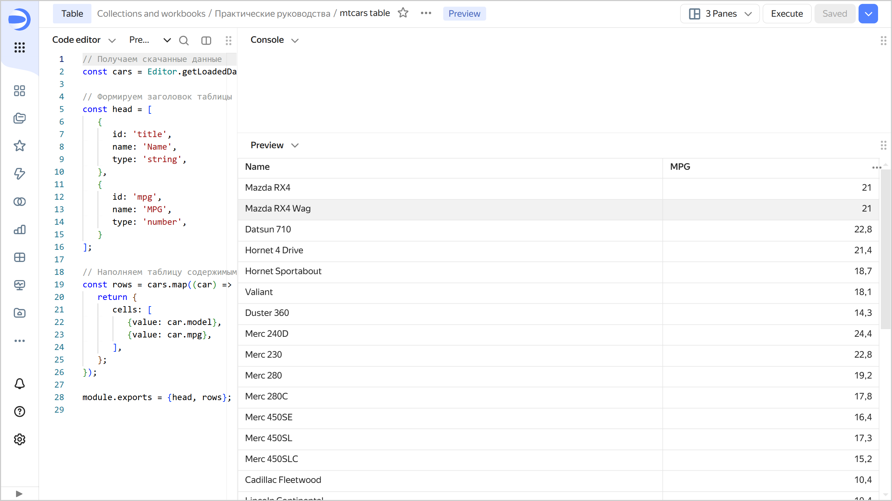

# Building a table based on API Connector





Follow this guide to build a table in Editor based on an API Connector connection.

You will use a static JSON file located at `https://storage.yandexcloud.net/datalens-public-demo-assets/data/mtcars.json` as your data source, but the process is similar for full-blown APIs.

## Getting started {#before-you-begin}



## Create a workbook {#create-workbook}

1. Go to the {{ datalens-short-name }} [home page]({{ link-datalens-main }}).
1. In the left-hand panel, select  **Collections and workbooks**.
1. In the top-right corner, click **Create** → **Create workbook**.
1. Enter a name for the [workbook](../../../workbooks-collections/index.md): `Tutorials`.
1. Click **Create**.

## Create an API Connector connection {#create-api-connector}

1. Navigate to the workbook created in the previous step and click **Create** → **Connection**.

1. Under **Files and services**, select **API Connector**.

1. Configure the connection as follows:

   * **Host name**: `storage.yandexcloud.net`.
   * **Port**: `443`.
   * **URL path**: `datalens-public-demo-assets/data/`.

   Leave the other parameters unchanged. 
   
1. Click **Create connection**. Enter a connection name and click **Create**.

1. Go to the `Tutorials` workbook and find the new connection on the **Connections** tab.

1. Copy the connection ID by clicking  → **Copy ID** next to it. The ID will be copied to the clipboard.

## Create a chart in Editor {#create-chart}

1. In the workbook, click **Create** → **Chart in Editor** in the top-right corner. On the page that opens, select the **Table** visualization type.

1. Link the chart with the connection by navigating to the **Meta** tab and adding the connection ID to `links`:

   ```javascript
   {
       "links": {
   	     "mtcars": "<connection_ID>"
       }
   }
   ```

   Where:
   * `<connection_ID>`: Connection ID copied in the previous step.
   * `mtcars`: Any alias name you assign to the connection and use to request chart data from the source.

   
   
   You need the **Meta** tab to describe service information about the list of related entities. This information is used to detect what connections and datasets the chart is related to, as well as for the related objects dialog, when copying a workbook and when publishing to Public.

   

1. Get data from the data source. To do this, go to the **Source** tab and specify:

   ```javascript
   module.exports = {
       mtcars: {

		   // Indicate which connection to go to for data
		   // Use the name given to the connection on the Meta tab
           apiConnectionId: Editor.getId("mtcars"),

		   // Specify the path to the API method/page in the source
           path: "/mtcars.json",

		   // Request method
           method: "GET",
       }
   };
   ```

1. Clear the contents of the **Config** tab: it contains a template that is not relevant to our example.

1. On the **Prepare** tab, create a table:

   ```javascript
   // Get the downloaded data
   const cars = Editor.getLoadedData().mtcars.data.body.cars;

   // Form the table header and describe the column types
   const head = [
      {
         id: 'title',
         name: 'Name',
         type: 'string',
      },
      {
      	id: 'mpg',
      	name: 'MPG',
      	type: 'number',
      }
   ];

   // Populate the table
   const rows = cars.map((car) => {
      return {
         cells: [
            {value: car.model},
            {value: car.mpg},
         ],
      };
   });

   module.exports = {head, rows};
   ```

1. At the top of the chart, click **Run**. The preview area will display a simple table displaying the data received from the JSON API.

   

1. To save a chart, click **Save** in the top-right corner and enter a name for the chart.