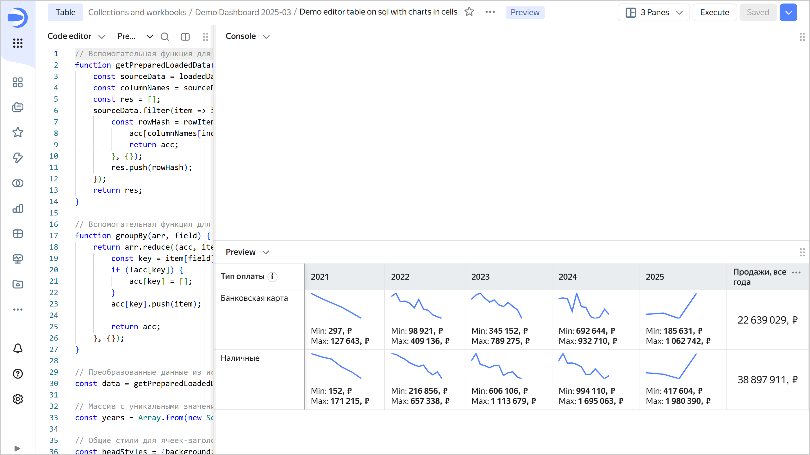

# Building a table based on an SQL query to the data source





Follow this guide to build a table based on an SQL query to the data source in Editor. For convenience, we will use the connection and dataset from the deployed demo workbook as the data source.

## Getting started {#before-you-begin}



## Deploy a demo workbook {#create-template}


1. Deploy a demo workbook titled [Demo Dashboard](https://datalens.yandex.cloud/marketplace/f2eui5ar8omalpcg1j3r) from the [marketplace](../../../operations/marketplace/add-marketplace-product.md).


1. Go to the deployed workbook and on the **Connections** tab, find the connection named `00: Demo Dashboard. Connection`.

1. Copy the connection ID by clicking  → **Copy ID** next to it. The ID will be copied to the clipboard.

### Create a chart in Editor {#create-chart}

1. In the workbook, click **Create** → **Chart in Editor** in the top-right corner. On the page that opens, select the **Table** visualization type.

1. Link the chart with the connection by navigating to the **Meta** tab and adding the connection ID to `links`:

   ```javascript
   {
       "links": {
           "demoConnection": "<connection_ID>"
       }
   }
   ```

   Where:
   * `<connection_ID>`: Connection ID copied in the previous step.
   * `demoConnection`: Any alias name you assign to the connection and use to request chart data from the source.

   
   
   You need the **Meta** tab to describe service information about the list of related entities. This information is used to detect what connections and datasets the chart is related to, as well as for the related objects dialog, when copying a workbook and when publishing to Public.

   

1. Get data from the data source: to do this, open the **Source** tab and specify:

   ```javascript
   module.exports = {
       'salesSourceData': {
           qlConnectionId: Editor.getId('demoConnection'),
           data: {
               sql_query: `
               SELECT
                   t1."PaymentType" AS PaymentType,
                   toYear(toDate(t1."OrderDatetime")) AS OrderYear,
                   toStartOfInterval(toDate(toDate(t1."OrderDatetime")), interval 1 month) AS OrderMonth,
                   sum(toFloat64(t1."Price")) AS PriceSum
               FROM samples."MS_SalesFacts_up" AS t1
               GROUP BY PaymentType, OrderYear, OrderMonth
               LIMIT 1000001`,
           },
       },
   };
   ```

   `salesSourceData`: An arbitrary alias name you assign to the object with requested chart data, used for access on the **Prepare** tab.

   The `sql_query` field describes the query to the connection data source.

1. Clear the contents of the **Params** and **Config** tabs: they contain a template that is not relevant to our example.

1. On the **Prepare** tab, create a table:

   ```javascript
   // Helper function to prepare source data in a more convenient format
   function getPreparedLoadedData(loadedData, sourceName) {
       const sourceData = loadedData[sourceName];
       const columnNames = sourceData.filter(item => item.event === 'metadata').map(item => item.data.names)?.[0] || [];
       const res = [];
       sourceData.filter(item => item.event === 'row').map(item => item.data).forEach(rowItem => {
           const rowHash = rowItem.reduce((acc, field, index) => {
               acc[columnNames[index]] = field;
               return acc;
           }, {});
           res.push(rowHash);
       });
       return res;
   }
   
   // Helper function to group data by a specified field name 
   function groupBy(arr, field) {
       return arr.reduce((acc, item) => {
           const key = item[field];
           if (!acc[key]) {
               acc[key] = [];
           }
           acc[key].push(item);
           
           return acc;
       }, {});
   }
   
   // Source data transformed into a convenient format
   const data = getPreparedLoadedData(Editor.getLoadedData(), 'salesSourceData');
   
   // Array containing unique values of the "OrderYear" field, sorted in ascending numerical order
   const years = Array.from(new Set(data.map(d => String(d['OrderYear'])))).sort();
   
   // Common styles for table header cells
   const headStyles = {background: 'var(--g-color-base-misc-light)', verticalAlign: 'middle'};
   
   // Table header cell configuration
   const head = [
       {
           name: 'Payment type',
           formattedName: Editor.generateHtml({
               tag: 'span',
               content: [
                   {tag: 'span', content: 'Payment type'},
   				// tooltip for a cell header
                   {
                       tag: 'dl-tooltip',
                       content: ' ℹ',
                       style: {
                           display: 'inline-block',
                           margin: '0px 0px 0px 4px',
                           'line-height': '12px',
                           'text-align': 'center',
                           width: '16px',
                           height: '16px',
                           border: '1px solid #ccc',
                           'border-radius': '50%',
                       },
                       attributes : {
                           'data-tooltip-content': {
                               tag: 'i',
                               content: 'Tooltip content',
                           },
                       },
                   }
               ],
           }),
           css: headStyles,
           pinned: true,
       },
       // Creating columns based on the array of values from the "OrderYear" field obtained earlier
       ...years.map(year => ({
           name: year,
           css: headStyles,
       })),
       {
           name: 'Sales, all years',
           css: headStyles,
       },
   ];
   
   // Helper function to render a chart line
   function createChart(chartData) {
       const chartWidth = 80;
       const chartHeight = 40;
   
       // Calculating the minimum and maximum coordinate values
       const minX = Math.min(...chartData.map(d => d.x));
       const maxX = Math.max(...chartData.map(d => d.x));
       const minY = Math.min(...chartData.map(d => d.y));
       const maxY = Math.max(...chartData.map(d => d.y));
   
       // Calculating coordinates based on the chart container dimensions (chartWidth, chartHeight)
       const coords = chartData.sort((d1, d2) => d1.x - d2.x).map(d => ([
           (d.x - minX) / (maxX - minX) * chartWidth, 
           (d.y - minY) / (maxY - minY) * chartHeight,
       ]));
       // Creating a path for the SVG line using the coordinates generated above
       let d = "";
       coords.forEach((_, x) => {
           d += d === "" ? "M" : " L";
           d += `${coords[x][0]} ${coords[x][1]}`;
       });
       // Creating an SVG with var(--g-color-base-brand) for line color and thickness of 2px
       return `
           <svg width="${chartWidth}" height="${chartHeight}">
               <path 
                   d="${d}" 
                   style="fill: none; stroke: var(--g-color-base-brand); stroke-width: 2;"
               />
           </svg>`;
   }
   
   const rows = [];
   
   // Helper function for number formatting
   const formatSalesValue = new Intl.NumberFormat('ru-RU').format;
   const postfix = ', ₽';
   
   // Rows grouped by the "PaymentType" field
   const groupedData = groupBy(data, 'PaymentType');
   
   // Generating and populating table rows for each grouped payment type (based on the PaymentType field value)
   Object.entries(groupedData).forEach(([key, items]) => {
       // Rows grouped by the "OrderYear" field
       const salesByYears = groupBy(items, 'OrderYear');
       // Calculating the sum for the "PriceSum" field across all years (based on OrderYear)
       const totalSales = items.reduce((sum, d) => sum + d['PriceSum'], 0);
       rows.push({
           cells: [
               {
                   value: key,
               },
               // Creating columns based on previously prepared "OrderYear" values
               ...years.map(year => {
                   const salesByYear = salesByYears[year] ?? [];
                   const yearSales = salesByYear.map(d => ({
                       x: new Date(d['OrderMonth']).getTime(), 
                       y: d['PriceSum'],
                   }));
                   const maxSales = Math.max(...salesByYear.map(d => d['PriceSum']));
                   const minSales = Math.min(...salesByYear.map(d => d['PriceSum']));
   
                   return {
                       value: maxSales, 
                       formattedValue: Editor.generateHtml(`
                           <div>
                               ${createChart(yearSales)}
                               <div style="margin-top: 8px;">Min: <b>${formatSalesValue(minSales)}${postfix}<b></div>
                               <div>Max: <b>${formatSalesValue(maxSales)}${postfix}</b></div>
                           </div>
                       `),   
                   };
               }),
               {
                   value: totalSales,
                   formattedValue: formatSalesValue(totalSales) + postfix,
                   css: {
                       verticalAlign: 'middle',
                       textAlign: 'center',
                       fontSize: '16px',
                   },
               },
           ],
       });
   });
   
   module.exports = {head, rows};
   ```

1. At the top of the chart, click **Run**. The preview will show the connection as a table with rows grouped by the **PaymentType** field and columns grouped by the **OrderYear** field, along with a monthly sales chart:

    

1. To save a chart, click **Save** in the top-right corner and enter a name for the chart.