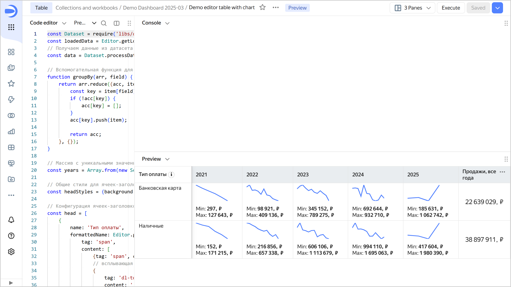

# Building a table based on a dataset



Follow this guide to build a table in Editor based on a dataset. For convenience, we will use a connection and dataset from a deployed demo workbook as the data source.

## Getting started {#before-you-begin}



## Deploy a demo workbook {#create-template}

1. Deploy a demo workbook titled [Demo Dashboard](https://datalens.yandex.cloud/marketplace/f2eui5ar8omalpcg1j3r) from the [marketplace](../../../operations/marketplace/add-marketplace-product.md).

1. Go to the workbook you deployed and find a dataset named `00: Sales` on the **Datasets** tab.

1. Copy the dataset ID by clicking  → **Copy ID** next to it. The ID will be copied to the clipboard.

## Create a chart in Editor {#create-chart}

1. In the workbook, click **Create** → **Chart in Editor** in the top-right corner. On the page that opens, select the **Table** visualization type.

1. Link the chart with the dataset by navigating to the **Meta** tab and adding the connection ID to `links`:

   ```javascript
   {
       "links": {
           "salesDataset": "<dataset_ID>"
   	   }
   }
   ```

   Where:
   * `<dataset_ID>`: Dataset ID copied in the previous step.
   * `salesDataset`: Any alias name you assign to the dataset and use to request chart data from the source.

   
   
   You need the **Meta** tab to describe service information about the list of related entities. This information is used to detect what connections and datasets the chart is related to, as well as for the related objects dialog, when copying a workbook and when publishing to Public.

   

1. Get data from the data source by opening the **Source** tab and specifying the following:

   ```javascript
   const {buildSource} = require('libs/dataset/v2');
   module.exports = {
       'salesSourceData': buildSource({
           datasetId: Editor.getId('salesDataset'),
           columns: ['Payment type', 'Request year', 'Request month', 'Sale, ₽'],
       }),
   };
   ```

   `salesSourceData`: Any alias name you assign to the object with requested chart data and use for access on the **Prepare** tab.

   The `columns` field value lists the fields from the dataset.

   
   
   In this example, the `const {buildSource} = require('libs/dataset/v2');` service module is used to make operations with datasets more convenient.

   

1. Clear the contents of the **Params** and **Config** tabs: they contain a template that is not relevant to our example.

1. On the **Prepare** tab, create a table:

   ```javascript
   const Dataset = require('libs/dataset/v2');
   const loadedData = Editor.getLoadedData();
   // Getting data from the dataset in a convenient format using the service module
   const data = Dataset.processData(loadedData, 'salesSourceData', Editor);
   
   // Helper function to group data by a specified dataset field name 
   function groupBy(arr, field) {
       return arr.reduce((acc, item) => {
           const key = item[field];
           if (!acc[key]) {
               acc[key] = [];
           }
           acc[key].push(item);
           
           return acc;
       }, {});
   }
   
   // Array containing unique values of the "Order year" field, sorted in ascending numerical order
   const years = Array.from(new Set(data.map(d => String(d['Order year'])))).sort();
   
   // Common styles for table header cells
   const headStyles = {background: 'var(--g-color-base-misc-light)', verticalAlign: 'middle'};
   
   // Configuration of table header cells
   const head = [
       {
           name: 'Payment type',
           formattedName: Editor.generateHtml({
               tag: 'span',
               content: [
                   {tag: 'span', content: 'Payment type'}
   				// tooltip for cell header
                   {
                       tag: 'dl-tooltip',
                       content: ' ℹ',
                       style: {
                           display: 'inline-block',
                           margin: '0px 0px 0px 4px',
                           'line-height': '12px',
                           'text-align': 'center',
                           width: '16px',
                           height: '16px',
                           border: '1px solid #ccc',
                           'border-radius': '50%',
                       },
                       attributes : {
                           'data-tooltip-content': {
                               tag: 'i',
                               content: 'Tooltip content',
                           },
                       },
                   }
               ],
           }),
           css: headStyles,
           pinned: true,
       },
       // Creating columns based on the array of values from the "Order year" field obtained earlier
       ...years.map(year => ({
           name: year,
           css: headStyles,
       })),
       {
           name: 'Sales, all years',
           css: headStyles,
       },
   ];
   
   // Helper function to render a chart line
   function createChart(chartData) {
       const chartWidth = 80;
       const chartHeight = 40;
   
       // Calculating the minimum and maximum coordinate values
       const minX = Math.min(...chartData.map(d => d.x));
       const maxX = Math.max(...chartData.map(d => d.x));
       const minY = Math.min(...chartData.map(d => d.y));
       const maxY = Math.max(...chartData.map(d => d.y));
   
       // Calculating coordinates based on the chart container dimensions (chartWidth, chartHeight)
       const coords = chartData.sort((d1, d2) => d1.x - d2.x).map(d => ([
           (d.x - minX) / (maxX - minX) * chartWidth, 
           (d.y - minY) / (maxY - minY) * chartHeight,
       ]));
       // Creating a path for the SVG line using the coordinates generated above
       let d = "";
       coords.forEach((_, x) => {
           d += d === "" ? "M" : " L";
           d += `${coords[x][0]} ${coords[x][1]}`;
       });
       // Creating an SVG with line color var(--g-color-base-brand) and thickness 2px
       return `
           <svg width="${chartWidth}" height="${chartHeight}">
               <path 
                   d="${d}" 
                   style="fill: none; stroke: var(--g-color-base-brand); stroke-width: 2;"
               />
           </svg>`;
   }
   
   const rows = [];
   
   // Helper function for number formatting
   const formatSalesValue = new Intl.NumberFormat('ru-RU').format;
   const postfix = ', ₽';
   
   // Rows grouped by the "Payment type" field
   const groupedData = groupBy(data, 'Payment type');
   // Generating and populating table rows for each grouped payment type
   Object.entries(groupedData).forEach(([key, items]) => {
       // Rows grouped by the "Order year" field
       const salesByYears = groupBy(items, 'Order year');
       // Calculating the sum for the "Sale, ₽" field across all years 
       const totalSales = items.reduce((sum, d) => sum + d['Sale, ₽'], 0);
       rows.push({
           cells: [
               {
                   value: key,
               },
               // Creating columns based on previously prepared "Order year" values
               ...years.map(year => {
                   const salesByYear = salesByYears[year] ?? [];
                   const yearSales = salesByYear.map(d => ({
                       x: new Date(d['Order month']).getTime(), 
                       y: d['Sale, ₽'],
                   }));
                   const maxSales = Math.max(...salesByYear.map(d => d['Sale, ₽']));
                   const minSales = Math.min(...salesByYear.map(d => d['Sale, ₽']));
   
                   return {
                       value: maxSales, 
                       formattedValue: Editor.generateHtml(`
                           <div>
                               ${createChart(yearSales)}
                               <div style="margin-top: 8px;">Min: <b>${formatSalesValue(minSales)}${postfix}<b></div>
                               <div>Max: <b>${formatSalesValue(maxSales)}${postfix}</b></div>
                           </div>
                       `),   
                   };
               }),
               {
                   value: totalSales,
                   formattedValue: formatSalesValue(totalSales) + postfix,
                   css: {
                       verticalAlign: 'middle',
                       textAlign: 'center',
                       fontSize: '16px',
                   },
               },
           ],
       });
   });
   
   module.exports = {head, rows};
   ```

1. At the top of the chart, click **Run**. The preview will show the dataset as a table with rows grouped by the **Payment type** field and columns grouped by the **Order year** field, along with a monthly sales chart:

   

1. To save the chart, click **Save** in the top-right corner and enter a name for the chart.