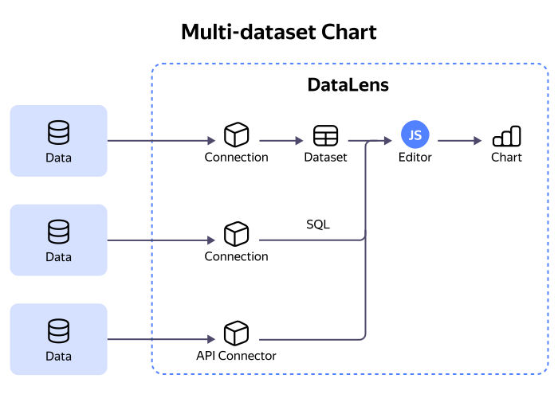

# Data sources in {{ datalens-full-name }} Editor

## Source types {#source-types}

You can get data from any of the following sources:

* [Dataset](./tabs.md#sources-dataset)
* [Connection to databases via an SQL query](./tabs.md#sources-database)
* [Connection via API Connector](./tabs.md#sources-api-connector)

For more information, see [Sources](./tabs.md#sources).

Editor supports multiple data sources.

## Limitations {#limits}

There are limits on the size and time of data loading:

* 100 MB: Maximum total size of data from all sources per request.
* 50 MB: Maximum data size per individual source.
* 95 seconds: Timeout for loading data from all sources per request.
* 95 seconds: Timeout for loading data from a single source.
* 10 seconds: Maximum execution time for the [Prepare](./tabs.md#prepare) tab.

These limits ensure stable operation of the service and data sources.