# Aggregations in {{ datalens-short-name }}

This section describes how data aggregation and grouping work in {{ datalens-short-name }}, how to correctly formulate expressions with aggregations, and also gives examples of SQL queries with aggregations for {{ CH }}.

{{ datalens-short-name }} accesses the source directly: it sends requests to select data using the SQL dialect of the source database. The request is formed based on the fields used in charts and the functions used in those fields. So, if you understand the basic principles of aggregation in SQL, it will be easier for you to deal with aggregate functions in {{ datalens-short-name }}.

As source data, we will use the [Selling.csv](https://storage.yandexcloud.net/doc-files/Selling.csv) file with the data on sales in cities.

## SQL basic concepts {#basic-sql}

### What is aggregation? {#what-is-aggregation}

Let's take a look at the `Selling` table with data on sales in cities:

| # | City | Category | Date | Sales | Profit | Day's discount |
| --- | --- | --- | --- | --- | --- | --- |
| 1 | Detroit | Office Supplies | 2014-01-02 |  10 | 7 | 0.05 |
| 2 | Portland | Office Supplies | 2014-04-05 | 14 | 10 | 0.00 |
| 3 | Portland | Office Supplies | 2014-01-21 | 20 | 12 | 0.20 |
| 4 | San Francisco | Office Supplies | 2014-03-11 | 8 | 3 | 0.10 |
| 5 | Detroit | Furniture | 2014-01-01 | 12 | 3 | 0.00 |
| 6 | Portland | Furniture | 2014-01-21 | 7 | 2 | 0.05 |
| 7 | San Francisco | Technology | 2014-01-02 | 7 | 3 | 0.10 |
| 8 | San Francisco | Technology | 2014-01-17 | 13 | 5 | 0.20 |

Aggregation is used to calculate resulting values. Aggregation process essentially means converting a large set of strings into a single value. In SQL, special aggregate functions are used for this. The most common functions include `SUM`, `MIN`, `MAX`, `AVG`, and `COUNT`. Each of these functions operates on values of a table column and returns a single value as a result. For example, the `SUM` function returns the sum of all the column values, `AVG`, the average value, and `MAX`, the highest value.

There are two ways to use aggregate functions:

* Aggregate functions return the resulting value for a [single group](#aggregation-without-group-by).
* Aggregate functions return the resulting value for [multiple groups](#aggregation-with-group-by).

### Aggregation for a single group {#aggregation-without-group-by}

In this case, aggregate functions calculate and return a single resulting value for all rows that are combined into a single group.

For example, to get the sum of `Sales` column values from the `Selling` table, you need to run the following query:

```sql
SELECT
    sum("Sales")
FROM "Selling"
```

Result:

| Sales |
| --- |
| 91 |

### Aggregation for multiple groups {#aggregation-with-group-by}

In this case, the entire set of rows returned by the query is split into separate groups. The group is determined by the value of the column for which the grouping is performed. In this way, aggregate functions calculate and return the resulting value separately for each group.

In SQL, the columns for grouping are specified in the `GROUP BY` section. Grouping can be performed either by one or several columns.

**Examples**

Calculating the sales amount for each city:

```sql
SELECT
    "City",
    sum("Sales")
FROM "Selling"
GROUP BY "City"
```

Result:

| City | Sales |
| --- | --- |
| Detroit | 22 |
| Portland | 41 |
| San Francisco | 28 |

Calculating the sales amount for each city and product category:

```sql
SELECT
    "City",
    "Category",
    sum("Sales")
FROM "Selling"
GROUP BY "City","Category"
```

Result:

| City | Category | Sales |
| --- | --- | --- |
| Detroit | Office Supplies | 10 |
| Portland | Office Supplies | 34 |
| San Francisco | Office Supplies | 8 |
| Detroit | Furniture | 12 |
| Portland | Furniture | 7 |
| San Francisco | Technology | 20 |

### Limitations {#sql-invalid-expressions}

When aggregating with grouping by several groups, keep in mind the following limitations:

* Specify the columns used for selection in the `GROUP BY` section:

    

    - Correct

        ```sql
        SELECT
            "City",
            sum("Sales")
        FROM "Selling"
        GROUP BY "City"
        ```

    - Incorrect

        ```sql
        SELECT
            "City",
            sum("Sales")
        FROM "Selling"
        GROUP BY "Category"
        ```

    

* Aggregated and non-aggregated expressions cannot be used at the same query level:

    

    - Correct

        ```sql
        SELECT
            "City",
            sum("Sales") as "Detroit Sales"
        FROM "Selling"
        WHERE "City" = 'Detroit'
        GROUP BY "City"

    - Incorrect

        ```sql
        SELECT
            if("City" = 'Detroit', sum("Sales"), 0) as "Detroit Sales"
        FROM "Selling"
        GROUP BY "Category"
        ```

    

### Filtering {#aggregation-with-filter}

You can apply filtering in queries with grouping and aggregate functions. You can filter both the original pre-aggregation set of rows and the resulting values calculated by aggregate functions.

The filtering conditions for the original set of rows are specified in the `WHERE` section:

```sql
SELECT
    "City",
    sum("Sales")
FROM "Selling"
WHERE "Category" = 'Furniture'
GROUP BY "City"
```

Result:

| City | Sales |
| --- | --- |
| Detroit | 12 |
| Portland | 7 |

To filter aggregated values, specify a condition in the `HAVING` section. In this case, the query returns only those rows in which the resulting value of the aggregate function satisfies the specified condition:

```sql
SELECT
    "City",
    "Category",
    sum("Sales")
FROM "Selling"
GROUP BY "City","Category"
HAVING sum("Sales") >= 10
```

Result:

| City | Category | Sales |
| --- | --- | --- |
| Detroit | Office Supplies | 10 |
| Portland | Office Supplies | 34 |
| Detroit | Furniture | 12 |
| San Francisco | Technology | 20 |

## Data aggregation in {{ datalens-short-name }} {#datalens-aggregation}

### Dimensions and measures {#dimensions-and-measures}

In {{ datalens-short-name }}, aggregation is performed using dimensions and measures.

[Measure](../dataset/data-model.md#field): A dataset field with a specified aggregation type (for example, sum, average, or quantity). In the dataset and in the wizard, measures are displayed in blue. Usually, a measure is a business metric scrutinized by different slices or groupings, such as revenue, number of customers, or average customer bill.

[Dimension](../dataset/data-model.md#field): A dataset field without the specified aggregation, such as a region, a product, or category. In the dataset and in the wizard, dimensions are displayed in green. Dimensions are used to group a query in the chart (the GROUP BY section in SQL). To group data in the chart, you need to drag the dimension to the desired section.

### Methods to create measures {#create-measure}

You can add measures both at the dataset and the chart level. We recommend adding dimensions at the dataset level. This allows you to reuse them in different charts and speed up chart rendering.

#### Creating measures at the dataset level {#add-measure-in-dataset}

You can add a measure at the dataset level in the following ways:

  * In the dataset creation interface, open the **Fields** tab and select the aggregation type for the field in the **Aggregation** column.

      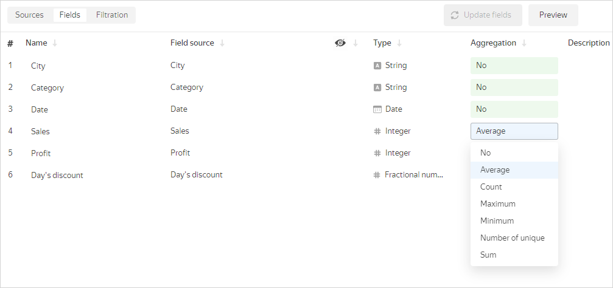

  * In the data creation interface, add a [calculated field](calculations/index.md) using [aggregate functions](../function-ref/aggregation-functions.md). For more information, see [{#T}](calculations/index.md#how-to-create-calculated-field). In the formula of the calculated field, you can [substitute](#substituting-fields) other measures.

      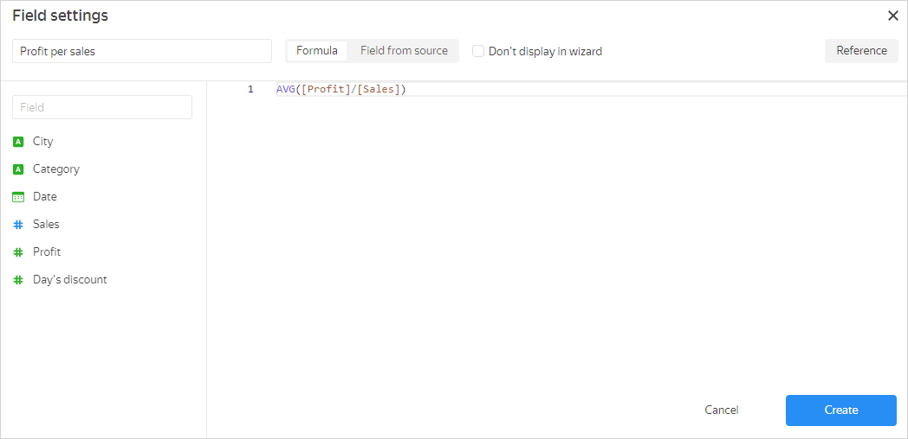

      When you create a calculated field using an aggregate function, it is assigned the **Auto** aggregation type, which cannot be changed.

#### Creating measures at the chart level {#add-measure-in-chart}

You can add a measure at the chart level in the following ways:

  * In the wizard, drag the dimension to the section for measures and select the aggregation type. The field color will change from green to blue.

      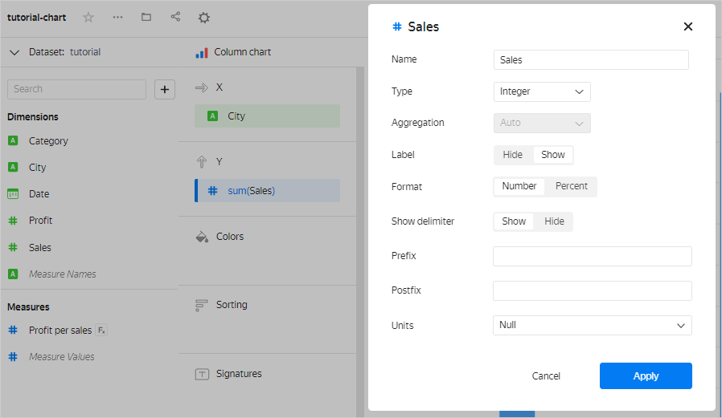
  
  * In the wizard, add a [calculated field](calculations/index.md) using [aggregate functions](../function-ref/aggregation-functions.md). For more information, see [{#T}](calculations/index.md#how-to-create-calculated-field). In the formula of the calculated field, you can [substitute](#substituting-fields) other measures.

Measures can consist of more than one aggregate function and have more complex expressions. For example, in this chart, to calculate the average sales amount for the day, we use the `Sales per day` measure calculated using the `SUM([Sales])/COUNTD([Date])` formula.

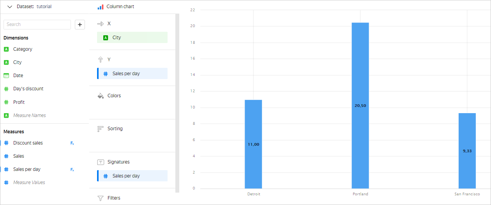

### Using dimensions and measures in charts {#aggregation-in-charts}

When building any chart in {{ datalens-short-name }}, data is grouped and aggregated.
Let's look at the [Selling](#what-is-aggregation) table, where we need to calculate the sales amount (`Sales`) for all dates (`Date`) separately for each city (`City`). To do this, you need to group the data by the `City` field. Rows are grouped in such a way that each `City` value occupies one row. All source rows where the `City` values match and are equal form a group of rows. As a result, you will get three groups to sum up the `Sales` value for: 

* The `Detroit` group will include rows 1 and 5. 
* The `Portland` group will include rows 2, 3, and 6.
* The `San Francisco` group will include rows 4, 7, and 8.

For example, in the **Column chart**, the result will be as follows:

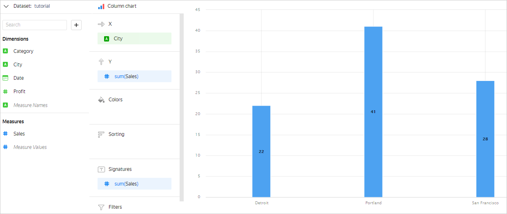

You can group by several fields rather than one. In this case, each row is defined by a set of values of all fields by which grouping is performed. There will be as many rows in the final result as there are unique sets of such values.
For example, if you add the `Category` field to the **Colors** section, it will affect grouping. The chart will look as follows:

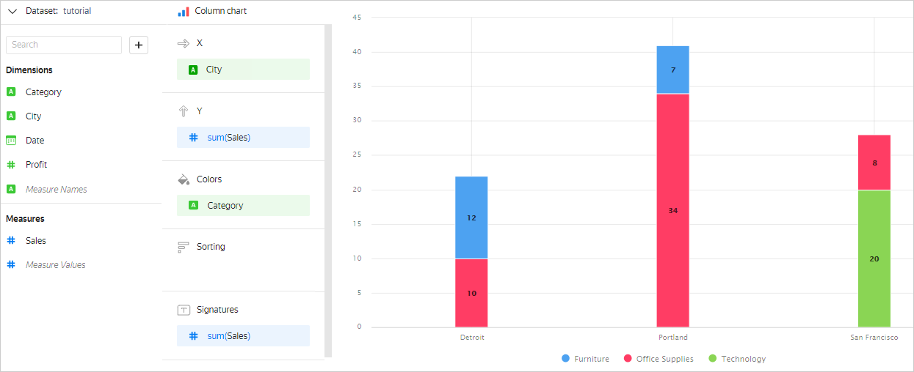



Measures in the **Colors** section also affect data grouping.



In some chart sections, you can drag only a dimension or only a measure. This depends on the [chart type](../visualization-ref/index.md). For example, in the **Y** section of the [Column chart](../visualization-ref/bar-chart.md), you can only drag a measure. If you drag a dimension to this section, it will be automatically converted to a measure as a result of the **Number of unique** aggregation.

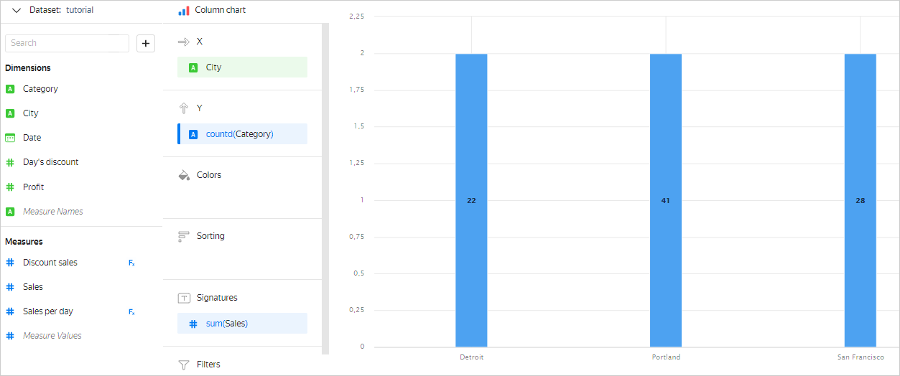

### Expression limitations {#datalens-invalid-expressions}

Like in SQL, in {{ datalens-short-name }}, you cannot use aggregated and non-aggregated values in the same expression.

For example, in the chart with groupings by the `City` and `Category` dimensions, you cannot add the `SUM([Sales]) * (1 - [Day's discount])` measure to calculate the sales amount including discount. In this case, the `City` and `Category` dimensions determine group breakdown, and therefore have fixed values in each group. For each group, you can calculate the `SUM([Sales])` value. However, the `Day's discount` field is neither an aggregation nor a dimension within the group. It does not have a fixed value and may vary from row to row in the group. Therefore, it is impossible to determine which specific `Day's discount` value to use for calculating the `SUM([Sales]) * (1 - [Day's discount])` measure for each group. This means the `SUM([Sales]) * (1 - [Day's discount])` expression cannot be calculated. In {{ datalens-short-name }}, you will get the `Inconsistent aggregation among operands` error in such cases.

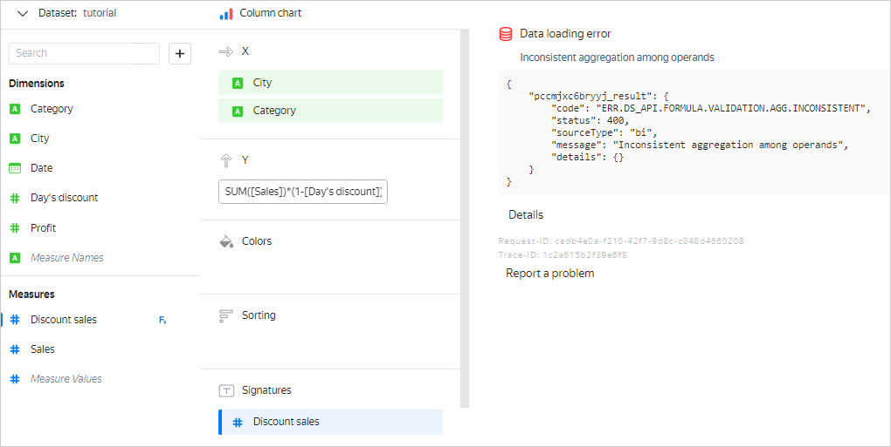

You can prevent this error in different ways:

  * Add the `Day's discount` field to the dimension section. In this case, data is grouped by the `City`, `Category`, and `Day's discount` dimensions, so a fixed `Day's discount` value is used in each group to calculate the value of the `SUM([Sales]) * (1 - [Day's discount])` measure.

      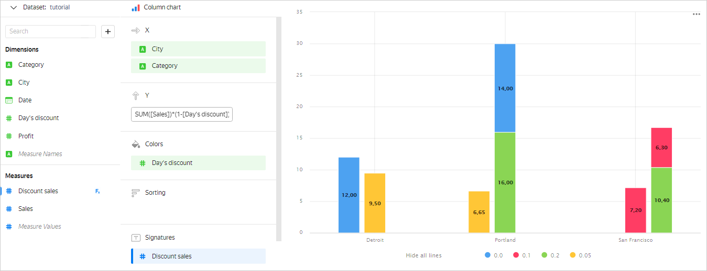

  * Specify the aggregation type for the `Day's discount` field. In this case, this field will become a measure and the original formula will be correct.

      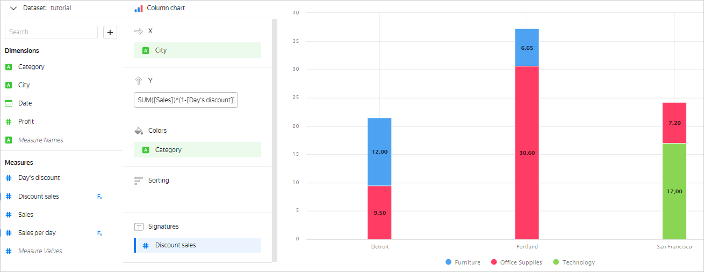

### Filtering dimensions and measures {#set-fiter}

In charts, you can filter the values of dimensions and measures. To do this, drag a dimension or a measure to **Filters** and set filtering conditions:

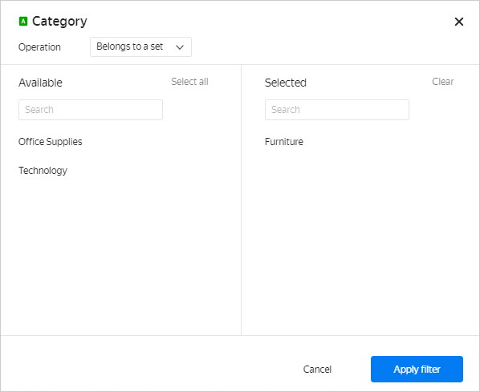

**Examples**

Sales by city in the `Furniture` category:

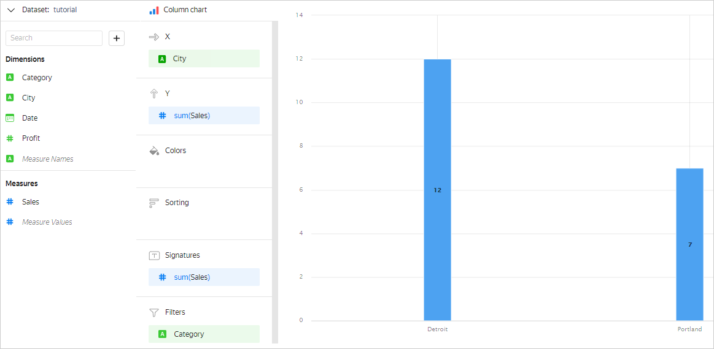

Sales by city and category, where the `SUM([Sales])` measure is greater than or equal to 10:

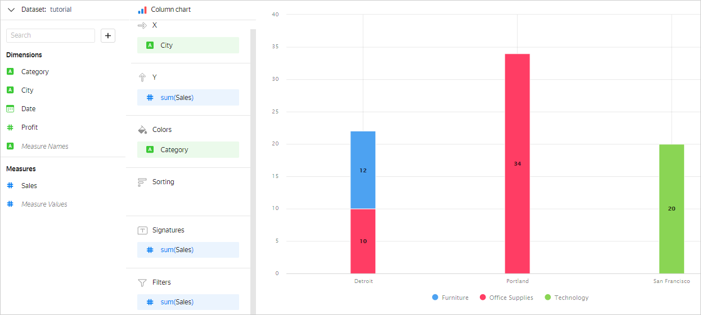

### Substituting fields {#substituting-fields}

When creating calculated fields in a formula, you can use pre-existing measures. These measures can be set either using a formula or the dataset creation interface. The created calculated field is assigned the **Auto** aggregation type.

**Example 1**

The `[TotalSales]` field is set using the `SUM([Sales])` aggregate function. Then the `[TotalSales]/10` calculated field will have the **Auto** aggregation type.

If the measure set using the dataset creation interface is substituted in the calculated field, you can redefine the aggregation type. To do this, use a function with a different aggregation type in the formula.

**Example 2**

The aggregation type for the `[Sales]` field in the dataset creation interface is **Amount**. In this case, the `AVG([Sales])` calculated field is assigned the **Auto** aggregation type and calculated as an average. The **Amount** aggregation will be ignored.


