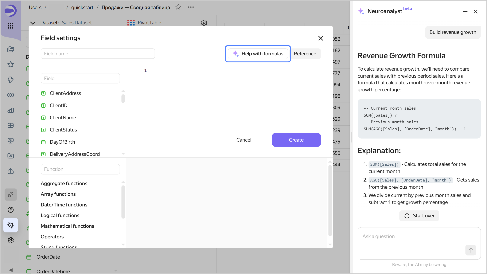

# Neuroanalyst for creating calculated fields



This feature is at the Beta testing stage.





Neuroanalyst streamlines the creation and editing of calculated fields. It is available in the calculated field constructor at the chart and dataset levels. You can use it to:

* Quickly write a new formula.
* Extend an existing formula.
* Navigate the complex logic of a formula.

The context provided to Neuroanalyst includes:

* Current formula from the constructor.
* Dataset metadata.
* Function reference.
* Examples of calculated fields.

To enable Neuroanalyst in a dataset or chart:

1. Open the field with the formula or add a new one.
1. Click **Help with formulas** to open the **Neuroanalyst** tab on the right.

   * Select a question or ask your own to search for in the documentation.
   * Ask a question about the current dataset, e.g., _revenue growth rate_. Neuroanalyst will give a detailed response and suggest possible solutions and code snippets.

   

   

   

   Request examples:

   * Build a regular expression that will return all the digits from the _Application number_ field.
   * Calculate the revenue growth rate.
   * Color the negative values red and the positive ones, green.
   * Explain how the current formula works.