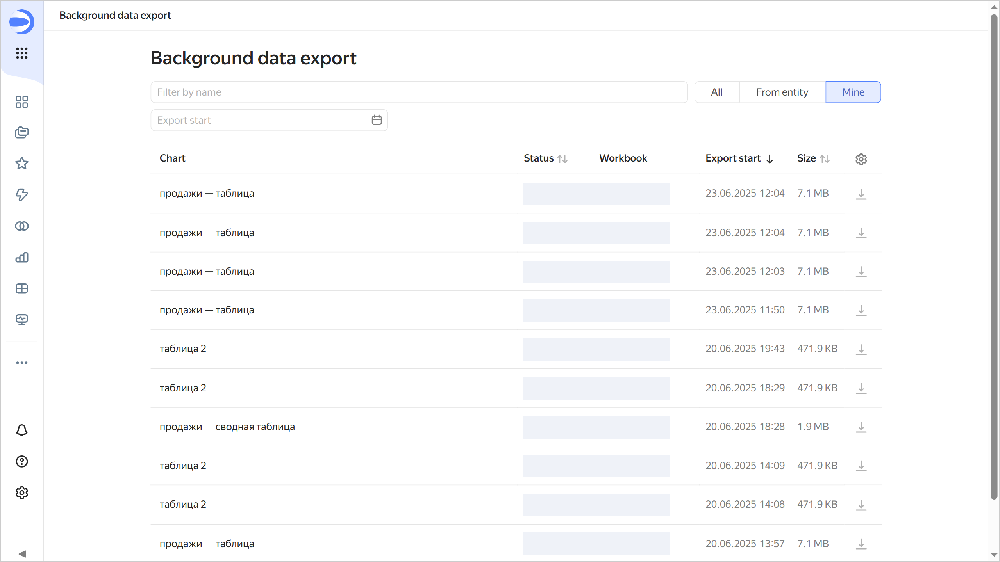
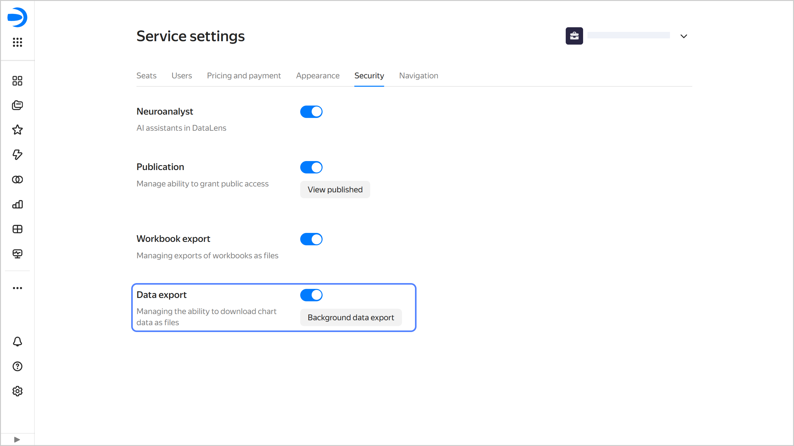
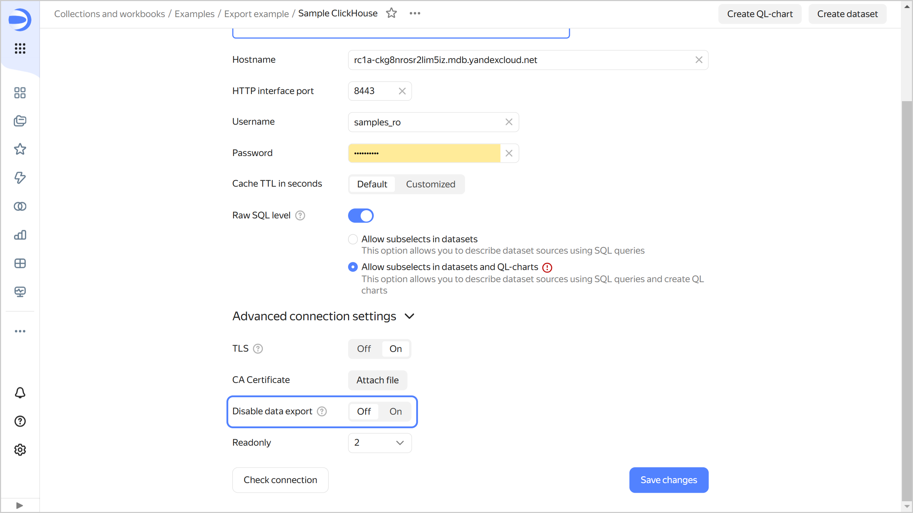
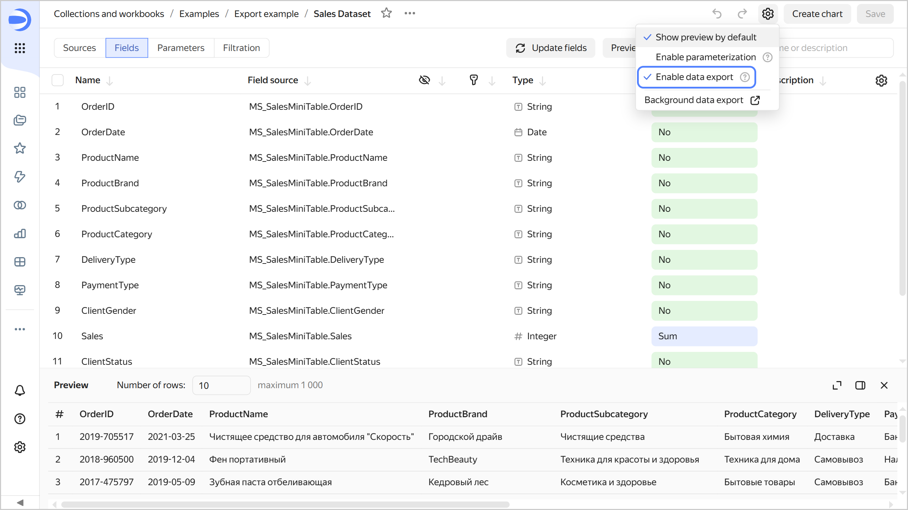

# Exporting data from charts

In {{ datalens-short-name }}, you can export data from charts:

* [Direct export of data](#save-data) displayed on the chart (within [display limits](../limits.md#datalens-chart-data-limits)):

  * Available for all chart types other than maps.

    * In tables with pagination enabled, exports only the current page data.
    * For graphs, exports the already aggregated data the chart is built based on.

  * The following formats are available:

    * `XLSX`
    * `CSV`
    * `Markdown` (copied to clipboard)

  * File upload begins immediately.

* [Background data export](#background-export) with extended limits of up to 1 GB:

  * Available only for paginated [Tables](../../visualization-ref/table-chart.md) created in the [wizard](./dataset-based-charts.md). Exports data from all the table's pages.
  * Format: `CSV` file.
  * First, the file is generated in the background, then a download link is created. File preparation takes up to 30 minutes.

Any user with access permissions for a chart can export its data unless you [disable data export](#disable-export).

## Direct data export from chart {#save-data}

To export the data displayed on the chart:

1. Open the data export window by doing one of the following:
   
   * Open the chart you want to export data from and click  →  **Save as** in its top-right corner.
   * On the dashboard, find the chart for data export and click  →  **Save as** in its top-right corner.

1. Select the format and download settings, then click **Save**.

   

   If you see two tabs named **Current page** and **All pages** in the window that opens when you select the `CSV` format, remain on the **Current page** tab. The **All pages** tab is reserved for [background export](#background-export).
  
   

The data file will be generated immediately and downloaded in your browser. The maximum export file size is 50 MB.

## Background data export {#background-export}

* [Limitations](#restrictions)
* [Exporting data in background](#how-to-background-export)
* [Export page](#export-page)
* [Export history](#data-export-history)

Before initiating a background data export, make sure that:

* Export is not [disabled](#data-export-disable) at the {{ datalens-short-name }} instance level or  connection or dataset level.
* The user has the `{{ permission-execute }}` permission for both the connection and dataset used to create the chart with the data you want to export.

### Limitations {#restrictions}

The following limitations apply to the background export:

* Not supported for [QL charts](./ql-charts.md), charts created in [Editor](../../charts/editor/index.md), or [non-publicly embedded](../../security/private-embedded-objects.md) charts.
* Not supported for [multi-dataset charts](../data-join.md#datasets-chart).
* Not available in [pivot tables](../../visualization-ref/pivot-table-chart.md).
* Table [pagination](./settings.md#common-settings) must be enabled.
* Minimum number of pages to export is two.
* Maximum number of rows in the table is 1,000,000.
* [Rows with totals](../../visualization-ref/table-chart.md#add-totals) and [tree hierarchy](../../dataset/data-types.md#how-to-create-tree) are not supported. You can export a tree hierarchy if pagination is disabled.

* The following connection types are not supported:

  * [{{ datalens-short-name }} Usage Analytics](../../operations/connection/create-usage-tracking.md)
  * [{{ speechsense-name }}](../../operations/connection/create-speechsense.md)
  * [{{ yandex-cloud }} Billing](../../operations/connection/create-cloud-billing.md)

* Maximum export file size is 1 GB.
* File is available for download for 24 hours after the export is complete.

### Exporting data in background {#how-to-background-export}

To initiate a background export, do the following:

1. Open the data export window by doing one of the following:
   
   * Open the chart you want to export data from and click  →  **Save as** → **CSV** in its top-right corner.
   * On the dashboard, find the chart for data export and click  →  **Save as** → **CSV** in its top-right corner.

1. In the export window, under **Pages**, select `All`. Optionally, edit the following export file settings: **Value delimiter**, **Decimal separator**, and **Encoding**. You can also navigate to the list of exported data by clicking **Export history**.
1. Click **Save**. At the bottom of your screen, you will see a message saying that the export has started and a link to the [export page](#export-page), where you can monitor the export status and details. Once the export is complete, you will get the **Chart export complete** message with links to the export page and file for download.
  
  If the export fails, you will get an error message. Make sure that data export is not [disabled](#data-export-disable) for this chart at any level and the user has the required permissions, then try again.

The user who initiated the export can download the export file from the [data export history](#data-export-history) page. To download the file, the user must have the `{{ permission-execute }}` access permissions for both the connection and dataset used to generate the chart with exported data.

### Export page {#export-page}

The export page displays the following information:

* Export status or errors.
* Chart with exported data.
* Dataset used to create the chart.
* Connection used to create the chart.
* Workbook containing the chart.
* Export start time and duration.
* User who initiated the export and the **Copy user ID** button.
* **Download** button to download the file with data. This button will be available after the export is complete to the user who started the export for 24 hours only.

### Background data export history {#data-export-history}

You can open the history window for background data export in one of the following ways:

* In the left-hand panel, select  **Background data export**.
* In the left-hand panel, select  **Service settings**, go to the **Security** tab, and click **Background data export** under **Data export**.
* Open the [chart export](#how-to-background-export) window and click **Export history**.
* After your export completes, follow the **Export page** link in the **Chart export complete** notification.

Export data is loading up as you scroll the page.

The page displays a list of export operations and their details:

* Chart with exported data.
* Export status.
* Workbook containing the chart.
* User who initiated the export.
* Export start date and time.
* Exported file size.

To download the file, click  in the export row. To select which columns to display in the list, click .

To narrow down the list of exports, you can filter them by:

* Selected object.
* Source chart name.
* Export start date.

Users with the `{{ roles-datalens-admin }}` role in the organization can also select to display `All` exports. This allows them to view all exports created within the organization and filter them by export initiator.

## Disabling data export {#data-export-disable}

By default, users can export data from charts. You can disable this option at the {{ datalens-short-name }} instance level or connection or dataset level.



- Instance level

  To disable data export, you need the `{{ roles-datalens-admin }}` role. An instance-level ban also prohibits data export from [non-publicly embedded](../../security/private-embedded-objects.md) charts and charts with [public access](../datalens-public.md) configured within this instance.
  
  1. In the left-hand panel, select  **Service settings**.

  
  1. Select the **Security** tab.
  1. Disable the **Data export** option (on by default).
  
     
  
  
  After you ban export:
  
  * In the chart interface, the export option will be removed from the  menu, and users will be unable to export chart data.
  * However, they will still be able to copy data from the charts and take screenshots.

- Connection level

  To disable data export, you need the `{{ permission-write }}` access permission for the connection.

  1. Go to the connection page.
  1. Under **Advanced connection settings**, activate the **Disable data export** option.

     

     For connections to [Files](../../operations/connection/create-file.md), [Yandex Documents](../../operations/connection/create-yadocs.md), or [Google Sheets](../../operations/connection/create-google-sheets.md), click  at the top right and uncheck **Allow data export**.

  After you ban export:
  
  * Charts based on this connection will no longer display the export option in their  menu, and users will be unable to export data from those charts.
  * However, users can still manually copy data from charts or take screenshots.

- Dataset level
 
  To disable data export, you need the `{{ permission-write }}` access permission for the dataset.
  
  1. Go to the dataset page.
  1. Click  at the top right and uncheck **Allow data export**.

     
  
  After you ban export:
  
  * Charts based on this dataset will no longer display the export option in their  menu, and users will be unable to export data from those charts.
  * However, they will still be able to copy data from the charts and take screenshots.


